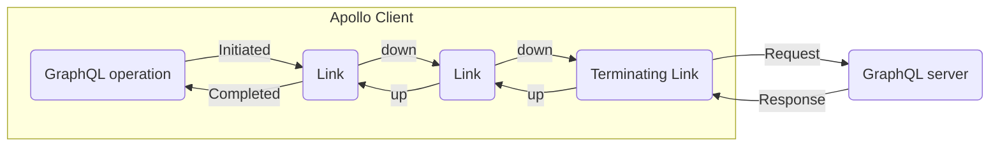

The **Apollo Link** library helps you customize the flow of data between Apollo Client and your GraphQL server. You can define your client's network behavior as a chain of **link** objects that execute in a sequence:



Each link should represent either a self-contained modification to a GraphQL operation or a side effect (such as logging).

**In the above diagram:**

1.  The first link might log the details of the operation for debugging purposes.
2.  The second link might add an HTTP header to the outgoing operation request for authentication purposes.
3.  The final link (called the [terminating link](#the-terminating-link)) sends the operation to its destination (usually a GraphQL server over HTTP).
4.  The server's response is passed back up each link in reverse order, enabling links to [modify the response](#handling-a-response) or take other actions before the data is cached.

## Composing a link chain

A link chain consists of one or more link objects. Each link represents either a self-contained modification to a GraphQL operation or a side effect (such as logging). By composing these links into a chain, you can create an arbitrarily complex model for your client's data flow.

When you compose multiple links together, the result is a single link object that represents the entire chain. You provide the composed link to your Apollo Client instance using the `link` option:

```ts {4}
import { ApolloClient, InMemoryCache } from "@apollo/client";

const client = new ApolloClient({
  link: /* your composed link */,
  cache: new InMemoryCache(),
});
```

### The terminating link

The last link in the link chain is called the _terminating link_. Instead of calling the [`forward` function](#the-forward-function), it is responsible for sending the GraphQL operation to the destination that executes it (typically a GraphQL server) and returning a result. If a link chain consists of a single link, the single link is the terminating link.

[`HttpLink`](./apollo-link-http/) and [`BatchHttpLink`](./apollo-link-batch-http/) are examples of terminating links.

### Link composition

You compose multiple links together to form a link chain using two forms of link composition: additive and directional.

- [Additive composition](#additive-composition) involves combining a set of links into a serially executed chain:

  ```mermaid
  flowchart LR
    link1(Link)
    link2(Link)
    link3(Terminating Link)
    link1-->link2
    link2-->link3
  ```

- [Directional composition](#directional-composition) involves branching to one of two links, depending on the details of an operation:

  ```mermaid
  flowchart LR
    link1(Link)
    link2(Link)
    link3(Terminating Link)
    link4(Terminating Link)
    link1-->link2
    link1-->link3
    link2-->link4
  ```

<Note>

No matter how your chain branches, each branch always ends in a [terminating link](#the-terminating-link).

</Note>

#### Additive composition

Additive composition composes a link chain by executing links in serial order. You use the [`ApolloLink.from`](#apollolinkfrom) and [`ApolloLink.concat`](#apollolinkconcat) helpers to create a link chain using additive composition.

##### `ApolloLink.from`

The most common way to compose multiple links together is to use the static `ApolloLink.from` helper. Pass an array of link objects to `ApolloLink.from` to create a composed link that executes each link in serial order:

```ts
import { HttpLink, ApolloLink } from "@apollo/client";
import { RetryLink } from "@apollo/client/link/retry";
import MyAuthLink from "../auth";

const link = ApolloLink.from([
  new RetryLink(),
  new MyAuthLink(),
  new HttpLink({ uri: "http://localhost:4000/graphql" }),
]);
```

##### `ApolloLink.concat`

Each link object includes a `concat` instance method to combine two links into a single composed link. This is useful to combine multiple links together using a chain of function calls:

```ts
import { ApolloLink, HttpLink } from "@apollo/client";
import { RetryLink } from "@apollo/client/link/retry";
import MyAuthLink from "../auth";

const link = new RetryLink()
  .concat(new MyAuthLink())
  .concat(new HttpLink({ uri: "http://localhost:4000/graphql" }));
```

<Note>

The link chain created by the `from` and `concat` examples are functionally equivalent and differ only in style. Choose the style that best fits your application. You may choose to mix and match these styles as needed.

</Note>

#### Directional composition

You might want your link chain's execution to branch, depending on the details of the operation being performed. You use the `ApolloLink.split` method to create a link that conditionally routes to different sub-chains.

The `ApolloLink.split` function takes three arguments:

| Name    | Description                                                                                                                                                                                        |
| ------- | -------------------------------------------------------------------------------------------------------------------------------------------------------------------------------------------------- |
| `test`  | A function that takes in the current `operation` and returns `true` or `false`. Returning `true` executes the `left` link. Returning `false` executes the `right` link.                            |
| `left`  | The link passed as the second argument to `split`. This link executes when the `test` function returns `true`.                                                                                     |
| `right` | An optional link passed as the third argument to `split`. This link executes when the `test` function returns `false`. If this is not provided, the request handler's `forward` parameter is used. |

The following example uses `ApolloLink.split` to create a link that routes to different `HttpLink` instances depending on the associated context's `version`:

```ts
import { ApolloLink, HttpLink } from "@apollo/client";

const link = ApolloLink.split(
  (operation) => operation.getContext().version === 1,
  new HttpLink({ uri: "http://localhost:4000/v1/graphql" }),
  new HttpLink({ uri: "http://localhost:4000/v2/graphql" })
);
```

<Note>

Each link instance also provides a `split` function. This is used to apply directional composition to an existing link.

<ExpansionPanel title="Example">

The following example adds directional composition to a `previousLink` to determine which `HttpLink` should be used as the terminating link.

```ts
const link = previousLink.split(
  (operation) => operation.getContext().version === 1,
  new HttpLink({ uri: "http://localhost:4000/v1/graphql" }),
  new HttpLink({ uri: "http://localhost:4000/v2/graphql" })
);
```

</ExpansionPanel>

</Note>

Other uses for the `split` method include:

- Using different transport methods depending on the operation type (such as HTTP for queries and WebSocket for subscriptions)
- Customizing the number of allowed retry attempts depending on the operation type
- Customizing logic depending on whether a user is logged in

In the following example, all subscription operations are sent to `GraphQLWsLink`, with all other operations sent to `HttpLink`:

```ts
import { ApolloLink, HttpLink } from "@apollo/client";
import { GraphQLWsLink } from "@apollo/client/link/subscriptions";
import { OperationTypeNode } from "graphql";
import { createClient } from "graphql-ws";

const link = ApolloLink.split(
  ({ operationType }) => {
    return operationType === OperationTypeNode.SUBSCRIPTION;
  },
  new GraphQLWsLink(createClient({ url: "ws://localhost:3000/subscriptions" })),
  new HttpLink({ uri: "http://localhost:4000/graphql" })
);
```

## Creating a custom link

A link object is an instance of the [`ApolloLink` class](https://github.com/apollographql/apollo-client/blob/main/src/link/core/ApolloLink.ts). Each link must define a [_request handler_](#the-request-handler) to handle the request.

### The request handler

Every link must define a request handler. The request handler is a method responsible for performing some logic and executing the request, either by [forwarding](#the-forward-function) the operation to the next link in the chain, or sending the operation to the destination that executes it, such as a GraphQL server.

This request handler receives the following arguments:

- `operation`: The [operation object](#the-operation-object) that provides information about the currently executed GraphQL request passed through the link.
- `forward`: A [function](#the-forward-function) called to execute the next link in the chain.

Apollo Client executes a GraphQL operation by calling the request handler of the first link in the composed link chain. Each non-terminating link is then responsible for executing its logic and delegating execution down to the next link by calling the [`forward` function](#the-forward-function). After the operation reaches the [terminating link](#the-terminating-link), the request handler sends the operation to the destination and reports the result back up through the chain.

#### Define a request handler using a callback function

The most common way to provide a request handler is by passing a callback function to the `ApolloLink` constructor:

```ts
import { ApolloLink } from "@apollo/client";

const link = new ApolloLink((operation, forward) => {
  // Handle the request
});
```

The callback function is called for each GraphQL operation sent through the link chain.

#### Define a request handler for an Apollo Link subclass

You define a request handler for a subclass of `ApolloLink` by overriding the `request` method. Subclassing is typically used to create [stateful links](#stateful-links).

```ts {7-9}
class MyCustomLink extends ApolloLink {
  constructor() {
    super();
    // ...other setup logic
  }

  request(operation, forward) {
    // Handle the request
  }
}
```

The `request` method is called for each GraphQL operation sent through the link chain.

### The `Operation` object

The `Operation` object includes the following fields:

<PropertySignatureTable
  canonicalReference="@apollo/client!ApolloLink.Operation:interface"
  idPrefix="operation"
/>

### The `forward` function

After your custom link's request handler is finished performing its logic, return a call to the `forward` function and provide the `operation` as an argument. Calling the `forward` function executes the next link in the chain.

```tsx {5}
const link = new ApolloLink((operation, forward) => {
  // ...Handle the request

  // Execute the next link in the chain
  return forward(operation);
});
```

The `forward` function returns an [`Observable`](https://rxjs.dev/guide/observable) provided by the [RxJS](https://rxjs.dev/) library. Learn more about Observables in the [RxJS documentation](https://rxjs.dev/guide/observable).

<Caution>

A non-terminating custom link's request handler must call `forward(operation)`. If it doesn't, the link is treated as a [terminating link](#the-terminating-link). This might result in the associated GraphQL operation not executed and the request remains pending indefinitely.

</Caution>

## Handling a response

When your GraphQL server responds with an operation result, that result is passed back up through each link in your chain:


Each link can perform custom logic on the result using [operators](https://rxjs.dev/guide/operators). These are special functions passed to an Observable's [`pipe`](https://rxjs.dev/guide/operators#piping) function.

The following example uses the RxJS [`map` operator](https://rxjs.dev/api/index/function/map) to modify the result before returning it back up the chain:

```ts
import { map } from "rxjs";

const link = new ApolloLink((operation, forward) => {
  return forward(operation).pipe(
    map((result) => {
      // ...modify result as desired here...
      return result;
    })
  );
});
```

This modification is seen by any previous link in the chain because the result travels back up the chain in reverse order.

<Note>

The `map` function is the most common operator for performing modifications to the result. See the RxJS [operators](https://rxjs.dev/guide/operators) documentation for references to other operators that provide other functionality that you can use when building custom links.

</Note>

### Executing side-effects

Links commonly perform side-effects when receiving responses instead of modifying the result.

The following example uses the [`tap` operator](https://rxjs.dev/api/operators/tap) to estimate the round-trip time of an operation by defining a start time on the [request context](#managing-context) then logging the total time when the response is received.

```ts
import { ApolloLink } from "@apollo/client";
import { tap } from "rxjs";

const roundTripLink = new ApolloLink((operation, forward) => {
  // Called before operation is sent to server
  operation.setContext({ start: new Date() });

  return forward(operation).pipe(
    tap((result) => {
      // Called after server responds
      const time = new Date() - operation.getContext().start;
      console.log(
        `Operation ${operation.operationName} took ${time} to complete`
      );
    })
  );
});
```

<Note>

The `tap` function is the most common operator for performing side-effects on the response. See the RxJS [operators](https://rxjs.dev/guide/operators) documentation for references to other operators that provide other functionality that you might need when building custom links.

</Note>

## Link types

### Stateless links

Most links perform the same logic for every operation they process and they don't need to know anything about operations that have been executed previously. These links are _stateless_.

Stateless links typically define request handlers by providing a callback function to the constructor of an `ApolloLink` object:

```ts
import { ApolloLink } from "@apollo/client";
import { tap } from "rxjs";

const consoleLink = new ApolloLink((operation, forward) => {
  console.log(`starting request for ${operation.operationName}`);
  return forward(operation).pipe(
    tap(() => {
      console.log(`ending request for ${operation.operationName}`);
    })
  );
});
```

Stateless links are great for building middleware. The following link adds an `Authorization` header to every outgoing request:

```ts
import { ApolloLink } from "@apollo/client";

const authLink = new ApolloLink((operation, forward) => {
  operation.setContext(({ headers }) => ({
    headers: {
      authorization: Auth.userId(), // however you get your token
      ...headers,
    },
  }));

  return forward(operation);
});
```

You can customize stateless links by wrapping them in a function:

```ts
import { ApolloLink } from "@apollo/client";

function reportErrors(errorCallback) {
  return new ApolloLink((operation, forward) => {
    return new Observable((observer) => {
      const observable = forward(operation);
      const subscription = observable.subscribe({
        next(value) {
          observer.next(value);
        },
        error(networkError) {
          errorCallback({ networkError, operation });
          observer.error(networkError);
        },
        complete() {
          observer.complete();
        },
      });

      return () => subscription.unsubscribe();
    });
  });
}

const link = reportErrors(console.error);
```

#### Extending `ApolloLink`

You can also create stateless links by subclassing the `ApolloLink` class and overriding the constructor and request handler.

Here's the same `reportErrors` link written as a subclass of `ApolloLink`:

```ts
import { ApolloLink } from "@apollo/client";
import { tap } from "rxjs";

class ReportErrorLink extends ApolloLink {
  constructor(errorCallback) {
    super();
    this.errorCallback = errorCallback;
  }
  request(operation, forward) {
    return forward(operation).pipe(
      tap({
        // errors will be sent to the errorCallback
        error: this.errorCallback,
      })
    );
  }
}

const link = new ReportErrorLink(console.error);
```

<Note>

The `ReportErrorLink` link is still considered a stateless link despite being built as a subclass because it does not maintain state between requests.

</Note>

### Stateful links

Links that maintain state between operations are called _stateful links_. You create stateful links by defining subclasses of `ApolloLink` and overriding the `constructor` and `request` methods.

The following example maintains an operation counter using an instance variable. The counter is incremented for every request that passes through the link.

```ts
import { ApolloLink } from "@apollo/client";

class OperationCountLink extends ApolloLink {
  constructor() {
    super();
    this.operationCount = 0;
  }
  request(operation, forward) {
    this.operationCount += 1;
    return forward(operation);
  }
}

const link = new OperationCountLink();
```

## Managing context

As an operation moves along the link chain, it maintains a `context` that each link can read and modify. This enables both links and request-based APIs (such as [`useQuery`](../react/useQuery)) to pass metadata along the chain that other links use in their execution logic. Context is not included in the terminating link's request to the GraphQL server or other destination.

<Note>

If your application is built using TypeScript, we recommend reading the [Defining context types](../../development-testing/static-typing#defining-context-types) guide to learn how to provide types for the context object.

</Note>

### Reading context

You get the current context object by calling `operation.getContext()` in a [request handler](#the-request-handler).

```ts {2}
const link = new ApolloLink((operation, forward) => {
  const context = operation.getContext();

  // handle the request
});
```

<Note>

Changes to the `context` object returned from `operation.getContext()` are not persisted, and downstream links won't see them. Use `operation.setContext()` to make modifications to context.

</Note>

### Modifying context

Modify context by calling `operation.setContext()`. You provide the updated context as an object directly to `setContext`.

```ts {2}
const timeStartLink = new ApolloLink((operation, forward) => {
  operation.setContext({ start: new Date() });

  return forward(operation);
});
```

It is common to read existing context to make modifications to it before writing it back. As a shortcut, you can provide a callback function to `operation.setContext()`. The callback function provides the previous context as an argument and expects the function to return the new context.

```ts {2-4}
const counterLink = new ApolloLink((operation, forward) => {
  operation.setContext((prevContext) => ({
    count: prevContext.count + 1,
  }));

  return forward(operation);
});
```

### Providing context for an operation

Context is typically used to communicate between a request API (such as [`useQuery`](../react/useQuery)) and the links in the link chain. You provide context for a particular operation using the `context` option.

The following example provides the initial context with [`useQuery`](../react/useQuery) to define the initial `count` from the previous example.

```ts
function MyComponent() {
  const { data } = useQuery(MY_QUERY, { context: { count: 10 } });

  // render data
}
```
