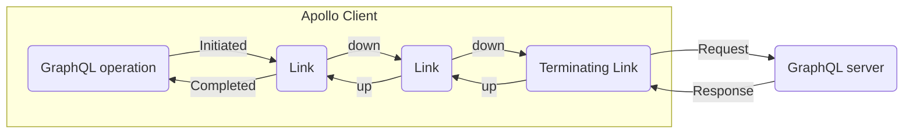

import LinkChain from '../../../shared/link-chain.mdx';

> If your application only needs to send conventional HTTP-based requests to a GraphQL server, you probably don't need to use the Apollo Link API. See [Basic HTTP networking](../../networking/basic-http-networking/).

The **Apollo Link** library helps you customize the flow of data between Apollo Client and your GraphQL server. You can define your client's network behavior as a chain of **link** objects that execute in a sequence:



Each link should represent either a self-contained modification to a GraphQL operation or a side effect (such as logging).

**In the above diagram:**

 1. The first link might log the details of the operation for debugging purposes.
 2. The second link might add an HTTP header to the outgoing operation request for authentication purposes.
 3. The final (terminating) link sends the operation to its destination (usually a GraphQL server over HTTP).
 4. The server's response is passed back up each link in reverse order, enabling links to [modify the response](#handling-a-response) or take other actions before the data is cached.

By default, Apollo Client uses Apollo Link's `HttpLink` to send GraphQL operations to a remote server over HTTP. Apollo Client takes care of creating this default link, and it covers many use cases without requiring additional customization.

To extend or replace this default networking behavior, you can define _custom_ links and specify their order of execution in the `ApolloClient` constructor.

## Your first link chain

The example below demonstrates a basic link chain with two Apollo-provided links:

* An `onError` link that checks for errors in the server's response. It logs the details of whichever error(s) it finds.
* An `HttpLink` that sends each GraphQL operation to your server.
    * _This is the chain's [terminating link](#the-terminating-link)._

Note that if you provide a link chain to the `ApolloClient` constructor, you _don't_ provide the `uri` option. Instead, you provide your server's URL to your `HttpLink`.

<ExpansionPanel title="Click to expand example">

<LinkChain/>

</ExpansionPanel>

## Creating a custom link

A link object is an instance of the [`ApolloLink` class](https://github.com/apollographql/apollo-client/blob/main/src/link/core/ApolloLink.ts) (or a subclass of it). Each link must define a method named `request`, which is known as the link's **request handler**. You can provide this method's definition to the `ApolloLink` constructor.


### Example

The following custom link defines a request handler that adds a GraphQL operation's approximate start time to the operation's [context](#managing-context):

```js
import { ApolloLink } from '@apollo/client';

const timeStartLink = new ApolloLink((operation, forward) => {
  operation.setContext({ start: new Date() });
  return forward(operation);
});
```

This request handler then calls `return forward(operation)`, which is the syntax for calling the next link down the chain.

### The request handler

Every link must define a `request` method, also known as its **request handler**. This method is passed the following arguments:

* `operation`: The GraphQL operation that's being passed through the link.
    * For details, see [The `Operation` object](#the-operation-object).
* `forward`: A function for executing the next link in the chain (unless this is a [terminating link](#the-terminating-link)).

Whenever Apollo Client prepares to execute a GraphQL operation, it calls the request handler of the first link in the chain. Each link is responsible for executing its logic and then passing execution to the _next_ link by calling the [`forward` function](#the-forward-function) and returning its result.

#### The `Operation` object

The `Operation` object includes the following fields:

| Name  | Description  |
|---|---|
| `query`  | A `DocumentNode` (parsed GraphQL operation) that describes the operation taking place.  |
| `variables`  | A map of GraphQL variables being sent with the operation.  |
| `operationName`  | A string name of the query if it is named, otherwise `null`.  |
| `extensions`  |  A map to store extensions data to be sent to the server. |
| `getContext`  | A function to return the context of the request. This context can be used by links to determine which actions to perform. See [Managing context](#managing-context). |
| `setContext`  |  A function that takes either a new context object, or a function which takes in the previous context and returns a new one. See [Managing context](#managing-context). |

#### The `forward` function

When your custom link's request handler is done executing its logic, it should return a call to the `forward` function that's passed to it (unless it's the chain's [terminating link](#the-terminating-link)). Calling `return forward(operation)` passes execution along to the next link in the chain.

> If a non-terminating custom link's request handler _doesn't_ `return forward(operation)`, the link chain ends and the associated GraphQL operation is not executed.

The `forward` function's return type is an `Observable` provided by the [`zen-observable`](https://github.com/zenparsing/zen-observable) library. See the `zen-observable` documentation for details.

### Handling a response

When your GraphQL server responds with an operation result, that result is passed back up through each link in your link chain before it's cached:


Each link can execute logic while the result is being passed back by modifying their request handler's `return` statement, like so:

```js {4-8}
// BEFORE (NO INTERACTION)
return forward(operation);

// AFTER
return forward(operation).map((data) => {
  // ...modify result as desired here...
  return data;
});
```

Whatever the function provided to `map` returns is passed to the next link up the chain.

You can also perform logic here that has nothing to do with the result. This request handler uses the [request context](#managing-context) to estimate the round-trip time for each operation:

```js
import { ApolloLink } from '@apollo/client';

const roundTripLink = new ApolloLink((operation, forward) => {
  // Called before operation is sent to server
  operation.setContext({ start: new Date() });

  return forward(operation).map((data) => {
    // Called after server responds
    const time = new Date() - operation.getContext().start;
    console.log(`Operation ${operation.operationName} took ${time} to complete`);
    return data;
  });
});
```


## Composing a link chain

Each link represents either a self-contained modification to a GraphQL operation or a side effect (such as logging). By composing these links into a chain, you can create an arbitrarily complex model for your client's data flow.

There are two forms of link composition: additive and directional.

* [Additive composition](#additive-composition) involves combining a set of links into a serially executed chain:

    ```mermaid
    flowchart LR
      link1(Link)
      link2(Link)
      link3(Terminating Link)
      link1-->link2
      link2-->link3
    ```

* [Directional composition](#directional-composition) involves branching to one of two links, depending on the details of an operation:

    ```mermaid
    flowchart LR
      link1(Link)
      link2(Link)
      link3(Terminating Link)
      link4(Terminating Link)
      link1-->link2
      link1-->link3
      link2-->link4
    ```

Note that no matter how your chain branches, each branch always ends in a [terminating link](#the-terminating-link).

### The terminating link

The **terminating link** is the last link in a link chain. Instead of calling the `forward` function, the terminating link is responsible for sending your composed GraphQL operation to the destination that executes it (usually a GraphQL server) and returning an `ExecutionResult`.

[`HttpLink`](./apollo-link-http/) and [`BatchHttpLink`](./apollo-link-batch-http/) are both examples of terminating links.

### Additive composition

If you have a collection of two or more links that should always be executed in serial order, use the `ApolloLink.from` helper method to combine those links into a _single_ link, like so:

```js
import { from, HttpLink } from '@apollo/client';
import { RetryLink } from '@apollo/client/link/retry';
import MyAuthLink from '../auth';

const additiveLink = from([
  new RetryLink(),
  new MyAuthLink(),
  new HttpLink({ uri: 'http://localhost:4000/graphql' })
]);
```

### Directional composition

You might want your link chain's execution to branch, depending on the details of the operation being performed. You can define this logic with the `split` method of an `ApolloLink` instance. This method takes three parameters:

| Name  | Description  |
|---|---|
| `test`  | A function that takes in the current `Operation` and returns either `true` or `false` depending on its details.  |
| `left`  | The link to execute next if the `test` function returns `true`.  |
| `right`  | An **optional** link to execute next if the `test` function returns `false`. If this is not provided, the request handler's `forward` parameter is used. |

In the following example, a `RetryLink` passes execution along to one of two different `HttpLink`s depending on the associated context's `version`:

```js
import { ApolloLink, HttpLink } from '@apollo/client';
import { RetryLink } from '@apollo/client/link/retry';

const directionalLink = new RetryLink().split(
  (operation) => operation.getContext().version === 1,
  new HttpLink({ uri: "http://localhost:4000/v1/graphql" }),
  new HttpLink({ uri: "http://localhost:4000/v2/graphql" })
);
```

Other uses for the `split` method include:

* Customizing the number of allowed retry attempts depending on the operation type
* Using different transport methods depending on the operation type (such as HTTP for queries and WebSocket for subscriptions)
* Customizing logic depending on whether a user is logged in

### Providing to Apollo Client

After you finish composing your entire link chain, you provide the resulting link to the constructor of `ApolloClient`, like so:

```js {12}
import { ApolloClient, HttpLink, InMemoryCache } from '@apollo/client';
import { RetryLink } from '@apollo/client/link/retry';

const directionalLink = new RetryLink().split(
  (operation) => operation.getContext().version === 1,
  new HttpLink({ uri: "http://localhost:4000/v1/graphql" }),
  new HttpLink({ uri: "http://localhost:4000/v2/graphql" })
);

const client = new ApolloClient({
  cache: new InMemoryCache(),
  link: directionalLink
});
```


## Link types


### Stateless links

Most links perform the same logic for every operation they process, and they don't need to know anything about operations that have been executed previously. These links are **stateless**.

You can define the request handler for a stateless link in the constructor of an `ApolloLink` object, like so:

```js
import { ApolloLink } from '@apollo/client';

const consoleLink = new ApolloLink((operation, forward) => {
  console.log(`starting request for ${operation.operationName}`);
  return forward(operation).map((data) => {
    console.log(`ending request for ${operation.operationName}`);
    return data;
  })
})
```

Stateless links are great for implementing middleware and even network requests. The following link adds an `Authorization` header to every outgoing request:

```js
import { ApolloLink } from '@apollo/client';

const authLink = new ApolloLink((operation, forward) => {
  operation.setContext(({ headers }) => ({ headers: {
    authorization: Auth.userId(), // however you get your token
    ...headers
  }}));
  return forward(operation);
});
```

This style of link also composes well for customization using a function:

```js
import { ApolloLink } from '@apollo/client';

const reportErrors = (errorCallback) => new ApolloLink((operation, forward) => {
  const observable = forward(operation);
  // errors will be sent to the errorCallback
  observable.subscribe({ error: errorCallback })
  return observable;
});

const link = reportErrors(console.error);
```

#### Extending `ApolloLink`

You can also create a stateless link by extending the `ApolloLink` class and overwriting its constructor and request handler. For example, here's the same `reportErrors` link written as an extension of `ApolloLink`:

```js
import { ApolloLink } from '@apollo/client';

class ReportErrorLink extends ApolloLink {
  constructor(errorCallback) {
    super();
    this.errorCallback = errorCallback;
  }
  request(operation, forward) {
    const observable = forward(operation);
    // errors will be sent to the errorCallback
    observable.subscribe({ error: this.errorCallback })
    return observable;
  }
}

const link = new ReportErrorLink(console.error);
```

### Stateful links

When it's useful, links can maintain state between operations. These links are **stateful**.

Stateful links are usually defined as subclasses of `ApolloLink`. They override the constructor of `ApolloLink` and implement a `request` function with the same signature as a stateless link. For example:

```js
import { ApolloLink } from '@apollo/client';

class OperationCountLink extends ApolloLink {
  constructor() {
    super();
    this.operationCount = 0;
  }
  request(operation, forward) {
    this.operationCount += 1;
    return forward(operation);
  }
}

const link = new OperationCountLink();
```

This stateful link maintains a counter called `operationCount` as an instance variable. Every time a request is passed through the link, `operationCount` is incremented.

## Managing context

As an operation moves along your link chain, it maintains a `context` that each link can read and modify. This allows links to pass metadata along the chain that _other_ links use in their execution logic.

* Obtain the current context object by calling `operation.getContext()`.
* Modify the context object and then write it back with `operation.setContext(newContext)` or `operation.setContext((prevContext) => newContext)`.

Note that this context is *not* included in the terminating link's request to the GraphQL server or other destination.

Here's an example:

```js
import { ApolloLink, from } from '@apollo/client';

const timeStartLink = new ApolloLink((operation, forward) => {
  operation.setContext({ start: new Date() });
  return forward(operation);
});

const logTimeLink = new ApolloLink((operation, forward) => {
  return forward(operation).map((data) => {
    // data from a previous link
    const time = new Date() - operation.getContext().start;
    console.log(`operation ${operation.operationName} took ${time} to complete`);
    return data;
  })
});

const additiveLink = from([
  timeStartLink,
  logTimeLink
]);
```

This example defines two links, `timeStartLink` and `logTimeLink`. The `timeStartLink` assigns the current time to the context's `start` field. When the operation completes, the `logTimeLink` then subtracts the value of `start` from the current time to determine the total duration of the operation.

You can set the context object's initial value for a particular operation by providing the `context` parameter to the [`useQuery` hook](../react/hooks/#usequery) (or `useMutation`, `useSubscription`, etc.).
