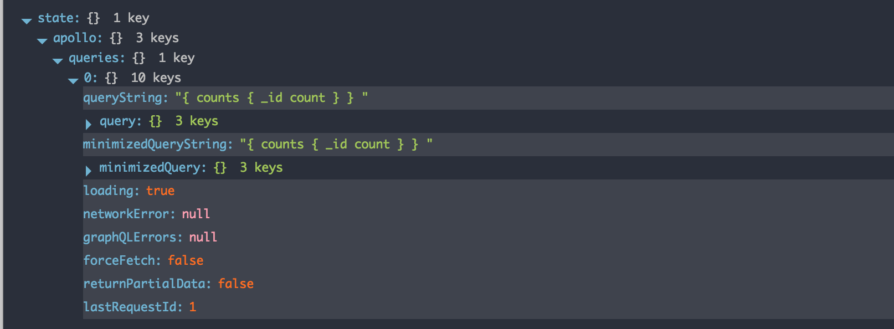
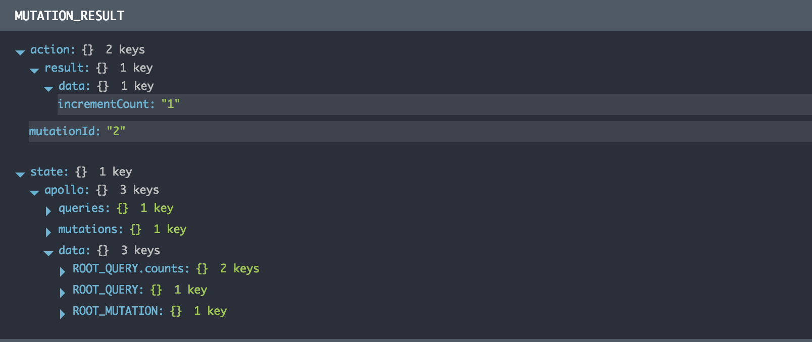

The Apollo Client is written from the ground up with the intention of making it easy to understand what is going on in your application. This is one of the main reasons we decided to build on top of Redux, which has an amazing ecosystem of developer tools.

If you don't pass in an existing Redux Store into the `ApolloClient` constructor, then you will get integration by default with the [Redux DevTools](https://chrome.google.com/webstore/detail/redux-devtools/lmhkpmbekcpmknklioeibfkpmmfibljd?hl=en) extension. Just install it, open the window, and you'll be able to keep track of all of the requests your client is making and how that affects the internal data Store.

<h2 id="demo">Inspecting your app</h2>

To get started with Redux DevTools, click the DevTools icon in your chrome browser. You will now see the Redux logger.


### Features

* Lets you inspect every state and action that comes through either your existing Redux Store or the Apollo Store integration.
* Lets you go back in time by “cancelling” action.
* If the change in Apollo's `apolloReducer` throws, you will see which action caused this to happen, and what the error was.

### Lifecycles

Redux Store's can be created with initial states. At the top of your DevTools you should see an action for `@@INIT`. The `@@INIT` action is responsible for calling `combineReducers` which bootstraps our store with 3 special state keys:

* `queries`
* `mutations`
* `data`

Along with these keys, any non-apollo reducer will have the same behavior as they do in vanilla Redux today.

As you interact with your application, the GraphQL server will resolve queries and mutations from the client. We utilize Redux to manage the state change our application goes through as we issue queries and mutations from the client.

### Queries

When a query is sent to your GraphQL server, Apollo dispatches an action to the Redux Store of type `APOLLO_QUERY_INIT`.

```js
// APOLLO_QUERY_INIT
{
    queryString: "{ counts { _id count } }",
    query: {},
    forceFetch: false,
    returnPartialData: false,
    queryId: "0"
    requestId: 1
}
```

Taking a closer look at the metadata that comes with a `APOLLO_QUERY_INIT` action, we see that `APOLLO_QUERY_INIT` sends over `queryId`, `queryString`, and `query`. The action takes these pieces of metadata and adds it to the Redux store. These properties can now be found saved in Redux.
The beauty of these state changes is the management for data "readyness". When the Store dispatches `APOLLO_QUERY_INIT`, the particular query we are trying to resolve will have this structure:



* The keys `loading` to manage our data "readyness",
* `networkError` and `graphQLErrors` to have complete visibility of errors to the end user.

When a query is executed and data has been resolved, the Store dispatches `APOLLO_QUERY_RESULT`.

```js
// APOLLO_QUERY_RESULT
{
    state: {
        apollo: {
            queries: {
               "0": {
                   queryString: "{ counts { _id count } }",
                   query: {},
                   loading: false,
                   networkError: null,
                   graphQLErrors: null,
                   forceFetch: false,
                   returnPartialData: false,
                   queryId: "0"
                   lastRequestId: 1

               }
            }
        }
    }
}
```

When the Store gets a `APOLLO_QUERY_RESULT`, a couple pieces of state change. First our query is no longer `loading`, so we can see that state has updated in oure Store. Next we see that the `data` property is hyrdated with the data resolved by our query. From here you can use one of the Frontend integrations to bind the data from `APOLLO_QUERY_RESULT` to your UI Components.

### Mutations

When a mutation is sent to your GraphQL server, Apollo dispatches an action to the Redux Store of type `APOLLO_MUTATION_INIT`.

```js
{
    mutationString: "mutation createCount($id: String) { incrementCount(id: $id) } ",
    mutation: {
        id: "ROOT_MUTATION",
        typeName: "Mutation",
        selectionSet: {},
        variables: {},
        id: "Y9WTEFbtsATdYzZnD"
    }
    mutationId: "2"
}
```

Here we can see the `selection set` of our mutation and the variables used in the mutation.

When a mutation has been resolved, the Store dispatches `APOLLO_MUTATION_RESULT`.



* The keys `loading` to manage our mutation "readyness"
* `error` to have complete visibility of errors to the end user.

```js
{
    state: {
        apollo: {
            mutations: {
               "2": {
                   mutationString: "mutation createCount($id: String) { incrementCount(id: $id) } ",
                   mutation: {},
                   variables: {},
                   loading: false,
                   error: null,
               }
            }
        }
    }
}

```
