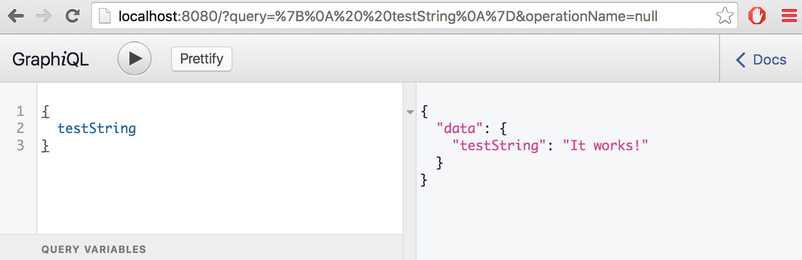

This guide will explain all the parts required for a simple GraphQL Blog server. If you're looking for a tutorial, check out this Medium post or our GraphQL server tutorial video on Youtube.

We'll be using a package called [graphql-tools](https://www.npmjs.com/package/graphql-tools), which is actively being developed for [Apollo](http://www.apollostack.com). There are of course many ways to build a GraphQL server for Node.js, but this is the way we recommend. It describes each step in detail, from defining a schema to writing your own resolve functions and loaders.

## Setup
For the remainder of this guide, we'll assume that you are familiar with using the command line of your operating system and already have Node 5 and npm set up for your environment.
If that's not the case, you should [do that first](https://nodejs.org/en/download/package-manager/) before you read the rest of this guide.

To get started, you need to install a few packages and set up some boilerplate. To make this easier, we've created a barebones started kit which you can use:
```bash
git clone --branch server-only https://github.com/apollostack/apollo-starter-kit
cd apollo-starter-kit
npm install
```

This will download the starter-kit from GitHub and install all the npm packages you need to get started.

Once the installation is finished, you can launch the server with this command:
```bash
npm start
```
If all goes well, the server should now print out a message that it is listening on port 8080. If you open [localhost:8080](http://localhost:8080/?query=%7B%0A%20%20testString%0A%7D) in your browser, you should now see the GraphiQL GUI for GraphQL, ready to query the server:



**For advanced users:**
If you already have an express server or a GraphQL server set up, then you can also simply install graphql-tools with the command `npm install graphql-tools` and jump to the [Tools](tools.html) section in this guide to learn about using the individual parts of the graphql-tools package.


## Schema

If you open the `data` folder in the project directory, you will see the file `schema.js` which defines the schema your server currently uses in GraphQL schema language:
```js
const typeDefinitions = `
type Query {
  testString: String
}

schema {
  query: Query
}
`;

export default [typeDefinitions];
```
ApolloServer uses the GraphQL schema language notation, which it then compiles to a GraphQL-JS schema. With the current schema, our server provides exactly one entry point `testString`, which returns a String.

The schema notation supports all GraphQL types. In this tutorial we are only going to use a few of them. You can learn about all the others in the [schema creation subsection of Tools](http://docs.apollostack.com//apollo-server/tools.html#Schema-creation).

For the blog app, we're going to use a schema that has the following two types: Authors and Posts. For each type, the schema defines which fields it has, and how it relates to the other types. The fields of the RootQuery and RootMutation types are the client's entry points to the schema. Every query or mutation has to start there, but it can ask for as much or as little data as it wants by expanding the fields when necessary.

````js
const typeDefinitions = `
type Author {
  id: Int! # the ! means that every author object _must_ have an id
  firstName: String
  lastName: String
  posts: [Post] # the list of Posts by this author
}

type Post {
  id: Int!
  tags: [String]
  title: String
  text: String
  author: Author
}

# the schema allows the following two queries:
type RootQuery {
  author(firstName: String, lastName: String): Author
  fortuneCookie: String
}

# this schema allows the following two mutations:
type RootMutation {
  createAuthor(
    firstName: String!
    lastName: String!
  ): Author

  createPost(
    tags: [String!]!
    title: String!
    text: String!
    authorId: Int!
  ): Post
}

# we need to tell the server which types represent the root query
# and root mutation types. We call them RootQuery and RootMutation by convention.
schema {
  query: RootQuery
  mutation: RootMutation
}
`;

export default [typeDefinitions];
```
For more information about GraphQL's type system and schema language, you can take a look at @sogko's [cheat sheet](https://raw.githubusercontent.com/sogko/graphql-shorthand-notation-cheat-sheet/master/graphql-shorthand-notation-cheat-sheet.png), read the [Schema definition subsection in the graphql-tools documentation chapter](http://docs.apollostack.com/apollo-server/tools.html#Schema-creation) or refer to the [official GraphQL website](http://graphql.org/docs/typesystem/).

## Mocking

Mocking is one of the many things that GraphQL makes much easier than traditional RESTful APIs. If you copy the schema of the previous subsection into the `data/schema.js` file and restart your server, you can immediately start querying it and it will return some mocked data!

The defaults for mocked data are a great, but sometimes you need data that looks more realistic. To achieve that, you need to tell the `apolloServer` how to generate mock data for your schema.

The rules for mocking are defined in `data/mocks.js`. In the unmodified starter kit, the file looks like this:

```js
const mocks = {
  String: () => "It works!",
};

export default mocks;
```

That's right, this is where the "It works!" that you saw earlier came from!

We're going to modify that now to create more realistic mock data. In order to do that, we'll use a package called casual to generate fake data. You can install it by running `npm i --save-dev casual`.

```js
import { MockList } from 'graphql-tools';
import casual from 'casual';

const mocks = {
  Int: () => casual.integer(1,1000),
  Author: () => ({
    firstName: () => casual.first_name,
    lastName: () => casual.last_name,
    posts: () => new MockList([1,6]),
  }),
  Post: () => ({
    tags: () => new MockList([1,3], () => casual.word),
    title: () => casual.title,
    text: () => casual.sentences(4),
  }),
  RootQuery: () => ({
    author: (o, args) => {
      if (casual.integer(1,10) > 8){
        return null;
      }
      return { ...args };
    },
  }),
};

export default mocks;
```
Go ahead and give the server a try with the new mocks. If all went well, you should be able to run the following query and get a similar result.

**TODO:** Screenshot here

You can tell `apolloServer` to mock a scalar type, such as Int or String in a specific way. In this case, we told it to return an integer between 1 and 1000 every time an Int field is requested by the client.

You can also tell `apolloSever` to use special mocks for a specific type. In the `mocks.js` file above, we're telling the server to use `casual.first_name` to mock the `firstName` field of `Author`. If we didn't tell it to do that, it would use the default mock for the `String` type instead. To mock lists of different length, you can use `new MockList([min, max])`, which will return a list of length between min and max (both inclusive).

In the mock functions, you can also access the arguments passed to the field. In the file above, we're using that feature for the `author` field on `RootQuery`, to make sure that when the query asks for a user with a specific fist and/or last name, we either return a user with that first and/or last name, or we return null (to simulate an unsuccessful search in 20% of the cases).

You can read more about mocking with graphql-tools in our [Medium Post on mocking with GraphQL](https://medium.com/apollo-stack/mocking-your-server-with-just-one-line-of-code-692feda6e9cd), which also includes more code snippets and a demo.

## Resolve Functions

Without resolve functions, our GraphQL server can only return mock data. To make it return real data and persist the effect of mutations, you have to define resolve functions. Resolve functions tell the server how to find and return the data for each field in the query.

It's probably easiest to explain this with an example query:
```
{
  author(firstName: "Jonas"){
    firstName
    lastName
  }
}
```
To respond to this query, the server will first run the resolve function for the `author` field on the type `RootQuery`. Next, it will pass the return value of the `author` resolve function to both the `firstName` and `lastName` resolve functions of the `Author` type, because the schema says that `author` returns an Author, and the query asked for the fields `firstName` and `lastName` on `Author`. Both `firstName` and `lastName` return a String. String is a built-in scalar of GraphQL-JS. Scalar type is just a fancy way of saying that this type represents a leaf node in the graph. A leaf node cannot be expanded further, so its value is serialized and included in the response.

Resolve functions are defined in the 'data/resolvers.js' file, and the format is quite straight-forward, defining a resolve function for each field.

```js
import { Author, Post, View, FortuneCookie } from './connectors';

const resolveFunctions = {
  RootQuery: {
    author(_, { firstName, lastName }){
      return Author.find({ where: { firstName, lastName } });
    },
    fortuneCookie(){
      return FortuneCookie.getOne();
    },
  },
  RootMutation: {
    createAuthor: (root, args) => { return Author.create(args); },
    createPost: (root, { authorId, tags, title, text }) => {
      return Author.findOne({ where: { id: authorId } }).then( (author) => {
        return author.createPost( { tags: tags.join(','), title, text });
      });
    },
  },
  Author: {
    posts(author){
      return author.getPosts();
    },
  },
  Post: {
    author(post){
      return post.getAuthor();
    },
    tags(post){
      return post.tags.split(',');
    },
    views(post){
      return View.findOne({ postId: post.id }).then( (res) => res.views );
    }
  }
}

export default resolveFunctions;
```

Not every field needs a resolve function. In the example above, `Author.firstName` doesn't have a resolve function, because the value is already on the Author object that the `RootQuery.author` resolve function returned. If the schema doesn't define a resolve function for a field, the server will try to apply the default resolve function, which looks for the property on the input value that has the same name as the field.

As a general rule of thumb, resolve functions should only use connectors and not depend on any external libraries. They should be kept as simple as possible, and any complicated logic should be moved into a connector, which is why the resolve functions on their own will not do anything without the corresponding connectors.

In order for the server to use the resolve functions instead of the mocked schema, mocks has to be commented out from `server.js`:

```js
import express from 'express';
import { apolloServer } from 'graphql-tools';
import Schema from './data/schema';
import Mocks from './data/mocks';
import Resolvers from './data/resolvers';

const GRAPHQL_PORT = 8080;

const graphQLServer = express();

graphQLServer.use('/graphql', apolloServer({
  graphiql: true,
  pretty: true,
  schema: Schema,
  resolvers: Resolvers,
  //mocks: Mocks,
}));

graphQLServer.listen(GRAPHQL_PORT, () => console.log(
  `GraphQL Server is now running on http://localhost:${GRAPHQL_PORT}/graphql`
));
```


## Connectors
Connectors are used to connect the GraphQL resolve functions to a backend that stores the actual data. GraphQL doesn't have any opinion when it comes to how the data is actually stored, so it can be used with MySQL, Postgres, MongoDB, RethinkDB, HFS, S3, Redis, Memcache, REST services and pretty much anything that can communicate over the network or a socket. You can also store things in memory or on disk on your GraphQL server. Anything is possible.

The example below uses three different connectors: Sequelize for SQL, Mongoose for MongoDB and a REST service. The GraphQL schema language file and resolve functions define how these connectors get integrated into a single schema.

```js
import Sequelize from 'sequelize';
import Mongoose from 'mongoose';
import casual from 'casual';
import rp from 'request-promise';

// SQL tables
const db = new Sequelize('blog', null, null, {
  dialect: 'sqlite',
  storage: './blog.sqlite'
});

const AuthorModel = db.define('author', {
  firstName: {
    type: Sequelize.STRING,
  },
  lastName: {
    type: Sequelize.STRING,
  },
});

const PostModel = db.define('post', {
  title: {
    type: Sequelize.STRING,
  },
  text: {
    type: Sequelize.STRING,
  },
  tags: {
    type: Sequelize.STRING,
  }
});

// foreign key relationships
AuthorModel.hasMany(PostModel);
PostModel.belongsTo(AuthorModel);

const Author = db.models.author;
const Post = db.models.post;

// MongoDB table
const mongo = Mongoose.connect('mongodb://localhost/views');

const ViewSchema = Mongoose.Schema({
  postId: Number,
  views: Number,
})

const View = Mongoose.model('views', ViewSchema);

// REST backend / service
const FortuneCookie = {
  getOne(){
    return rp('http://fortunecookieapi.com/v1/cookie')
      .then((res) => JSON.parse(res))
      .then((res) => {
        return res[0].fortune.message;
      });
  },
};

export { Author, Post, View, FortuneCookie };
```

In this example, we used the Sequelize and Mongoose ORMs for interacting with the SQL and MongoDB databases, but using an ORM is not required. ORMs just happen to be useful here, because they offer a higher-level abstraction on top of the database technology, which makes them easier to use in resolve functions.
