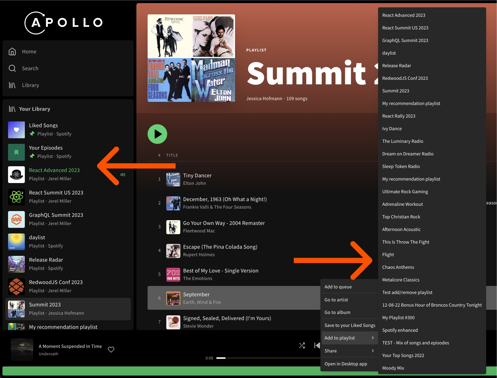

This article describes special cases and considerations when using the [Apollo Client cache](./overview).

## Bypassing the cache

Sometimes you _shouldn't_ use the cache for a particular GraphQL operation. For example, a query's response might be a token that's only used once. In cases like this, use [the `no-cache` fetch policy](../data/queries/#setting-a-fetch-policy):

```js
const { loading, error, data } = useQuery(GET_DOGS, {
  fetchPolicy: "no-cache" // highlight-line
});
```

Operations that use this fetch policy don't write their result to the cache, and they also don't check the cache for data before sending a request to your server. [See all available fetch policies.](../data/queries/#setting-a-fetch-policy)

## Persisting the cache

You can persist and rehydrate the `InMemoryCache` from a storage provider like `AsyncStorage` or `localStorage`. To do so, use the [`apollo3-cache-persist`](https://github.com/apollographql/apollo-cache-persist) library. This library works with a variety of [storage providers](https://github.com/apollographql/apollo-cache-persist/blob/master/docs/storage-providers.md).

To get started, pass your cache and a storage provider to `persistCache`. By default, the contents of your cache are immediately restored asynchronously, and they're persisted on every write to the cache with a short configurable debounce interval.

<Note>

The `persistCache` method is async and returns a `Promise`.

</Note>

```js
import AsyncStorage from '@react-native-async-storage/async-storage';
import { InMemoryCache } from '@apollo/client';
import { persistCache } from 'apollo3-cache-persist';

const cache = new InMemoryCache();

persistCache({
  cache,
  storage: AsyncStorage,
}).then(() => {
  // Continue setting up Apollo Client as usual.
})
```

For advanced usage and additional configuration options, see the [README of `apollo3-cache-persist`](https://github.com/apollographql/apollo-cache-persist).

## Resetting the cache

Sometimes, you might want to reset the cache entirely, such as [when a user logs out](../networking/authentication/#reset-store-on-logout). To accomplish this, call `client.resetStore`. This method is asynchronous, because it also refetches any of your active queries.

```js
import { useQuery } from '@apollo/client';
function Profile() {
    const { data, client } = useQuery(PROFILE_QUERY);
    return (
      <Fragment>
        <p>Current user: {data?.currentUser}</p>
        <button onClick={async ()=>client.resetStore()}>
            Log out
        </button>
      </Fragment>
    );
}
```

To reset the cache _without_ refetching active queries, use `client.clearStore()` instead of `client.resetStore()`.

### Responding to cache resets

You can register callback functions that execute whenever `client.resetStore` is called. To do so, call `client.onResetStore` and pass in your callback. To register multiple callbacks, call `client.onResetStore` multiple times. All of your callbacks are added to an array and are executed concurrently whenever the cache is reset.

In this example, we use `client.onResetStore` to write default values to the cache. This is useful when using Apollo Client's [local state management](../local-state/local-state-management/) features and calling `client.resetStore` anywhere in your application.

```js
import { ApolloClient, InMemoryCache } from '@apollo/client';
import { withClientState } from 'apollo-link-state';

import { resolvers, defaults } from './resolvers';

const cache = new InMemoryCache();
const stateLink = withClientState({ cache, resolvers, defaults });

const client = new ApolloClient({
  cache,
  link: stateLink,
});

client.onResetStore(stateLink.writeDefaults);
```

You can also call `client.onResetStore` from your React components. This can be useful if you want to force your UI to rerender after the cache is reset.

The `client.onResetStore` method's return value is a function you can call to unregister your callback:

```js {8-10,13}
import { useApolloClient } from '@apollo/client';

function Foo (){
  const [reset, setReset] = useState(0);
  const client = useApolloClient();

  useEffect(() => {
    const unsubscribe = client.onResetStore(() =>
      new Promise(()=>setReset(reset + 1))
    );

    return () => {
      unsubscribe();
    };
  });

  return reset ? <div /> : <span />
}

export default Foo;
```

## TypePolicy inheritance

JavaScript developers will be familiar with the idea of [inheritance](https://en.m.wikipedia.org/wiki/Inheritance_(object-oriented_programming)) from the `extends` clause of `class` declarations, or possibly from dealing with prototype chains created by `Object.create`.

Inheritance is a powerful code-sharing tool, and it works well with Apollo Client for several reasons:

 * `InMemoryCache` already knows about the supertype-subtype relationships (_interfaces and unions_) in your schema, thanks to `possibleTypes`, so no additional configuration is necessary to provide that information.

 * Inheritance allows a supertype to provide default configuration values to all its subtypes, including `keyFields` and individual field policies, which can be selectively overridden by subtypes that want something different.

 * A single subtype can have multiple supertypes in a GraphQL schema, which is difficult to model using the single inheritance model of classes or prototypes. In other words, supporting multiple inheritance in JavaScript requires building a system something like this one, rather than just reusing built-in language features.

 * Developers can add their own client-only supertypes to the `possibleTypes` map, as a way of reusing behavior across types, even if their schema knows nothing about those supertypes.

 * The `possibleTypes` map is currently used only for fragment matching purposes, which is an important but fairly small part of what the client does. Inheritance adds another compelling use for `possibleTypes`, and should drastically reduce repetition of `typePolicies` when used effectively.

Here's how type policy inheritance works for `InMemoryCache`, considering the example below:

```ts
const cache = new InMemoryCache({
  possibleTypes: {
    Reptile: ["Snake", "Turtle"],
    Snake: ["Python", "Viper", "Cobra"],
    Viper: ["Cottonmouth", "DeathAdder"],
  },

  typePolicies: {
    Reptile: {
      // Suppose all our reptiles are captive, and have a tag with an ID.
      keyFields: ["tagId"],
      fields: {
        // Scientific name-related logic can be shared among Reptile subtypes.
        scientificName: {
          merge(_, incoming) {
            // Normalize all scientific names to lower case.
            return incoming.toLowerCase();
          },
        },
      },
    },

    Snake: {
      fields: {
        // Default to a truthy non-boolean value if we don't know
        // whether this snake is venomous.
        venomous(status = "unknown") {
          return status;
        },
      },
    },
  },
});
```

## Refetching queries after a mutation

In certain cases, writing an `update` function to [update the cache after a mutation](../data/mutations/#updating-local-data) can be complex, or even impossible if the mutation doesn't return modified fields.

In these cases, you can provide a `refetchQueries` option to the `useMutation` hook to automatically rerun certain queries after the mutation completes.

For details, see [Refetching queries](../data/mutations/#refetching-queries).

<Note>

Although `refetchQueries` can be faster to implement than an `update` function, it also requires additional network requests that are usually undesirable. For more information, see [this blog post](https://www.apollographql.com/blog/when-to-use-refetch-queries/).

</Note>

## Cache redirects

In some cases, a query requests data that already exists in the cache under a different reference. For example, your UI might have a list view and a detail view that both use the same data.

The list view might run the following query:

```graphql
query Books {
  books {
    id
    title
    abstract
  }
}
```

When a specific book is selected, the detail view might display an individual item using this query:

```graphql
query Book($id: ID!) {
  book(id: $id) {
    id
    title
    abstract
  }
}
```

In a case like this, _we_ know that the second query's data might already be in the cache, but because that data was fetched by a different query, _Apollo Client_ doesn't know that. To tell Apollo Client where to look for the cached `Book` object, we can define a field policy `read` function for the `book` field:

```js {9-14}
import { ApolloClient, InMemoryCache } from '@apollo/client';

const client = new ApolloClient({
  cache: new InMemoryCache({
    typePolicies: {
      Query: {
        fields: {
          book: {
            read(_, { args, toReference }) {
              return toReference({
                __typename: 'Book',
                id: args.id,
              });
            }
          }
        }
      }
    }
  })
});
```

This `read` function uses the `toReference` helper utility to generate and return a **cache reference** for a `Book` object, based on its `__typename` and `id`.

Now whenever a query includes the `book` field, the `read` function above executes and returns a reference to a `Book` object. Apollo Client uses this reference to look up the object in its cache and return it if it's present. If it _isn't_ present, Apollo Client knows it needs to execute the query over the network.

<Note>

To avoid a network request, _all_ of a query's requested fields must already be present in the cache. If the detail view's query fetches _any_ `Book` field that the list view's query _didn't_, Apollo Client considers the cache hit to be incomplete, and it executes the full query over the network.

</Note>

## Pagination utilities

Pagination is a best practice in GraphQL [for several reasons](../pagination/overview). Apollo Client enables fetching and caching paginated results using the [Core pagination API](../pagination/core-api). The API includes a few important utilities, including the [`fetchMore`](../pagination/core-api/#the-fetchmore-function) function and the `@connection` directive.

### Incremental loading: `fetchMore`

You can use the `fetchMore` function to update a query's cached result with data returned by a _follow-up_ query. Most often, `fetchMore` is used to handle infinite-scroll pagination and other situations where you're loading more data when you already have some.

For details, see [The `fetchMore` function](../pagination/core-api/#the-fetchmore-function).

### The `@connection` directive

The `@connection` directive solves the problem of multiple copies of the same field in the cache. This can happen with paginated queries because the `fetchMore` function sends follow-up queries to fetch additional pages of results using arguments like [`offset`](../pagination/offset-based/) and [`limit`](../pagination/offset-based/). These arguments inadvertently fragment data from different pagination requests across the cache.

The `@connection` directive lets you unify paginated results by specifying a custom, stable cache key for a field. It also lets you _intentionally_ separate paginated results in the cache by fields that you specify.

<Tip>

Starting in Apollo Client v3, setting the [`keyArgs` field policy](../pagination/key-args/#setting-keyargs) is the most straightforward way to resolve fragmented pagination results in the cache. For example, setting [`keyArgs` to `false`](../pagination/key-args/#supported-values-for-keyargs) indicates that no arguments should be included in cache keys, causing all pagination results to be cached together. Additionally, you only have to set your `keyArgs` configuration once, rather than using `@connection` in multiple queries. Refer to the [usage instructions](#connection-directive-usage) below to compare `@connection` and `keyArgs` usage.

The `@connection` directive is useful when you want to store distinct data in the cache on a query-by-query, field-by-field basis. See the [advanced usage instructions](#advanced-connection-directive-usage) for more details.

</Tip>

#### `@connection` directive usage

<Tip>

For the standard `@connection` directive usage described in this section, it's best to configure a [`keyArgs` field policy](../pagination/key-args/#setting-keyargs). For example, you can use the following [`keyArgs`](../pagination/key-args/#setting-keyargs) configuration for the same effect as the `@connection` example below.

```js
const cache = new InMemoryCache({
  typePolicies: {
    Query: {
      fields: {
        feed: {
          keyArgs: ["type"]
        }
      }
    }
  }
})
```

With this centralized `keyArg`s configuration, you don't need to include the `@connection` directive in your queries because the `type` argument is adequate for keeping feeds of different types separate in the cache. For an example of storing distinct data on a query-by-query basis, see the [advanced usage instructions](#advanced-connection-directive-usage).

</Tip>

To use the `@connection` directive, add it to the field you want a custom cache key for. The directive requires a `key` parameter to specify the custom cache key. You can optionally include the `filter` parameter, which takes an array of query argument names to include in the generated custom cache key.

```js
const query = gql`
  query Feed($type: FeedType!, $offset: Int, $limit: Int) {
    feed(type: $type, offset: $offset, limit: $limit) @connection(key: "feed", filter: ["type"]) {
      ...FeedEntry
    }
  }
`
```

With the above query, even when multiple `fetchMore`s queries are performed, each feed update always results in an update to the cache's `feed` key with the latest accumulated values. The example also uses the `@connection` directive's optional `filter` argument to include the `type` query argument in the cache key. This creates multiple cache values that accumulate queries from each type of feed.

With a stable cache key, you can use [`writeQuery`](./cache-interaction/#writequery) to perform a cache update that clears out the feed.

```js
client.writeQuery({
  query: gql`
    query Feed($type: FeedType!) {
      feed(type: $type) @connection(key: "feed", filter: ["type"]) {
        id
      }
    }
  `,
  variables: {
    type: "top",
  },
  data: {
    feed: [],
  },
});
```

<Note>

Because this example uses the `type` argument in the cache key, it doesn't need to provide `offset` or `limit` arguments.

</Note>

#### Advanced `@connection` directive usage

The `@connection` directive is useful when using the same field in multiple queries, with no distinguishing arguments (for example, `type`)  that `keyArgs` can use, and you want to keep that field's data separate in the cache.

For example, Apollo's [Spotify showcase](https://github.com/apollographql/spotify-showcase) uses `@connection` to independently cache lists of playlists. One list is in the left sidebar, where you navigate between playlists. The other appears when you right-click a song to add it to a playlist.


</img>

Without caching the playlists separately, loading the next page of data from one list affects the other, negatively impacting the UX.

For code examples, see:
- [The type policy](https://github.com/apollographql/spotify-showcase/blob/185f7b8a155209e9a099490dbc5d1e3bfba4c32f/client/src/apollo/client.ts#L105-L108)
- [Playlist sidebar query](https://github.com/apollographql/spotify-showcase/blob/185f7b8a155209e9a099490dbc5d1e3bfba4c32f/client/src/components/LoggedInLayout.tsx#L75)
- [Add to playlist menu](https://github.com/apollographql/spotify-showcase/blob/185f7b8a155209e9a099490dbc5d1e3bfba4c32f/client/src/components/ContextMenuAction/AddToPlaylist.tsx#L17)
