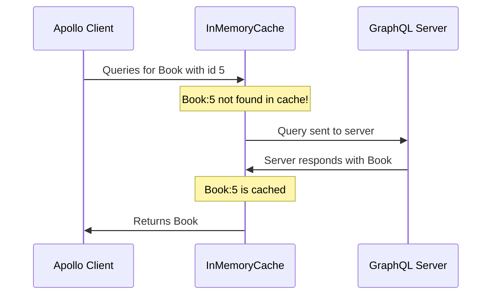
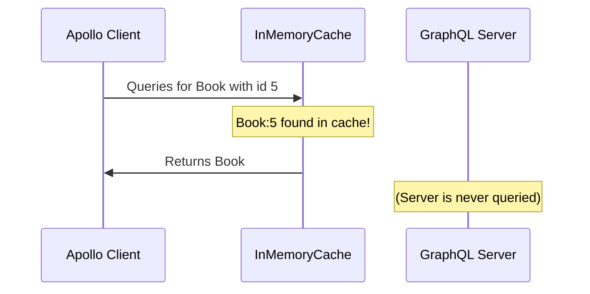
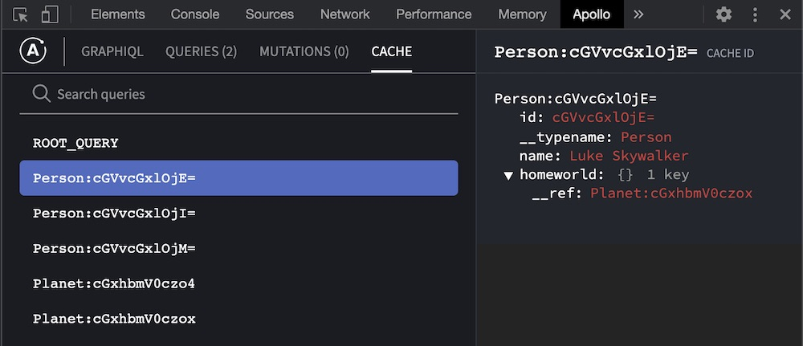

import {
  ExpansionPanel,
} from 'gatsby-theme-apollo-docs/src/components/expansion-panel';

Apollo Client stores the results of your GraphQL queries in a local, [normalized](#data-normalization), in-memory cache. This enables Apollo Client to respond almost immediately to queries for already-cached data, without even sending a network request.

For example, the _first_ time your app queries for a `Book` object with id `5`, the flow looks like this:



And each _later_ time your app queries for that same object, the flow looks like this instead:



The Apollo Client cache is highly configurable. You can customize its behavior for individual types and fields in your schema, and you can even use it to store and interact with local data that _isn't_ fetched from your GraphQL server.

## How is data stored?

Apollo Client's `InMemoryCache` maintains a **flat lookup table** of objects that can reference each other. These objects accumulate field information from objects that are returned by your GraphQL queries. A single cached object might include fields returned by multiple queries, if those queries fetch _different_ fields of the _same_ object.

The cache is flat, but objects returned by a GraphQL query often _aren't_! In fact, their nesting can be arbitrarily deep. Take a look at this example query response:

```json
{
  "data": {
    "person": {
      "__typename": "Person",
      "id": "cGVvcGxlOjE=",
      "name": "Luke Skywalker",
      "homeworld": {
        "__typename": "Planet",
        "id": "cGxhbmV0czox",
        "name": "Tatooine"
      }
    }
  }
}
```

This response contains a `Person` object, which in turn contains a `Planet` object in its `homeworld` field.

So how does the `InMemoryCache` store _hierarchical_ data in a _flat_ lookup table? Before storing this data, the cache needs to **normalize** it.

### Data normalization

Whenever the Apollo Client cache receives query response data, it does the following:

#### 1. Identify objects

First, the cache identifies all of the distinct objects included in a query response. In [the example above](#how-is-data-stored), there are two objects: a `Person` with `id` `cGVvcGxlOjE=`, and a `Planet` with `id` `cGxhbmV0czox`.

#### 2. Generate cache IDs

Second, the cache generates a **cache ID** for each identified object. A cache ID uniquely identifies a particular object while it's in the `InMemoryCache`.

By default, an object's cache ID is the concatenation of the object's `__typename` and `id` (or `_id`) fields, separated by a colon (`:`).


So, the default cache IDs for the objects in [the example above](#how-is-data-stored) are:

* `Person:cGVvcGxlOjE=`
* `Planet:cGxhbmV0czox`

> You can customize the cache ID format for a particular object type. See [Customizing cache IDs](./cache-configuration/#customizing-cache-ids).

If the cache _can't_ generate a cache ID for a particular object (for example, if no `__typename` field is present), that object is cached directly inside its _parent_ object and it must be referenced via the parent (this means the cache isn't always _completely_ flat).

#### 3. Replace object fields with references

Third, the cache takes each field that contains an object and replaces its value with a **reference** to the appropriate object.

For example, here's the `Person` object from the example above _before_ reference replacement:

```json{5-9}
{
  "__typename": "Person",
  "id": "cGVvcGxlOjE=",
  "name": "Luke Skywalker",
  "homeworld": {
    "__typename": "Planet",
    "id": "cGxhbmV0czox",
    "name": "Tatooine"
  }
}
```

And here it is _after_ replacement:

```json{5-7}
{
  "__typename": "Person",
  "id": "cGVvcGxlOjE=",
  "name": "Luke Skywalker",
  "homeworld": {
    "__ref": "Planet:cGxhbmV0czox"
  }
}
```

The `homeworld` field now contains a reference to the appropriate normalized `Planet` object.

> This replacement does _not_ occur for a particular object if [the previous step](#2-generate-cache-ids) failed to generate a cache ID for that object. Instead, the original object remains.

Later, if you query for _another_ `Person` who has the same `homeworld`, that normalized `Person` object will contain a reference to the _same_ cached object! Normalization can dramatically reduce data duplication, and it also helps your local data stay up to date with your server.

#### 4. Store normalized objects

The resulting objects are all stored in the cache's flat lookup table.

Whenever an incoming object has the same cache ID as an _existing_ cached object, the fields of those objects are _merged_:

* If the incoming object and the existing object share any fields, the incoming object _overwrites_ the cached values for those fields.
* Fields that appear in _only_ the existing object or _only_ the incoming object are preserved.

Normalization constructs a partial copy of your graph on your client, in a format that's optimized for reading and updating as your app's state changes.

## Visualizing the cache

To help understand the structure of your cached data, we strongly recommend installing the [Apollo Client Devtools](../development-testing/developer-tooling/#apollo-client-devtools).

This browser extension includes an inspector that enables you to view all of the normalized objects contained in your cache:

</img>

### Example

Let's say we use Apollo Client to run the following query on the [SWAPI demo API](https://github.com/graphql/swapi-graphql):

```graphql
query {
  allPeople(first:3) { # Return the first 3 items
    people {
      id
      name
      homeworld {
        id
        name
      }
    }
  }
}
```

This query returns the following result of three `Person` objects, each with a corresponding `homeworld` (a `Planet` object):

<ExpansionPanel title="Click to expand">

```json
{
  "data": {
    "allPeople": {
      "people": [
        {
          "__typename": "Person",
          "id": "cGVvcGxlOjE=",
          "name": "Luke Skywalker",
          "homeworld": {
            "__typename": "Planet",
            "id": "cGxhbmV0czox",
            "name": "Tatooine"
          }
        },
        {
          "__typename": "Person",
          "id": "cGVvcGxlOjI=",
          "name": "C-3PO",
          "homeworld": {
            "__typename": "Planet",
            "id": "cGxhbmV0czox",
            "name": "Tatooine"
          }
        },
        {
          "__typename": "Person",
          "id": "cGVvcGxlOjM=",
          "name": "R2-D2",
          "homeworld": {
            "__typename": "Planet",
            "id": "cGxhbmV0czo4",
            "name": "Naboo"
          }
        }
      ]
    }
  }
}
```

</ExpansionPanel>

> Notice that each object in the result includes a `__typename` field, even though our query string _didn't_ include this field. That's because Apollo Client _automatically_ queries for every object's `__typename` field.

After the result is cached, we can view the state of our cache in the Apollo Client Devtools:

</img>

Our cache now contains five normalized objects (in addition to the `ROOT_QUERY` object): three `Person` objects and two `Planet` objects.

**Why do we only have two `Planet` objects?** Because two of the three returned `Person` objects have the same `homeworld`. By [normalizing data](#data-normalization) like this, Apollo Client can cache a single copy of an object, and multiple _other_ objects can include _references_ to it (see the `__ref` field of the object in the screenshot above).

## Next steps

Now that you have a basic understanding of how Apollo Client's cache works, learn more about how to [install and configure it](./cache-configuration/).

Then, you can learn how to [read and write data to your cache](./cache-interaction/) directly, without executing a query against your server. This is a powerful option for [local state management](../local-state/local-state-management/).
