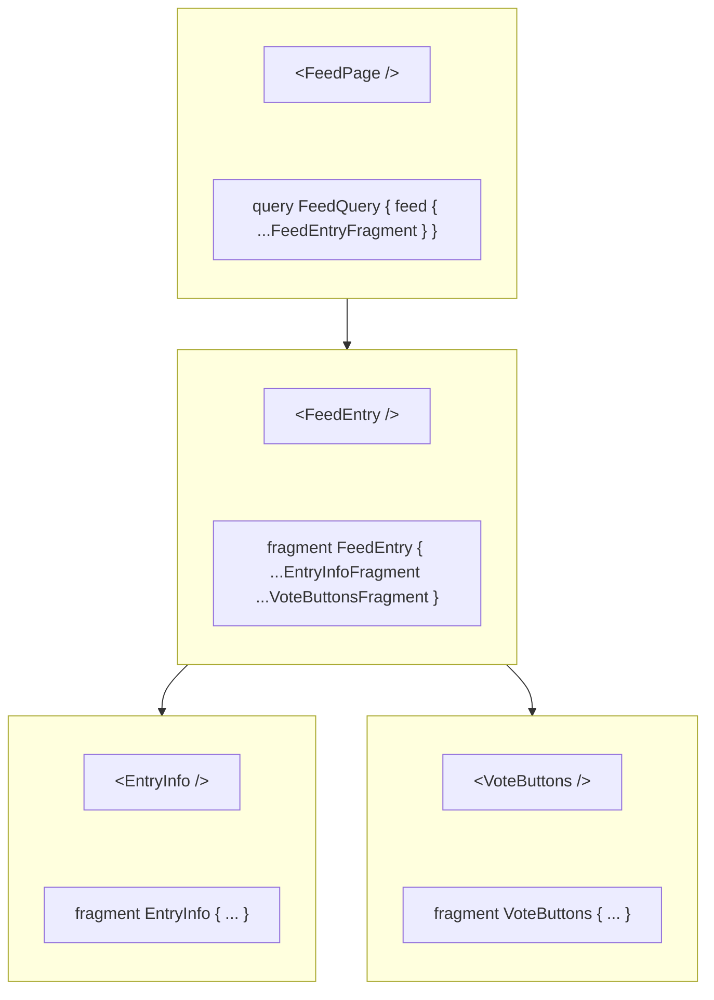

A [GraphQL fragment](http://graphql.org/learn/queries/#fragments) is a set of fields you can reuse across multiple queries and mutations. Fragments are especially useful when [colocated with components](#colocating-fragments) to define the component's data requirements.

Here's the declaration of a `NameParts` fragment that can be used with any `Person` object:

```graphql
fragment NameParts on Person {
  firstName
  lastName
}
```

Every fragment includes a subset of the fields that belong to its associated type. In the above example, the `Person` type must declare `firstName` and `lastName` fields for the `NameParts` fragment to be valid.

You can include the `NameParts` fragment in any number of operations that refer to `Person` objects by using the spread operator (`...`), followed by the fragment name:

```graphql
query GetPerson {
  people(id: "7") {
    ...NameParts
    avatar(size: LARGE)
  }
}
```

Based on our `NameParts` definition, the above query is equivalent to:

```graphql
query GetPerson {
  people(id: "7") {
    firstName
    lastName
    avatar(size: LARGE)
  }
}
```

Changes to the `NameParts` fragment automatically update the fields included in any operations that use it. This reduces the effort required to keep fields consistent across a set of operations.

## Example usage

Let's say we have a blog application that executes several GraphQL operations related to comments (submitting a comment, fetching a post's comments, etc.). Our application likely has a `Comment` component that is responsible for rendering comment data.

We can define a fragment on the `Comment` type to define the `Comment` component's data requirements, like so:

```js title="Comment.js"
import { gql } from '@apollo/client';

export const COMMENT_FRAGMENT = gql`
  fragment CommentFragment on Comment {
    id
    postedBy {
      username
      displayName
    }
    createdAt
    content
  }
`;
```

> The example above `export`s the fragment from the `Comment.js` component file. You can declare fragments in any file of your application, though we recommend this approach of [colocating fragments](#colocating-fragments) with your components.

We can then include the `CommentFragment` fragment in a GraphQL operation like so:

```jsx {2,11,16} title="PostDetails.jsx"
import { gql } from '@apollo/client';
import { COMMENT_FRAGMENT } from './Comment';

const GET_POST_DETAILS = gql`
  query GetPostDetails($postId: ID!) {
    post(postId: $postId) {
      title
      body
      author
      comments {
        ...CommentFragment
      }
    }
  }

  ${COMMENT_FRAGMENT}
`;

// ...PostDetails component definition...
```

* We first `import` `COMMENT_FRAGMENT` because it's declared in another file.
* We add our fragment definition to the `GET_POST_DETAILS` `gql` template literal via a placeholder (`${COMMENT_FRAGMENT}`)
* We include the `CommentFragment` fragment in our query with standard `...` notation.

<MinVersion version="3.7.0">
## Registering named fragments using `createFragmentRegistry`
</MinVersion>

Registering fragments with your `InMemoryCache` instance lets you refer to them by name in queries and cache operations (for example, `cache.readFragment`, `cache.readQuery`, and `cache.watch`) without needing to interpolate their declarations.

<Note>
We do not recommend using the fragment registry when using the `graphql` function generated by the GraphQL Codegen [client preset](https://the-guild.dev/graphql/codegen/plugins/presets/preset-client). The client preset creates precompiled GraphQL documents that already include fragment definitions.
</Note>

Let's look at an example in React.

```js title="index.js" {7-12}
import { ApolloClient, gql, InMemoryCache } from "@apollo/client";
import { createFragmentRegistry } from "@apollo/client/cache";

const client = new ApolloClient({
  uri: "http://localhost:4000/graphql",
  cache: new InMemoryCache({
    fragments: createFragmentRegistry(gql`
      fragment ItemFragment on Item {
        id
        text
      }
    `)
  })
});
```

Since `ItemFragment` was registered with `InMemoryCache`, it can be referenced by name, as seen below, with the fragment spread inside of the `GetItemList` query.

```jsx title="ItemList.jsx" {4,13}
const listQuery = gql`
  query GetItemList {
    list {
      ...ItemFragment
    }
  }
`;
function ToDoList() {
  const { data } = useQuery(listQuery);
  return (
    <ol>
      {data?.list.map(item => (
        <Item key={item.id} text={item.text} />
      ))}
    </ol>
  );
}
```

### Overriding registered fragments with local versions

Queries can declare their own local versions of named fragments which take precedence over ones registered via `createFragmentRegistry`, even if the local fragment is only indirectly referenced by other registered fragments. Take the following example:

```js title="index.js" {7-17}
import { ApolloClient, gql, InMemoryCache } from "@apollo/client";
import { createFragmentRegistry } from "@apollo/client/cache";

const client = new ApolloClient({
  uri: "http://localhost:4000/graphql",
  cache: new InMemoryCache({
    fragments: createFragmentRegistry(gql`
      fragment ItemFragment on Item {
        id
        text
        ...ExtraFields
      }

      fragment ExtraFields on Item {
        isCompleted
      }
    `)
  })
});
```

The local version of the `ExtraFields` fragment declared in `ItemList.jsx` takes precedence over the `ExtraFields` fragment originally registered with the `InMemoryCache` instance. Thus, the local definition will _only be used when `GetItemList` query is executed_, because explicit definitions take precedence over registered fragments.

```jsx title="ItemList.jsx" {8-10,17}
const GET_ITEM_LIST = gql`
  query GetItemList {
    list {
      ...ItemFragment
    }
  }

  fragment ExtraFields on Item {
    createdBy
  }
`;
function ToDoList() {
  const { data } = useQuery(GET_ITEM_LIST);
  return (
    <ol>
      {data?.list.map((item) => (
        {/* `createdBy` exists on the returned items, `isCompleted` does not */}
        <Item key={item.id} text={item.text} author={item.createdBy} />
      ))}
    </ol>
  );
}
```

### Lazily registering named fragments

Fragments don't need to be defined upfront when the cache is created. Instead, you can register named fragments lazily with the fragment registry. This is especially useful when combined with [colocated fragments](#colocating-fragments) whose fragment definitions are defined in component files. Let's look at an example:

```js title="fragmentRegistry.js"
export const { fragmentRegistry } = createFragmentRegistry();
```

```js title="index.js"
import { fragmentRegistry } from "./fragmentRegistry";

const client = new ApolloClient({
  uri: "http://localhost:4000/graphql",
  cache: new InMemoryCache({
    fragments: fragmentRegistry,
  })
});
```

We create a separate file that creates and exports our fragment registry. This lets us access our shared fragment registry across our application. We use this shared fragment registry with our `InMemoryCache` instance.

```jsx title="TodoItem.jsx"
import { gql } from "@apollo/client";
import { fragmentRegistry } from "./fragmentRegistry";

// Define the fragment outside the component to ensure it gets registered when this module is loaded.
const ITEM_FRAGMENT = gql`
  fragment ItemFragment on Item {
    # ...
  }
`

fragmentRegistry.register(ITEM_FRAGMENT);

function TodoItem() {
  // ...
}
```

We then import our shared fragment registry into our component file and register our fragment definition.

<Caution>
  You need to register fragment definitions with the fragment registry before executing operations that use them. This can be problematic when lazy loading component files because the application might not register the fragment definition with the registery until after the query begins executing. Move the fragment definition to a shared file that isn't lazy-loaded.
</Caution>

## Colocating fragments

The tree-like structure of a GraphQL response resembles the hierarchy of a frontend's rendered components. Because of this similarity, you can use fragments to split query logic _between_ components, so each component requests exactly the fields it needs. This helps make your component logic more succinct by combining multiple UI components into a single data fetch.

Consider the following view hierarchy for an app:



In this app, the `FeedPage` component executes a query to fetch a list of `FeedEntry` objects. The `EntryInfo` and `VoteButtons` subcomponents need specific fields from the enclosing `FeedEntry` object.

### Creating colocated fragments

A colocated fragment is just like any other fragment, except it's defined in the same file as a particular component that uses the fragment's fields. For example, the `VoteButtons` child component of `FeedPage` might use the fields `score` and `vote { choice }` from the `FeedEntry` object:

```js title="VoteButtons.jsx"
export const VOTE_BUTTONS_FRAGMENT = gql`
  fragment VoteButtonsFragment on FeedEntry {
    score
    vote {
      choice
    }
  }
`
```

After you define a fragment in a child component, the _parent_ component can refer to it in its _own_ colocated fragments, like so:

```js title="FeedEntry.jsx"
export const FEED_ENTRY_FRAGMENT = gql`
  fragment FeedEntryFragment on FeedEntry {
    commentCount
    repository {
      full_name
      html_url
      owner {
        avatar_url
      }
    }
    ...VoteButtonsFragment
    ...EntryInfoFragment
  }
  ${VOTE_BUTTONS_FRAGMENT}
  ${ENTRY_INFO_FRAGMENT}
`
```

<Tip>
To prevent coupling with deeply nested components, we recommend parent components only add fragments defined by their directly-rendered children. In this example, our `FeedPage` should not use the `EntryInfoFragment` or `VoteButtonsFragment` directly. Instead the `FeedPage` uses the `FeedEntryFragment` fragment colocated with the `FeedEntry` component to combine the `VoteButtonsFragment` and `EntryInfoFragment` fragments into its own fragment.
</Tip>

There's nothing special about the naming of `VoteButtonsFragment` or `EntryInfoFragment`. We recommend prefixing the fragment name with the component name to make it easily identifiable when combined with other fragments. However any naming convention works as long as you can retrieve a component's fragments given the component.

### Importing fragments when using Webpack

When loading `.graphql` files with [graphql-tag/loader](https://github.com/apollographql/graphql-tag/blob/main/loader.js), include fragments using `import` statements. For example:

```graphql
#import "./someFragment.graphql"
```

This makes the contents of `someFragment.graphql` available to the current file. See the [Webpack Fragments](../integrations/webpack/#fragments) section for additional details.

## Using fragments with unions and interfaces

You can define fragments on [unions and interfaces](https://graphql.com/learn/interfaces-and-unions/).

Here's an example of a query that includes a shared field and two in-line fragments:

```graphql
query AllCharacters {
  allCharacters {
    name

    ... on Jedi {
      side
    }

    ... on Droid {
      model
    }
  }
}
```

The `AllCharacters` query above returns a list of `Character` objects. The `Character` type is an interface type that both the `Jedi` and `Droid` types implement. Each item in the list includes a `side` field if it's an object of type `Jedi`, and it includes a `model` field if it's of type `Droid`. Both `Jedi` and `Droid` objects include a `name` field.

**However**, for this query to work, the client needs to understand the polymorphic relationship between the `Character` interface and the types that implement it. To inform the client about these relationships, you must pass a `possibleTypes` option when you initialize your `InMemoryCache` instance.

### Defining `possibleTypes` manually

Use the `possibleTypes` option to the `InMemoryCache` constructor to specify supertype-subtype relationships in your schema. This object maps the name of an interface or union type (the supertype) to the types that implement or belong to it (the subtypes).

Here's an example `possibleTypes` declaration:

```js
const cache = new InMemoryCache({
  possibleTypes: {
    Character: ["Jedi", "Droid"],
    Test: ["PassingTest", "FailingTest", "SkippedTest"],
    Snake: ["Viper", "Python"],
  },
});
```

This example lists three interfaces (`Character`, `Test`, and `Snake`) and the object types that implement them.

If your schema includes only a few unions and interfaces, you can probably specify your `possibleTypes` manually without issue. However, as your schema grows in size and complexity, you should instead [generate `possibleTypes` automatically from your schema](#generating-possibletypes-automatically).

### Generating `possibleTypes` automatically

The following script translates a GraphQL introspection query into a `possibleTypes` configuration object:

```js
const fetch = require('cross-fetch');
const fs = require('fs');

fetch(`${YOUR_API_HOST}/graphql`, {
  method: 'POST',
  headers: { 'Content-Type': 'application/json' },
  body: JSON.stringify({
    variables: {},
    query: `
      {
        __schema {
          types {
            kind
            name
            possibleTypes {
              name
            }
          }
        }
      }
    `,
  }),
}).then(result => result.json())
  .then(result => {
    const possibleTypes = {};

    result.data.__schema.types.forEach(supertype => {
      if (supertype.possibleTypes) {
        possibleTypes[supertype.name] =
          supertype.possibleTypes.map(subtype => subtype.name);
      }
    });

    fs.writeFile('./possibleTypes.json', JSON.stringify(possibleTypes), err => {
      if (err) {
        console.error('Error writing possibleTypes.json', err);
      } else {
        console.log('Fragment types successfully extracted!');
      }
    });
  });
```

You can then `import` the generated `possibleTypes` JSON module into the file where you create your `InMemoryCache`:

```ts
import possibleTypes from './path/to/possibleTypes.json';

const cache = new InMemoryCache({
  possibleTypes,
});
```

### Generating `possibleTypes` with GraphQL Codegen

[GraphQL Codegen](https://the-guild.dev/graphql/codegen) has the ability to generate `possibleTypes` for you using the [`fragment-matcher` plugin](https://the-guild.dev/graphql/codegen/plugins/other/fragment-matcher). Follow the guide in the [fragment matcher plugin docs](https://the-guild.dev/graphql/codegen/plugins/other/fragment-matcher) to configure GraphQL Codegen to write a JSON file that contains `possibleTypes`.

You can then `import` the generated `possibleTypes` JSON module into the file where you create your `InMemoryCache`:

```ts
import possibleTypes from './path/to/possibleTypes.json';

const cache = new InMemoryCache({
  possibleTypes,
});
```

<MinVersion version="3.8.0">

## `useFragment`

</MinVersion>

The `useFragment` hook represents a lightweight live binding into the Apollo Client Cache. It enables Apollo Client to broadcast specific fragment results to individual components. This hook returns an always-up-to-date view of whatever data the cache currently contains for a given fragment. `useFragment` never triggers network requests of its own.

**The `useQuery` hook remains the primary hook responsible for querying and populating data in the cache** ([see the API reference](../api/react/hooks#usequery)). As a result, the component reading the fragment data via `useFragment` is still subscribed to all changes in the query data, but receives updates only when that fragment's specific data change.

<Note>
`useFragment` was introduced as an experimental hook in version `3.7.0` under the named export `useFragment_experimental`. Starting with `3.8.0-beta.0` and greater the `_experimental` suffix was removed in its named export.
</Note>

### Example

Given the following fragment definition:

```js
const ITEM_FRAGMENT = gql`
  fragment ItemFragment on Item {
    text
  }
`;
```

We can first use the `useQuery` hook to retrieve a list of items with `id`s as well as any fields selected on the named `ItemFragment` fragment by including `ItemFragment` in the `list` field in the `GetItemList` query.

```jsx
const listQuery = gql`
  query GetItemList {
    list {
      id
      ...ItemFragment
    }
  }

  ${ITEM_FRAGMENT}
`;

function List() {
  const { loading, data } = useQuery(listQuery);

  return (
    <ol>
      {data?.list.map(item => (
        <Item key={item.id} item={item}/>
      ))}
    </ol>
  );
}
```

<Note>
Instead of interpolating fragments within each query document, you can use Apollo Client's `createFragmentRegistry` method to pre-register named fragments with `InMemoryCache`. This allows Apollo Client to include the definitions for registered fragments in the document sent over the network before the request is sent. For more information, see [Registering named fragments using `createFragmentRegistry`](#registering-named-fragments-using-createfragmentregistry).
</Note>

We can then use `useFragment` from within the `<Item>` component to create a live binding for each item by providing the `fragment` document, `fragmentName` and object reference via `from`.

<MultiCodeBlock>

```tsx
function Item(props: { id: number }) {
  const { complete, data } = useFragment({
    fragment: ITEM_FRAGMENT,
    fragmentName: "ItemFragment",
    from: {
      __typename: "Item",
      id: props.id
    }
  });

  return <li>{complete ? data.text : "incomplete"}</li>;
}
```

```jsx
function Item(props) {
  const { complete, data } = useFragment({
    fragment: ITEM_FRAGMENT,
    fragmentName: "ItemFragment",
    from: {
      __typename: "Item",
      id: props.id
    }
  });

  return <li>{complete ? data.text : "incomplete"}</li>;
}
```

</MultiCodeBlock>

<Note>
You may omit the `fragmentName` option when your fragment definition only includes a single fragment.
</Note>

You may instead prefer to pass the whole `item` as a prop to the `Item` component. This makes the `from` option more concise.

<MultiCodeBlock>

```tsx
function Item(props: { item: { __typename: 'Item', id: number }}) {
  const { complete, data } = useFragment({
    fragment: ItemFragment,
    fragmentName: "ItemFragment",
    from: item
  });

  return <li>{complete ? data.text : "incomplete"}</li>;
}
```

```jsx
function Item(props) {
  const { complete, data } = useFragment({
    fragment: ITEM_FRAGMENT,
    fragmentName: "ItemFragment",
    from: item
  });

  return <li>{complete ? data.text : "incomplete"}</li>;
}
```

</MultiCodeBlock>


<Note>
`useFragment` can be used in combination with the `@nonreactive` directive in cases where list items should react to individual cache updates without rerendering the entire list. For more information, see the [`@nonreactive` docs](/react/data/directives#nonreactive).
</Note>

See the [API reference](../api/react/hooks#usefragment) for more details on the supported options.

<MinVersion version="3.12.0">
## Data masking
</MinVersion>

By default, Apollo Client returns all data for all fields defined in a GraphQL operation. As your app grows, components that query your GraphQL data can become tightly coupled to their component subtrees. [Colocated fragments](#colocating-fragments) reduce the degree of coupling by moving components' data requirements into fragments. However, colocating fragments doesn't eliminate the issue.

Let's take a look at an example. The following `Posts.jsx` defines a `Posts` component that fetches and displays a list of posts, optionally filtering out unpublished ones, using a GraphQL query that includes a fragment for post details.

```jsx title="Posts.jsx"
import { POST_DETAILS_FRAGMENT } from './PostDetails';

const GET_POSTS = gql`
  query GetPosts {
    posts {
      id
      ...PostDetailsFragment
    }
  }

  ${POST_DETAILS_FRAGMENT}
`;

export default function Posts({ includeUnpublishedPosts }) {
  const { data, loading } = useQuery(GET_POSTS);
  const posts = data?.posts ?? [];

  if (loading) {
    return <Spinner />;
  }

  const allPosts = includeUnpublishedPosts
    ? posts
    : posts.filter((post) => post.publishedAt);

  if (allPosts.length === 0) {
    return <div>No posts to display</div>;
  }

  return (
    <div>
      {allPosts.map((post) => (
        <PostDetails key={post.id} post={post} />
      ))}
    </div>
  );
}
```

The following `PostDetails.jsx` defines the fragment for post details and the associated UI elements.
```jsx title="PostDetails.jsx"
export const POST_DETAILS_FRAGMENT = gql`
  fragment PostDetailsFragment on Post {
    title
    shortDescription
    publishedAt
  }
`;

export default function PostDetails({ post }) {
  return (
    <section>
      <h1>{post.title}</h1>
      <p>{post.shortDescription}</p>
      <p>
        {post.publishedAt ?
          `Published: ${formatDate(post.publishedAt)}`
        : 'Private'}
      </p>
    </section>
  );
}
````

The `Posts` component is responsible for fetching and rendering a list of posts. We loop over each post and render a `PostDetails` component to display details about the post. `PostDetails` uses a colocated fragment to define its own data requirements necessary to render post details, which is included in the `GetPosts` query.

When the `includeUnpublishedPosts` prop is false, the `Posts` component filters out unpublished posts from the list of all posts by checking the `publishedAt` property on the post object.

This strategy might work well for a while, but consider what happens when we start modifying the `PostDetails` component.

Suppose we've decided we no longer want to show the publish date on the list of posts and prefer to display it on individual posts. Let's modify `PostDetails` accordingly.

```jsx title="PostDetails.jsx"
export const POST_DETAILS_FRAGMENT = gql`
  fragment PostDetailsFragment on Post {
    title
    shortDescription
  }
`;

export default function PostDetails({ post }) {
  return (
    <section>
      <h1>{post.title}</h1>
      <p>{post.shortDescription}</p>
    </section>
  );
}
````

We've removed the check for `publishedAt` since we no longer show the publish date. We've also removed the `publishedAt` field from the `PostDetailsFragment` fragment since we no longer use this field in the `PostDetails` component.

Uh oh, we just broke our app—the `Posts` component no longer shows any posts! The `Posts` component still depends on `publishedAt`, but because the field was declared in the `PostDetailsFragment` fragment, changes to `PostDetails` resulted in a subtle breakage of the `Posts` component.

This coupling is an example of an **implicit dependency** between components. As the application grows in complexity, these implicit dependencies can become more and more difficult to track. Imagine if `PostDetails` was a component nested much deeper in the component tree or if multiple queries used it.

**Data masking** helps eliminate these types of implicit dependencies by returning only the data declared by the component's query or fragment. As a result, data masking creates more loosely coupled components that are more resistant to change.

### Enabling data masking

To enable data masking in Apollo Client, set the `dataMasking` flag in the `ApolloClient` constructor to `true`.

```jsx {2}
const client = new ApolloClient({
  dataMasking: true,
  // ...
});
```

When `dataMasking` is enabled, fields defined in fragments are hidden from components. This prevents the component from accessing data it didn't ask for.

Enabling data masking applies it to all operation types and all request-based APIs, such as `useQuery`, `client.query`, `client.mutate`, etc. Cache APIs, such as `cache.readQuery` and `cache.readFragment` are never masked.

<Tip>
We recommend enabling the `dataMasking` flag immediately when creating new applications. See the section on [adoption in an existing application](#adoption-in-an-existing-application) to learn how to enable data masking in existing applications.
</Tip>

Let's revisit the example from the previous section.

```jsx title="Posts.jsx"
const GET_POSTS = gql`
  query GetPosts {
    posts {
      id
      ...PostDetailsFragment
    }
  }

  ${POST_DETAILS_FRAGMENT}
`;

export default function Posts({ includeUnpublishedPosts }) {
  const { data, loading } = useQuery(GET_POSTS);

  // ...
}
```

Our `GetPosts` query asks for the `posts` field along with an `id` for each post. All other fields are defined in `PostDetailsFragment`. If we were to inspect `data`, we'd see that the only accessible fields are those defined in the query but not the fragment.

```json
{
  "posts": [
    {
      "__typename": "Post",
      "id": "1"
    },
    {
      "__typename": "Post",
      "id": "2"
    }
  ]
}
```

We can access more data by adding fields to the query. Let's fix the previous section's example by adding the `publishedAt` field to the `GetPosts` query so that the `Posts` component can use it.

```jsx {5} title="Posts.jsx"
const GET_POSTS = gql`
  query GetPosts {
    posts {
      id
      publishedAt
      ...PostDetailsFragment
    }
  }

  ${POST_DETAILS_FRAGMENT}
`;
```

Now if we inspect `data`, we'll see that `publishedAt` is available to the `Posts` component.

```json
{
  "posts": [
    {
      "__typename": "Post",
      "publishedAt": "2024-01-01",
      "id": "1"
    },
    {
      "__typename": "Post",
      "publishedAt": null,
      "id": "2"
    }
  ]
}
```

### Reading fragment data

Now that the `GetPosts` query is masked, we've introduced a problem for the `PostDetails` component. The `post` prop no longer contains the fields from the `PostDetailsFragment` fragment, preventing us from rendering that data.

We read the fragment data with the [`useFragment` hook](#usefragment).

```jsx title="PostDetails.jsx"
function PostDetails({ post }) {
  const { data, complete } = useFragment({
    fragment: POST_DETAILS_FRAGMENT,
    from: post,
  });

  // ...
}
```

Now we use the `data` property returned from `useFragment` to render the details from the `post`.

```jsx {17-18} title="PostDetails.jsx"
function PostDetails({ post }) {
  const { data, complete } = useFragment({
    fragment: POST_DETAILS_FRAGMENT,
    from: post,
  });

  // It's a good idea to check the `complete` flag to ensure all data was
  // successfully queried from the cache. This can indicate a potential
  // issue with the cache configuration or parent object when `complete`
  // is `false`.
  if (!complete) {
    return null;
  }

  return (
    <section>
      <h1>{data.title}</h1>
      <p>{data.shortDescription}</p>
    </section>
  )
}
```

<Note>
It's important that the parent query or fragment selects any [`keyFields`](../caching/cache-configuration#customizing-cache-ids) for objects passed to the `from` option. Without this, we'd have no way to identify the object with the cache and the `data` returned from `useFragment` would be incomplete. If you forget to include key fields in the parent object, you will see a warning in the console.
</Note>

### Nesting fragments in other fragments

<Note>
You can nest fragments with or without data masking (for an example, see the section on [colocating fragments](#colocating-fragments).) The following section describes how you can use masking in components with `useFragment`.
</Note>

As your UI grows in complexity, it is common to split up components into smaller, more reusable chunks. As a result you may end up with more deeply nested components that have their own data requirements. Much like queries, we can nest fragments within other fragments.

Let's add a `Comment` component that will be used by `PostDetails` to render the `topComment` for the post.

```jsx title="Comment.jsx"
export const COMMENT_FRAGMENT = gql`
  fragment CommentFragment on Comment {
    postedBy {
      displayName
    }
    createdAt
    content
  }
`

export default function Comment({ comment }) {
  const { data, complete } = useFragment({
    fragment: COMMENT_FRAGMENT,
    from: comment,
  });

  // ... render comment details
}
```

Much like `PostDetails`, we used `useFragment` to read the `CommentFragment` fragment data since it is masked and not available on the `comment` prop.

We can now use the `Comment` component and `CommentFragment` fragment in the `PostDetails` component to render the `topComment`.

```jsx {1,7-10,13,29} title="PostDetails.jsx"
import { COMMENT_FRAGMENT } from "./Comment";

export const POST_DETAILS_FRAGMENT = gql`
  fragment PostDetailsFragment on Post {
    title
    shortDescription
    topComment {
      id
      ...CommentFragment
    }
  }

  ${COMMENT_FRAGMENT}
`;

export default function PostDetails({ post }) {
  const { data, complete } = useFragment({
    fragment: POST_DETAILS_FRAGMENT,
    from: post,
    fragmentName: "PostDetailsFragment",
  });

  // complete check omitted for brevity

  return (
    <section>
      <h1>{data.title}</h1>
      <p>{data.shortDescription}</p>
      <Comment comment={data.topComment} />
    </section>
  );
}
```

<Note>
We added the `fragmentName` option to `useFragment` in `PostDetails`. This is needed because we've added another fragment definition (`CommentFragment`) to the `POST_DETAILS_FRAGMENT` document. `fragmentName` tells `useFragment` that it should use the `PostDetailsFragment` fragment definition when querying for data in the cache.
</Note>

If we inspect the `data` property returned by `useFragment` in `PostDetails`, we'll see that only the fields included by the `PostDetailsFragment` fragment are a part of the object.

```json
{
  "__typename": "Post",
  "title": "The Amazing Adventures of Data Masking",
  "shortDescription": "In this article we dive into...",
  "topComment": {
    "__typename": "Comment",
    "id": "1"
  }
}
```

Throughout this example, You'll notice that we never touched the `GetPosts` query as a result of this change. Because we included `CommentFragment` with `PostDetailsFragment`, it was added to the query automatically. Colocating fragments like this is a powerful pattern that, when combined with data masking, provide very self-isolated components.

<Tip>
We recommend that parent components only add fragments defined by their directly-rendered children to prevent coupling with more deeply nested components. In this example, the `GetPosts` query did not include the `CommentFragment` fragment directly but rather it relied on the `PostDetails` component to include it with the `PostDetailsFragment` fragment.
</Tip>

### Working with other operation types

Data masking is not limited to queries but also extends to other operation types. As a rule of thumb, any value that is used to _read_ data from a request-based API is masked. APIs that perform cache updates are never masked.

Refer to the code samples below to see what data is masked in mutations and subscriptions.

#### Mutations

For more information about mutations, visit the [mutations page](./mutations).

```jsx
// data is masked
const [mutate, { data }] = useMutation(MUTATION, {
  onCompleted: (data) => {
    // data is masked
  },
  update: (cache, { data }) => {
    // data is unmasked
  },
  refetchQueries: ({ data }) => {
    // data is unmasked
  },
  updateQueries: {
    ExampleQuery: (previous, { mutationResult }) => {
      // mutationResult is unmasked
    }
  }
});

async function runMutation() {
  const { data } = await mutate()

  // data is masked
}
```

```jsx
// data is masked
const { data } = await client.mutate({
  update: (cache, { data }) => {
    // data is unmasked
  },
  refetchQueries: ({ data }) => {
    // data is unmasked
  },
  updateQueries: {
    ExampleQuery: (previous, { mutationResult }) => {
      // mutationResult is unmasked
    }
  }
});
```

#### Subscriptions

For more information about subscriptions, visit the [subscriptions page](./subscriptions).

```jsx
function MyComponent() {
  // data is masked
  const { data } = useSubscription(SUBSCRIPTION, {
    onData: ({ data }) => {
      // data is unmasked
    }
  });
}
```

```jsx
const observable = client.subscribe({ query: SUBSCRIPTION });

observable.subscribe({
  next: ({ data }) => {
    // data is masked
  },
});
```

```jsx
const { subscribeToMore } = useQuery(QUERY);

function startSubscription() {
  subscribeToMore({
    document: SUBSCRIPTION,
    updateQuery: (queryData, { subscriptionData }) => {
      // queryData is unmasked
      // subscriptionData is unmasked
    }
  })
}
```

### Selectively unmasking fragment data

As you work with data masking more extensively, you may need access to the full operation result. Apollo Client includes an `@unmask` directive you can apply to fragment spreads. Adding `@unmask` to a fragment spread makes the fragment data available.

<Note>
The `@unmask` directive is an escape hatch. First try adding additional needed fields to the operation before relying on `@unmask`. As an exception, you might use `@unmask` frequently to [adopt data masking in an existing application](#incremental-adoption-in-an-existing-application).
</Note>

```graphql
query GetPosts {
  posts {
    id
    ...PostFragment @unmask
  }
}
```

Only fragments marked with `@unmask` will unmask the results. Fragments not marked with `@unmask` will remain masked.

```graphql
query GetPosts {
  posts {
    id
    ...PostFragment @unmask
    # This data remains masked
    ...PostDetailsFragment
  }
}
```

### Using with TypeScript

Apollo Client provides robust TypeScript support for data masking. We've integrated data masking with [GraphQL Codegen](https://the-guild.dev/graphql/codegen) and the type format generated by its [Fragment Masking](https://the-guild.dev/graphql/codegen/plugins/presets/preset-client#fragment-masking) feature.

Masked types don't include fields from fragment spreads. As an example, let's use the following query.

```graphql
query GetCurrentUser {
  currentUser {
    id
    ...ProfileFragment
  }
}

fragment ProfileFragment on User {
  name
  age
}
```

The type definition for the query might resemble the following:

```ts
type GetCurrentUserQuery = {
  currentUser: {
    __typename: "User";
    id: string;
    name: string;
    age: number;
  } | null
}
```

<Note>
This example does not use GraphQL Codegen's true type output since it includes additional types that map scalar values differently.
</Note>

This version of the `GetCurrentUserQuery` type is _unmasked_ since it includes fields from the `ProfileFragment`.

On the other hand, _masked_ types don't include fields defined in fragments.

```ts
type GetCurrentUserQuery = {
  currentUser: {
    __typename: "User";
    id: string;
    // omitted: additional internal metadata
  } | null
}
```

#### Generating masked types

You generate masked types with either the [`typescript-operations` plugin](https://the-guild.dev/graphql/codegen/plugins/typescript/typescript-operations) or the [client preset](https://the-guild.dev/graphql/codegen/plugins/presets/preset-client). The following sections show how to configure GraphQL Codegen to output masked types.

##### With the `typescript-operations` plugin

<Note>
Support for the `@unmask` directive was introduced with `@graphql-codegen/typescript-operations` [v4.4.0](https://github.com/dotansimha/graphql-code-generator/releases/tag/release-1732308151614)
</Note>

Add the following configuration to your GraphQL Codegen config.

```ts title="codegen.ts"
const config: CodegenConfig = {
  // ...
  generates: {
    "path/to/types.ts": {
      plugins: ["typescript-operations"],
      config: {
        // ...
        inlineFragmentTypes: "mask",
        customDirectives: {
          apolloUnmask: true
        }
      }
    }
  }
}
```

##### With the `client-preset`

<Note>
Support for the `@unmask` directive was introduced with `@graphql-codegen/client-preset` [v4.5.1](https://github.com/dotansimha/graphql-code-generator/releases/tag/release-1732308151614)
</Note>

You can't use the `client-preset` [Fragment Masking](https://the-guild.dev/graphql/codegen/plugins/presets/preset-client#fragment-masking) and Apollo Client's data masking features simultaneously.
The incompatibility between the features is in runtime behavior only.
Apollo's data masking uses the same type output generated by CodeGen's Fragment Masking feature.

If you've [enabled data masking](#enabling-data-masking) in Apollo Client, make sure you [turn off Fragment Masking](https://the-guild.dev/graphql/codegen/plugins/presets/preset-client#how-to-disable-fragment-masking) in your GraphQL Codegen config, along with these additions:

```ts title="codegen.ts"
const config: CodegenConfig = {
  // ...
  generates: {
    "path/to/gql/": {
      preset: "client",
      presetConfig: {
        // ...
        // disables the incompatible GraphQL Codegen fragment masking feature
        fragmentMasking: false,
        customDirectives: {
          apolloUnmask: true
        }
      },
      config: {
        inlineFragmentTypes: "mask",
      }
    }
  }
}
```

Additionally, if you use the [generated `useFragment` function](https://the-guild.dev/graphql/codegen/plugins/presets/preset-client#the-usefragment-helper), you must use Apollo Client's [`useFragment`](#usefragment) hook instead.

#### Opting in to use masked types

<Note>
We recommend that you opt in to use masked types only after you've [enabled `dataMasking`](#enabling-data-masking) in your `ApolloClient` instance.
</Note>

By default, the client unwraps operation types and provides the full operation result type. To prevent this behavior and have the client use masked types, you need to opt in. This strategy allows for [incremental adoption](#incremental-adoption-in-an-existing-application) in your application and avoids the need to update large parts of your application to satisfy the change in types.

You can opt in to use the masked types in one of two ways.

##### Opting in globally

To turn on masked types for your whole application at once, modify the `DataMasking` exported type from `@apollo/client` using TypeScript's [declaration merging](https://www.typescriptlang.org/docs/handbook/declaration-merging.html) ability.

<Tip>
We recommend this approach for most cases. Use this approach with the [`@unmask` directive](./directives#unmask) for the best path to [incremental adoption](#incremental-adoption-in-an-existing-application).
</Tip>

First, create a TypeScript file that will be used to modify the `DataMasking` type.

```ts title="apollo-client.d.ts"
// This import is necessary to ensure all Apollo Client imports
// are still available to the rest of the application.
import '@apollo/client';

declare module "@apollo/client" {
  interface DataMasking {
    enabled: true;
  }
}
```

<Note>
This example uses `apollo-client.d.ts` as the file name to make it easily identifiable. You can name this file as you wish.
</Note>

With `enabled` set to `true`, any request-based API will type `data` using the masked type and prevent the client from unwrapping it.

##### Opting in per operation

If you prefer an incremental approach, you can opt in to use masked types per operation. This can be useful when your application creates multiple Apollo Client instances where only a subset enables data masking.

Apollo Client provides a `Masked` helper type that tells the client to use the masked type directly. You can use this with `TypedDocumentNode` or with generic arguments.

```ts
import { Masked, TypedDocumentNode } from "@apollo/client";

// With TypedDocumentNode
const QUERY: TypedDocumentNode<Masked<QueryType>, VarsType> = gql`
  # ...
`;

// with generic arguments
const { data } = useQuery<Masked<QueryType>, VarsType>(QUERY)
```

The use of `TypedDocumentNode` with the `Masked` type is common enough that Apollo Client provides a `MaskedDocumentNode` convenience type as a replacement for `TypedDocumentNode`. It is simply a shortcut for `TypedDocumentNode<Masked<QueryType>, VarsType>`.

```ts
import { MaskedDocumentNode } from "@apollo/client";

const QUERY: MaskedDocumentNode<QueryType, VarsType> = gql`
  # ...
`;
```

#### Using with fragments

When using [colocated fragments](#colocating-fragments) with your components, it's best to ensure the object passed to your component is done in a type-safe way. This means:

- TypeScript prevents you from accessing fields on the object that may be defined with the parent.
- The object passed to the component is guaranteed to contain a fragment reference of the same type.

Apollo Client provides the `FragmentType` helper type for this purpose. As an example, let's use the `PostDetails` fragment from previous sections.

```tsx {1,14} title="PostDetails.tsx"
import type { FragmentType } from "@apollo/client";
import type { PostDetailsFragment } from "./path/to/gql/types.ts";

export const POST_DETAILS_FRAGMENT: TypedDocumentNode<
  PostDetailsFragment
> = gql`
  fragment PostDetailsFragment on Post {
    title
    shortDescription
  }
`;

interface PostDetailsProps {
  post: FragmentType<PostDetailsFragment>
}

function PostDetails({ post }: PostDetailsProps) {
  const { data } = useFragment({
    fragment: POST_DETAILS_FRAGMENT,
    from: post,
  });

  // ...
}
```

Using properties from the `post` prop instead of the `data` from `useFragment` results in a TypeScript error similar to the following:

```ts
function PostDetails({ post }: PostDetailsProps) {
  // ...

  post.title
  // ❌ Property 'title' does not exist on type '{ " $fragmentRefs"?: { PostDetailsFragment: PostDetailsFragment; } | undefined; }'
}
```

`FragmentType` also prevents parent components from accidentally omitting fragment spreads for child components, regardless of whether the field selection satisfies the fragment's data requirements.

```tsx title="Posts.tsx"
const GET_POSTS = gql`
  query GetPosts {
    posts {
      id
      title
      shortDescription
    }
  }
`;

export default function Posts() {
  // ...

  return (
    <div>
      {allPosts.map((post) => (
        <PostDetails key={post.id} post={post} />
        // ❌ Type '{ __typename: "Post"; id: string; title: string; shortDescription: string; }' has no properties in common with type '{ " $fragmentRefs"?: { PostDetailsFragment: PostDetailsFragment; } | undefined; }'.
      ))}
    </div>
  );
}
```

In this example, the `GetPosts` query selects enough fields to satisfy the `PostDetails` data requirements, but TypeScript warns us because the `PostDetailsFragment` was not included in the `GetPosts` query.

#### Unwrapping masked types

On rare occasions, you may need access to the unmasked type of a particular operation. Apollo Client provides the `Unmasked` helper type that unwraps masked types and removes meta information on the type.

<Note>
This is the same helper type the client uses when unwrapping types while data masking is turned off or for APIs that use the full result.
</Note>

```ts
import { Unmasked } from "@apollo/client";

type QueryType = {
  currentUser: {
    __typename: "User";
    id: string;
    name: string;
  } & { " $fragmentRefs"?: { UserFragment: UserFragment } }
}

type UserFragment = {
  __typename: "User";
  age: number | null;
} & { " $fragmentName"?: "UserFragment" }

type UnmaskedQueryType = Unmasked<QueryType>;
//   ^? type UnmaskedQueryType = {
//        currentUser: {
//          __typename: "User";
//          id: string;
//          name: string;
//          age: number | null;
//        }
//      }
```

<Note>
This example does not use GraphQL Codegen's true type output since it includes additional types that map scalar values differently.
</Note>

### Incremental adoption in an existing application

Existing applications can take advantage of the data masking features through an incremental adoption approach. This section will walk through the steps needed to adopt data masking in a larger codebase.

#### 1. Apply the `@unmask` directive to all fragment spreads

Before enabling the `dataMasking` flag in the client, it is wise to ensure that your components continue to receive full results to avoid breakages. We can use the `@unmask` directive to handle this.

<Tip>
We recommend using `@unmask` in migrate mode to enable development-only warnings when accessing would-be masked fields. Learn more about migrate mode in the [`@unmask` docs](./directives#unmask).
</Tip>

```graphql
query GetPost($id) {
  post(id: $id) {
    id
    ...PostDetails @unmask(mode: "migrate")
  }
}
```

This is rather tedious to do by hand for large applications. Apollo Client provides a codemod that applies `@unmask` to your GraphQL documents for you. To use the codemod:

1. Clone the [`apollo-client` repository](https://github.com/apollographql/apollo-client)

   ```sh
   git clone https://github.com/apollographql/apollo-client.git
   ```

2. Install dependencies in `apollo-client`

    ```sh
    npm install
    ```

3. Run the codemod via [`jscodeshift`](https://github.com/facebook/jscodeshift) against your codebase.

   ```sh
   npx jscodeshift -t ../path/to/apollo-client/scripts/codemods/data-masking/unmask.ts --extensions ts --parser ts ./src/**/*.ts --mode migrate
   ```

   <Note>
   This command uses the `--mode migrate` option to enable migrate mode on all `@unmask` directives. Omit this option if you prefer to use `@unmask` without the development-only warnings.
   </Note>

The codemod supports `.js`, `.jsx`, `.ts`, `.tsx`, `.graphql`, and `.gql` files. Use the `graphql` parser when running the codemod against GraphQL files.

By default, the codemod searches for `gql` and `graphql` tags in source files. If your application uses a custom name, use the `--tag` option to specify the name. Use `--tag` more than once to specify multiple names.

```sh
npx jscodeshift ... --tag myGql
```

<Caution>
Comments in GraphQL documents may be lost after running the codemod because the `graphql` library's `print` function used by the codemod doesn't retain comments. Always check the output from changes made by the codemod before comitting them.
</Caution>

#### 2. Enable `dataMasking`

With fragments unmasked, it is safe to enable data masking in your application. Add the `dataMasking` option to your client instance to enable it.

```js {2}
new ApolloClient({
  dataMasking: true,
  // ...
});
```

> Enabling data masking early in the adoption process makes it much easier to adopt for newly added queries and fragments since masking becomes the default behavior. Ideally data masking is enabled in the same pull request as the `@unmask` changes to ensure that no new queries and fragments are introduced to the codebase without the `@unmask` modifications applied.

#### 3. Generate and opt in to use masked types

If you are using TypeScript in your application, you will need to update your GraphQL Codegen configuration to [generate masked types](#generating-masked-types). Once you generate masked types, [opt in](#opting-in-to-use-masked-types) to use the masking types with your client.

Learn more about using TypeScript with data masking in the ["Using with TypeScript"](#using-with-typescript) section.

#### 4. Use `useFragment`

With data masking enabled, you can now begin the process of refactoring your components to use data masking. It is easiest to look for areas of the codebase where you see field access warnings in the console on would-be masked fields (requires migrate mode).

Refactor components that consume query data from props to use `useFragment` instead. Use the `data` property returned from `useFragment` to get the field value instead of the prop.

```jsx
function PostDetails({ post }) {
  const { data, complete } = useFragment({
    fragment: POST_DETAILS_FRAGMENT,
    from: post,
  })

  // ... use `data` instead of `post`
}
```

As you make these changes, you will begin to see warnings disappear. Repeat this process until you no longer see warnings in the console.

When you no longer see field access warnings, it is safe to remove the `@unmask` directive from your query.

```diff
query GetPosts {
  posts {
    id
-   ...PostDetails @unmask(mode: "migrate")
+   ...PostDetails
  }
}
```

Repeat this process until all `@unmask` directives have been removed from your codebase.

Congratulations 🎉! Your application is now using data masking everywhere 😎.
