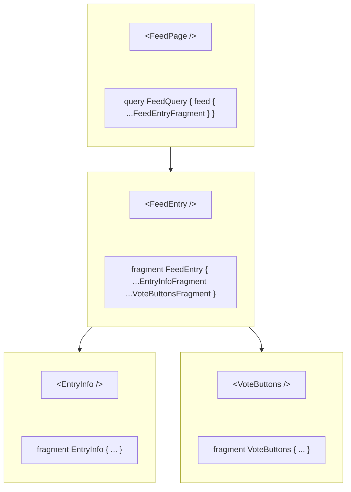

A [GraphQL fragment](http://graphql.org/learn/queries/#fragments) is a set of fields you can reuse across multiple queries and mutations. Fragments are especially useful when [colocated with components](#colocating-fragments) to define the component's data requirements.

Here's the declaration of a `NameParts` fragment that can be used with any `Person` object:

```graphql
fragment NameParts on Person {
  firstName
  lastName
}
```

Every fragment includes a subset of the fields that belong to its associated type. In the above example, the `Person` type must declare `firstName` and `lastName` fields for the `NameParts` fragment to be valid.

You can include the `NameParts` fragment in any number of operations that refer to `Person` objects by using the spread operator (`...`), followed by the fragment name:

```graphql
query GetPerson {
  people(id: "7") {
    ...NameParts
    avatar(size: LARGE)
  }
}
```

Based on our `NameParts` definition, the above query is equivalent to:

```graphql
query GetPerson {
  people(id: "7") {
    firstName
    lastName
    avatar(size: LARGE)
  }
}
```

Changes to the `NameParts` fragment automatically update the fields included in any operations that use it. This reduces the effort required to keep fields consistent across a set of operations.

## Example usage

Let's say we have a blog application that executes several GraphQL operations related to comments (submitting a comment, fetching a post's comments, etc.). Our application likely has a `Comment` component that is responsible for rendering comment data.

We can define a fragment on the `Comment` type to define the `Comment` component's data requirements, like so:

```js title="Comment.js"
import { gql } from '@apollo/client';

export const COMMENT_FRAGMENT = gql`
  fragment CommentFragment on Comment {
    id
    postedBy {
      username
      displayName
    }
    createdAt
    content
  }
`;
```

> The example above `export`s the fragment from the `Comment.js` component file. You can declare fragments in any file of your application, though we recommend this approach of [colocating fragments](#colocating-fragments) with your components.

We can then include the `CommentFragment` fragment in a GraphQL operation like so:

```jsx {2,11,16} title="PostDetails.jsx"
import { gql } from '@apollo/client';
import { COMMENT_FRAGMENT } from './Comment';

const GET_POST_DETAILS = gql`
  query GetPostDetails($postId: ID!) {
    post(postId: $postId) {
      title
      body
      author
      comments {
        ...CommentFragment
      }
    }
  }

  ${COMMENT_FRAGMENT}
`;

// ...PostDetails component definition...
```

* We first `import` `COMMENT_FRAGMENT` because it's declared in another file.
* We add our fragment definition to the `GET_POST_DETAILS` `gql` template literal via a placeholder (`${COMMENT_FRAGMENT}`)
* We include the `CommentFragment` fragment in our query with standard `...` notation.

<MinVersion version="3.7.0">
## Registering named fragments using `createFragmentRegistry`
</MinVersion>

Registering fragments with your `InMemoryCache` instance lets you refer to them by name in queries and cache operations (for example, `cache.readFragment`, `cache.readQuery`, and `cache.watch`) without needing to interpolate their declarations.

<Note>
We do not recommend using the fragment registry when using the `graphql` function generated by the GraphQL Codegen [client preset](https://the-guild.dev/graphql/codegen/plugins/presets/preset-client). The client preset creates precompiled GraphQL documents that already include fragment definitions.
</Note>

Let's look at an example in React.

```js title="index.js" {7-12}
import { ApolloClient, gql, InMemoryCache } from "@apollo/client";
import { createFragmentRegistry } from "@apollo/client/cache";

const client = new ApolloClient({
  uri: "http://localhost:4000/graphql",
  cache: new InMemoryCache({
    fragments: createFragmentRegistry(gql`
      fragment ItemFragment on Item {
        id
        text
      }
    `)
  })
});
```

Since `ItemFragment` was registered with `InMemoryCache`, it can be referenced by name, as seen below, with the fragment spread inside of the `GetItemList` query.

```jsx title="ItemList.jsx" {4,13}
const listQuery = gql`
  query GetItemList {
    list {
      ...ItemFragment
    }
  }
`;
function ToDoList() {
  const { data } = useQuery(listQuery);
  return (
    <ol>
      {data?.list.map(item => (
        <Item key={item.id} text={item.text} />
      ))}
    </ol>
  );
}
```

### Overriding registered fragments with local versions

Queries can declare their own local versions of named fragments which take precedence over ones registered via `createFragmentRegistry`, even if the local fragment is only indirectly referenced by other registered fragments. Take the following example:

```js title="index.js" {7-17}
import { ApolloClient, gql, InMemoryCache } from "@apollo/client";
import { createFragmentRegistry } from "@apollo/client/cache";

const client = new ApolloClient({
  uri: "http://localhost:4000/graphql",
  cache: new InMemoryCache({
    fragments: createFragmentRegistry(gql`
      fragment ItemFragment on Item {
        id
        text
        ...ExtraFields
      }

      fragment ExtraFields on Item {
        isCompleted
      }
    `)
  })
});
```

The local version of the `ExtraFields` fragment declared in `ItemList.jsx` takes precedence over the `ExtraFields` fragment originally registered with the `InMemoryCache` instance. Thus, the local definition will _only be used when `GetItemList` query is executed_, because explicit definitions take precedence over registered fragments.

```jsx title="ItemList.jsx" {8-10,17}
const GET_ITEM_LIST = gql`
  query GetItemList {
    list {
      ...ItemFragment
    }
  }

  fragment ExtraFields on Item {
    createdBy
  }
`;
function ToDoList() {
  const { data } = useQuery(GET_ITEM_LIST);
  return (
    <ol>
      {data?.list.map((item) => (
        {/* `createdBy` exists on the returned items, `isCompleted` does not */}
        <Item key={item.id} text={item.text} author={item.createdBy} />
      ))}
    </ol>
  );
}
```

### Lazily registering named fragments

Fragments don't need to be defined upfront when the cache is created. Instead, you can register named fragments lazily with the fragment registry. This is especially useful when combined with [colocated fragments](#colocating-fragments) whose fragment definitions are defined in component files. Let's look at an example:

```js title="fragmentRegistry.js"
export const { fragmentRegistry } = createFragmentRegistry();
```

```js title="index.js"
import { fragmentRegistry } from "./fragmentRegistry";

const client = new ApolloClient({
  uri: "http://localhost:4000/graphql",
  cache: new InMemoryCache({
    fragments: fragmentRegistry,
  })
});
```

We create a separate file that creates and exports our fragment registry. This lets us access our shared fragment registry across our application. We use this shared fragment registry with our `InMemoryCache` instance.

```jsx title="TodoItem.jsx"
import { gql } from "@apollo/client";
import { fragmentRegistry } from "./fragmentRegistry";

// Define the fragment outside the component to ensure it gets registered when this module is loaded.
const ITEM_FRAGMENT = gql`
  fragment ItemFragment on Item {
    # ...
  }
`

fragmentRegistry.register(ITEM_FRAGMENT);

function TodoItem() {
  // ...
}
```

We then import our shared fragment registry into our component file and register our fragment definition.

<Caution>
  You need to register fragment definitions with the fragment registry before executing operations that use them. This can be problematic when lazy loading component files because the application might not register the fragment definition with the registery until after the query begins executing. Move the fragment definition to a shared file that isn't lazy-loaded.
</Caution>

## Colocating fragments

The tree-like structure of a GraphQL response resembles the hierarchy of a frontend's rendered components. Because of this similarity, you can use fragments to split query logic _between_ components, so each component requests exactly the fields it needs. This helps make your component logic more succinct by combining multiple UI components into a single data fetch.

Consider the following view hierarchy for an app:



In this app, the `FeedPage` component executes a query to fetch a list of `FeedEntry` objects. The `EntryInfo` and `VoteButtons` subcomponents need specific fields from the enclosing `FeedEntry` object.

### Creating colocated fragments

A colocated fragment is just like any other fragment, except it's defined in the same file as a particular component that uses the fragment's fields. For example, the `VoteButtons` child component of `FeedPage` might use the fields `score` and `vote { choice }` from the `FeedEntry` object:

```js title="VoteButtons.jsx"
export const VOTE_BUTTONS_FRAGMENT = gql`
  fragment VoteButtonsFragment on FeedEntry {
    score
    vote {
      choice
    }
  }
`
```

After you define a fragment in a child component, the _parent_ component can refer to it in its _own_ colocated fragments, like so:

```js title="FeedEntry.jsx"
export const FEED_ENTRY_FRAGMENT = gql`
  fragment FeedEntryFragment on FeedEntry {
    commentCount
    repository {
      full_name
      html_url
      owner {
        avatar_url
      }
    }
    ...VoteButtonsFragment
    ...EntryInfoFragment
  }
  ${VOTE_BUTTONS_FRAGMENT}
  ${ENTRY_INFO_FRAGMENT}
`
```

<Tip>
To prevent coupling with deeply nested components, we recommend parent components only add fragments defined by their directly-rendered children. In this example, our `FeedPage` should not use the `EntryInfoFragment` or `VoteButtonsFragment` directly. Instead the `FeedPage` uses the `FeedEntryFragment` fragment colocated with the `FeedEntry` component to combine the `VoteButtonsFragment` and `EntryInfoFragment` fragments into its own fragment.
</Tip>

There's nothing special about the naming of `VoteButtonsFragment` or `EntryInfoFragment`. We recommend prefixing the fragment name with the component name to make it easily identifiable when combined with other fragments. However any naming convention works as long as you can retrieve a component's fragments given the component.

### Importing fragments when using Webpack

When loading `.graphql` files with [graphql-tag/loader](https://github.com/apollographql/graphql-tag/blob/main/loader.js), include fragments using `import` statements. For example:

```graphql
#import "./someFragment.graphql"
```

This makes the contents of `someFragment.graphql` available to the current file. See the [Webpack Fragments](../integrations/webpack/#fragments) section for additional details.

## Using fragments with unions and interfaces

You can define fragments on [unions and interfaces](https://graphql.com/learn/interfaces-and-unions/).

Here's an example of a query that includes a shared field and two in-line fragments:

```graphql
query AllCharacters {
  allCharacters {
    name

    ... on Jedi {
      side
    }

    ... on Droid {
      model
    }
  }
}
```

The `AllCharacters` query above returns a list of `Character` objects. The `Character` type is an interface type that both the `Jedi` and `Droid` types implement. Each item in the list includes a `side` field if it's an object of type `Jedi`, and it includes a `model` field if it's of type `Droid`. Both `Jedi` and `Droid` objects include a `name` field.

**However**, for this query to work, the client needs to understand the polymorphic relationship between the `Character` interface and the types that implement it. To inform the client about these relationships, you must pass a `possibleTypes` option when you initialize your `InMemoryCache` instance.

### Defining `possibleTypes` manually

Use the `possibleTypes` option to the `InMemoryCache` constructor to specify supertype-subtype relationships in your schema. This object maps the name of an interface or union type (the supertype) to the types that implement or belong to it (the subtypes).

Here's an example `possibleTypes` declaration:

```js
const cache = new InMemoryCache({
  possibleTypes: {
    Character: ["Jedi", "Droid"],
    Test: ["PassingTest", "FailingTest", "SkippedTest"],
    Snake: ["Viper", "Python"],
  },
});
```

This example lists three interfaces (`Character`, `Test`, and `Snake`) and the object types that implement them.

If your schema includes only a few unions and interfaces, you can probably specify your `possibleTypes` manually without issue. However, as your schema grows in size and complexity, you should instead [generate `possibleTypes` automatically from your schema](#generating-possibletypes-automatically).

### Generating `possibleTypes` automatically

The following script translates a GraphQL introspection query into a `possibleTypes` configuration object:

```js
const fetch = require('cross-fetch');
const fs = require('fs');

fetch(`${YOUR_API_HOST}/graphql`, {
  method: 'POST',
  headers: { 'Content-Type': 'application/json' },
  body: JSON.stringify({
    variables: {},
    query: `
      {
        __schema {
          types {
            kind
            name
            possibleTypes {
              name
            }
          }
        }
      }
    `,
  }),
}).then(result => result.json())
  .then(result => {
    const possibleTypes = {};

    result.data.__schema.types.forEach(supertype => {
      if (supertype.possibleTypes) {
        possibleTypes[supertype.name] =
          supertype.possibleTypes.map(subtype => subtype.name);
      }
    });

    fs.writeFile('./possibleTypes.json', JSON.stringify(possibleTypes), err => {
      if (err) {
        console.error('Error writing possibleTypes.json', err);
      } else {
        console.log('Fragment types successfully extracted!');
      }
    });
  });
```

You can then `import` the generated `possibleTypes` JSON module into the file where you create your `InMemoryCache`:

```ts
import possibleTypes from './path/to/possibleTypes.json';

const cache = new InMemoryCache({
  possibleTypes,
});
```

### Generating `possibleTypes` with GraphQL Codegen

[GraphQL Codegen](https://the-guild.dev/graphql/codegen) has the ability to generate `possibleTypes` for you using the [`fragment-matcher` plugin](https://the-guild.dev/graphql/codegen/plugins/other/fragment-matcher). Follow the guide in the [fragment matcher plugin docs](https://the-guild.dev/graphql/codegen/plugins/other/fragment-matcher) to configure GraphQL Codegen to write a JSON file that contains `possibleTypes`.

You can then `import` the generated `possibleTypes` JSON module into the file where you create your `InMemoryCache`:

```ts
import possibleTypes from './path/to/possibleTypes.json';

const cache = new InMemoryCache({
  possibleTypes,
});
```

<MinVersion version="3.8.0">

## `useFragment`

</MinVersion>

The `useFragment` hook represents a lightweight live binding into the Apollo Client Cache. It enables Apollo Client to broadcast specific fragment results to individual components. This hook returns an always-up-to-date view of whatever data the cache currently contains for a given fragment. `useFragment` never triggers network requests of its own.

**The `useQuery` hook remains the primary hook responsible for querying and populating data in the cache** ([see the API reference](../api/react/hooks#usequery)). As a result, the component reading the fragment data via `useFragment` is still subscribed to all changes in the query data, but receives updates only when that fragment's specific data change.

<Note>
`useFragment` was introduced as an experimental hook in version `3.7.0` under the named export `useFragment_experimental`. Starting with `3.8.0-beta.0` and greater the `_experimental` suffix was removed in its named export.
</Note>

### Example

Given the following fragment definition:

```js
const ITEM_FRAGMENT = gql`
  fragment ItemFragment on Item {
    text
  }
`;
```

We can first use the `useQuery` hook to retrieve a list of items with `id`s as well as any fields selected on the named `ItemFragment` fragment by including `ItemFragment` in the `list` field in the `GetItemList` query.

```jsx
const listQuery = gql`
  query GetItemList {
    list {
      id
      ...ItemFragment
    }
  }

  ${ITEM_FRAGMENT}
`;

function List() {
  const { loading, data } = useQuery(listQuery);

  return (
    <ol>
      {data?.list.map(item => (
        <Item key={item.id} item={item}/>
      ))}
    </ol>
  );
}
```

<Note>
Instead of interpolating fragments within each query document, you can use Apollo Client's `createFragmentRegistry` method to pre-register named fragments with `InMemoryCache`. This allows Apollo Client to include the definitions for registered fragments in the document sent over the network before the request is sent. For more information, see [Registering named fragments using `createFragmentRegistry`](#registering-named-fragments-using-createfragmentregistry).
</Note>

We can then use `useFragment` from within the `<Item>` component to create a live binding for each item by providing the `fragment` document, `fragmentName` and object reference via `from`.

<MultiCodeBlock>

```tsx
function Item(props: { id: number }) {
  const { complete, data } = useFragment({
    fragment: ITEM_FRAGMENT,
    fragmentName: "ItemFragment",
    from: {
      __typename: "Item",
      id: props.id
    }
  });

  return <li>{complete ? data.text : "incomplete"}</li>;
}
```

```jsx
function Item(props) {
  const { complete, data } = useFragment({
    fragment: ITEM_FRAGMENT,
    fragmentName: "ItemFragment",
    from: {
      __typename: "Item",
      id: props.id
    }
  });

  return <li>{complete ? data.text : "incomplete"}</li>;
}
```

</MultiCodeBlock>

<Note>
You may omit the `fragmentName` option when your fragment definition only includes a single fragment.
</Note>

You may instead prefer to pass the whole `item` as a prop to the `Item` component. This makes the `from` option more concise.

<MultiCodeBlock>

```tsx
function Item(props: { item: { __typename: 'Item', id: number }}) {
  const { complete, data } = useFragment({
    fragment: ItemFragment,
    fragmentName: "ItemFragment",
    from: item
  });

  return <li>{complete ? data.text : "incomplete"}</li>;
}
```

```jsx
function Item(props) {
  const { complete, data } = useFragment({
    fragment: ITEM_FRAGMENT,
    fragmentName: "ItemFragment",
    from: item
  });

  return <li>{complete ? data.text : "incomplete"}</li>;
}
```

</MultiCodeBlock>


<Note>
`useFragment` can be used in combination with the `@nonreactive` directive in cases where list items should react to individual cache updates without rerendering the entire list. For more information, see the [`@nonreactive` docs](/react/data/directives#nonreactive).
</Note>

See the [API reference](../api/react/hooks#usefragment) for more details on the supported options.

<MinVersion version="3.12.0">
## Data masking
</MinVersion>

By default, Apollo Client returns all data for all fields defined in a GraphQL operation. As your app grows and scales over time, this can create a high degree of coupling between the components that query your GraphQL data and the component subtree underneath it. [Colocated fragments](#colocating-fragments) reduce the degree of coupling by moving component's data requirements into fragments, however on its own does not entirely eliminate it.

Let's take a look at an example.

```jsx title="Posts.jsx"
import { POST_DETAILS_FRAGMENT } from './PostDetails';

const GET_POSTS = gql`
  query GetPosts {
    posts {
      id
      ...PostDetailsFragment
    }
  }

  ${POST_DETAILS_FRAGMENT}
`;

export default function Posts({ includeUnpublishedPosts }) {
  const { data, loading } = useQuery(GET_POSTS);
  const posts = data?.posts ?? [];

  if (loading) {
    return <Spinner />;
  }

  const allPosts = includeUnpublishedPosts
    ? posts
    : posts.filter((post) => post.publishedAt);

  if (allPosts.length === 0) {
    return <div>No posts to display</div>;
  }

  return (
    <div>
      {allPosts.map((post) => (
        <PostDetails key={post.id} post={post} />
      ))}
    </div>
  );
}
```

```jsx title="PostDetails.jsx"
export const POST_DETAILS_FRAGMENT = gql`
  fragment PostDetailsFragment on Post {
    title
    shortDescription
    publishedAt
  }
`;

export default function PostDetails({ post }) {
  return (
    <section>
      <h1>{post.title}</h1>
      <p>{post.shortDescription}</p>
      <p>
        {post.publishedAt ?
          `Published: ${formatDate(post.publishedAt)}`
        : 'Private'}
      </p>
    </section>
  );
}
````

The `Posts` component is responsible for fetching and rendering a list of posts. We loop over each post and render a `PostDetails` component to display details about the post. `PostDetails` uses a colocated fragment to define it's own data requirements necessary to render post details, which is included in the `GetPosts` query. When the `includeUnpublishedPosts` prop is false, the `Posts` component filters out unpublished posts from our list of all posts by checking the `publishedAt` property on the post object.

This may work great for a while, but consider what happens when we start modifying our `PostDetails` component.

We've decided that we no longer want to show the publish date when viewing the list of posts and prefer to display it when viewing an individual post. Let's modify `PostDetails` accordingly.

```jsx title="PostDetails.jsx"
export const POST_DETAILS_FRAGMENT = gql`
  fragment PostDetailsFragment on Post {
    title
    shortDescription
  }
`;

export default function PostDetails({ post }) {
  return (
    <section>
      <h1>{post.title}</h1>
      <p>{post.shortDescription}</p>
    </section>
  );
}
````

We've removed the check for `publishedAt` since we no longer show the publish date. We've also removed the `publishedAt` field from the `PostDetailsFragment` fragment since we no longer use this field in the `PostDetails` component.

Uh oh, we just broke our app! Our `Posts` component no longer shows any posts! Our `Posts` component still depends on `publishedAt`, but because the field was declared in the `PostDetailsFragment` fragment, changes to `PostDetails` resulted in a subtle breakage of our `Posts` component.

This is an example of an **implicit dependency** between our components. As the application grows in complexity, these types of implicit dependencies can be more and more difficult to track. Imagine if `PostDetails` was a component nested much deeper in our component tree or if this component was used in multiple queries!

Data masking helps us eliminate these types of implicit dependencies by returning only the data declared by the component's query or fragment. This creates more loosely coupled components that are more resistant to change.

### Enabling data masking

To enable data masking in Apollo Client, set the `dataMasking` flag in the `ApolloClient` constructor to `true`.

```jsx {2}
const client = new ApolloClient({
  dataMasking: true,
  // ...
});
```

When `dataMasking` is enabled, fields defined in fragments are hidden from our component. This prevents us from accessing data the component didn't ask for.

<Tip>
We recommend enabling the `dataMasking` flag immediately when creating new applications. See the section on [migrating an existing application](#migrating-an-existing-application) to learn how to enable data masking in existing applications.
</Tip>

Let's revisit our example from the previous section.

```jsx title="Posts.jsx"
const GET_POSTS = gql`
  query GetPosts {
    posts {
      id
      ...PostDetailsFragment
    }
  }

  ${POST_DETAILS_FRAGMENT}
`;

export default function Posts({ includeUnpublishedPosts }) {
  const { data, loading } = useQuery(GET_POSTS);

  // ...
}
```

Our `GetPosts` query asks for the `posts` field along with an `id` for each post. All other fields are defined in `PostDetailsFragment`. If we were to inspect `data`, we'd see that the only accessible fields are those defined in our query but not the fragment.

```json
{
  "posts": [
    {
      "__typename": "Post",
      "id": "1"
    },
    {
      "__typename": "Post",
      "id": "2"
    }
  ]
}
```

We can access more data by adding fields to our query. Let's fix the previous section's example by adding the `publishedAt` field to our `GetPosts` query so that our `Posts` component can use it.

```jsx {5} title="Posts.jsx"
const GET_POSTS = gql`
  query GetPosts {
    posts {
      id
      publishedAt
      ...PostDetailsFragment
    }
  }

  ${POST_DETAILS_FRAGMENT}
`;
```

Now if we inspect `data`, we'll see that `publishedAt` is available to the `Posts` component.

```json
{
  "posts": [
    {
      "__typename": "Post",
      "publishedAt": "2024-01-01",
      "id": "1"
    },
    {
      "__typename": "Post",
      "publishedAt": null,
      "id": "2"
    }
  ]
}
```

### Reading fragment data

Now that our `GetPosts` query is masked, we've introduced a problem for our `PostDetails` component. The `post` prop no longer contains the fields from our `PostDetailsFragment` fragment, preventing us from rendering that data!

We read the fragment data with the [`useFragment` hook](#usefragment).

```jsx title="PostDetails.jsx"
function PostDetails({ post }) {
  const { data, complete } = useFragment({
    fragment: POST_DETAILS_FRAGMENT,
    from: post,
  });

  // ...
}
```

Now we use the `data` property returned from `useFragment` to render the details from the `post`.

```jsx {17-18} title="PostDetails.jsx"
function PostDetails({ post }) {
  const { data, complete } = useFragment({
    fragment: POST_DETAILS_FRAGMENT,
    from: post,
  });

  // It's a good idea to check the `complete` flag to ensure all data was
  // successfully queried from the cache. This can indicate a potential
  // issue with our cache configuration or parent object when `complete`
  // is `false`.
  if (!complete) {
    return null;
  }

  return (
    <section>
      <h1>{data.title}</h1>
      <p>{data.shortDescription}</p>
    </section>
  )
}
```

<Note>
It's important that the parent query or fragment selects any [`keyFields`](../caching/cache-configuration#customizing-cache-ids) for objects passed to the `from` option. Without this, we'd have no way to identify the object with the cache and the `data` returned from `useFragment` would be incomplete. If you forget to include key fields in the parent object, you will see a warning emitted in the console.
</Note>
