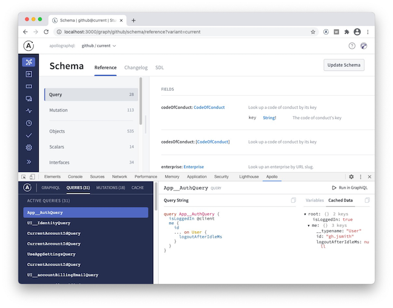

## GraphOS and Apollo Studio

[GraphOS](/graphos/) is Apollo's all-purpose platform for growing and collaborating on your graph. **Apollo Studio** is the web interface for GraphOS, which provides helpful views into your graph's usage and performance.

Among others, these GraphOS features are available to all Apollo users for free:

- The Explorer, a powerful GraphQL IDE that connects to all your environments and provides ergonomic ways to author and manage queries.
- A GraphQL schema registry that tracks the evolution of your graph across your environments.
- Key insights into which parts of your schema are being actively used, and by whom.
- Team collaboration via organizations

To learn more about GraphOS, check out the [overview](/graphos/).

## Apollo Client Devtools

The Apollo Client Devtools are available as an extension for [Chrome](https://chrome.google.com/webstore/detail/apollo-client-developer-t/jdkknkkbebbapilgoeccciglkfbmbnfm) and [Firefox](https://addons.mozilla.org/en-US/firefox/addon/apollo-developer-tools/).

### Features

The Apollo Client Devtools appear as an "Apollo" tab in your web browser's Inspector panel, alongside default tabs like "Console" and "Network". The devtools currently have four main features:

- **GraphiQL:** Send queries to your server through your web application's configured Apollo Client instance, or query the Apollo Client cache to see what data is loaded.
- **Watched query inspector:** View active queries, variables, and cached results, and re-run individual queries.
- **Mutation inspector:** View active mutations and their variables, and re-run individual mutations.
- **Cache inspector:** Visualize the Apollo Client cache and search it by field name and/or value.



### Installation

You can install the extension via the webstores for [Chrome](https://chrome.google.com/webstore/detail/apollo-client-developer-t/jdkknkkbebbapilgoeccciglkfbmbnfm) and [Firefox](https://addons.mozilla.org/en-US/firefox/addon/apollo-developer-tools/).

### Configuration

While your app is in dev mode, the Apollo Client Devtools will appear as an "Apollo" tab in your web browser inspector. To enable the devtools in your app in production, pass `connectToDevTools: true` to the `ApolloClient` constructor in your app. Pass `connectToDevTools: false` if want to manually disable this functionality.

Find more information about contributing and debugging on the [Apollo Client Devtools GitHub page](https://github.com/apollographql/apollo-client-devtools).

## Apollo Client Devtools in VS Code

The Apollo VSCode extension ships with an instance of the Apollo Client Devtools.
You can use it to remotely debug your client, which makes it possible to also debug React Native and node applications.

The following sections walk through how to install and integrate with the extension.

<Note>
This feature is currently released as "experimental" - please try it out and give us feedback in our [GitHub issues](https://github.com/apollographql/vscode-graphql/issues)!
</Note>

* Install the Apollo VS Code extension: [start installation](vscode:extension/apollographql.vscode-apollo) | [marketplace page](https://marketplace.visualstudio.com/items?itemName=apollographql.vscode-apollo)
* Set the "Apollographql > Dev Tools: Show Panel" setting to "detect" or "always" in the VS code settings dialog.

* In your code base, install the `@apollo/client-devtools-vscode` package:
```sh
npm install @apollo/client-devtools-vscode
```
* After initializing your `ApolloClient` instance, call `registerClient` with your client instance.
```js
import { registerClient } from "@apollo/client-devtools-vscode";

const client = new ApolloClient({ /* ... */ });

// we recommend wrapping this statement in a check for e.g. process.env.NODE_ENV === "development"
const devtoolsRegistration = registerClient(
  client,
  // the default port of the VSCode DevTools is 7095
  "ws://localhost:7095",
);
```
* Open the "Apollo Client DevTools" panel in VS Code.
* Start your application. It should automatically connect to the DevTools.

