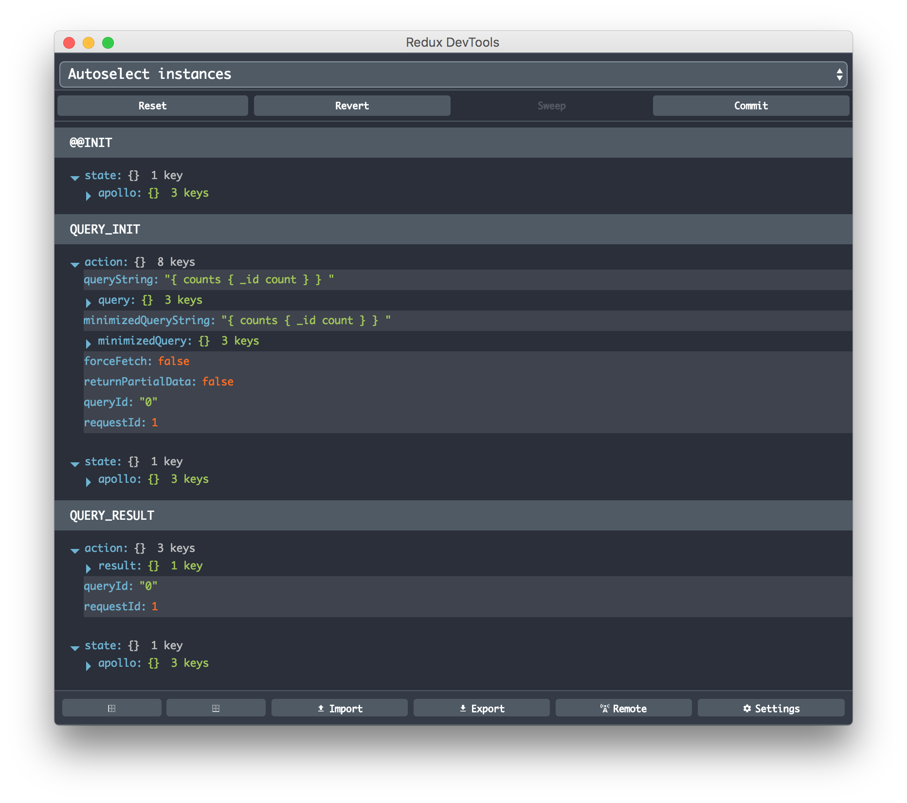

## Apollo Client Devtools

The [Apollo Client Devtools](https://chrome.google.com/webstore/detail/apollo-client-developer-t/jdkknkkbebbapilgoeccciglkfbmbnfm) is a Chrome extension.

### Features

The devtools appear as an "Apollo" tab in your Chrome inspector, along side the "Elements" and "Console" tabs. There are currently 3 main features of the devtools:

 * GraphiQL: Send queries to your server through the Apollo network interface, or query the Apollo cache to see what data is loaded.
 * Normalized store inspector: Visualize your GraphQL store the way Apollo Client sees it, and search by field names or values.
 * Watched query inspector: View active queries and variables, and locate the associated UI components.

 

Make requests against either your app’s GraphQL server or the Apollo Client cache through the Chrome developer console. This version of GraphiQL leverages your app’s network interface, so there’s no configuration necessary — it automatically passes along the proper HTTP headers, etc. the same way your Apollo Client app does.

View the state of your client-side cache as a tree and inspect every object inside. Visualize the [mental model](https://dev-blog.apollodata.com/the-concepts-of-graphql-bc68bd819be3) of the Apollo cache. Search for specific keys and values in the store and see the path to those keys highlighted.

View the queries being actively watched on any given page. See when they're loading, what variables they're using, and, if you’re using React, which React component they’re attached to. Angular support coming soon.

### Installation

You can install the extension via the [Chrome Webstore](https://chrome.google.com/webstore/detail/apollo-client-developer-t/jdkknkkbebbapilgoeccciglkfbmbnfm).
If you want to install a local version of the extension instead, skip ahead to the __Developing__ section.

#### Configuration

While your app is in dev mode, the devtools will appear as an "Apollo" tab in your chrome inspector. To enable the devtools in your app even in production, pass `connectToDevTools: true` to the ApolloClient constructor in your app.  Pass `connectToDevTools: false` if want to manually disable this functionality.

The "Apollo" tab will appear in the Chrome console if a global `window.__APOLLO_CLIENT__` object exists in your app. Apollo Client adds this hook to the window automatically unless `process.env.NODE_ENV === 'production'`. If you would like to use the devtools in production, just manually attach your Apollo Client instance to `window.__APOLLO_CLIENT__` or pass `connectToDevTools: true` to the constructor.

Find more information about contributing and debugging on the [Apollo Client DevTools GitHub page](https://github.com/apollographql/apollo-client-devtools).

## Redux DevTools

Apollo Client is written from the ground up with the intention of making it easy to understand what is going on in your application. This is one of the main reasons we decided to build on top of Redux, which has an amazing ecosystem of developer tools.

If you don't pass in an existing Redux Store into the `ApolloClient` constructor, then you will get integration by default with the [Redux DevTools](https://chrome.google.com/webstore/detail/redux-devtools/lmhkpmbekcpmknklioeibfkpmmfibljd?hl=en) extension. Just install it, open the window, and you'll be able to keep track of all of the requests your client is making and how that affects the internal data Store.

<h2 id="demo">Inspecting your app</h2>

To get started with Redux DevTools, click the DevTools icon in your chrome browser. You will now see the Redux logger.

### Benefits

* Lets you inspect every state and action that comes through either your existing Redux Store or the Apollo Store integration.
* Lets you go back in time by “cancelling” actions.
* If the change in Apollo's `apolloReducer` throws, you will see which action caused this to happen, and what the error was.
