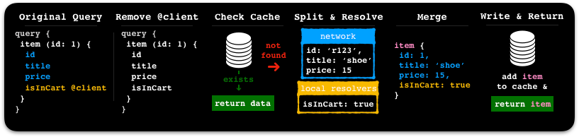

import { MultiCodeBlock } from 'gatsby-theme-apollo-docs';

## Overview

We've learned how to manage remote data from our GraphQL server with Apollo Client, but what should we do with our local data? We want to be able to access boolean flags and device API results from multiple components in our app, or perhaps, we only want to store a user's cart information locally until they create an account that we link their cart to in the database. Ideally, we could avoid maintaining a seperate Redux or MobX and the Apollo cache to would be our single source of truth for all data in our client application.

Apollo Client (>= 2.5) has built-in local state handling capabilities that allow you to exactly that. You can store your local data inside the Apollo cache alongside your remote data and to access your local data, just query it with GraphQL. You can even request local and server data within the same query!

In this section, you'll learn how Apollo Client can help simplify local state management in your app. We'll cover how client-side resolvers can help us execute local queries and mutations. You'll also learn how to query and update the cache with the `@client` directive.

Please note that this documentation is intended to be used to familiarize yourself with Apollo Client's local state management capabilities, and serve as a reference guide. If you're looking for a step by step tutorial outlining how to handle local state with Apollo Client (and leverage other Apollo components to build a fullstack application), please refer to the [Apollo tutorial](https://www.apollographql.com/docs/tutorial/introduction).

> ⚠️ If you're interested in integrating local state handling capabilities with Apollo Client < 2.5, please refer to our (now deprecated) [`apollo-link-state`](https://github.com/apollographql/apollo-link-state) project. As of Apollo Client 2.5, local state handling is baked into the core, which means it is no longer necessary to use `apollo-link-state`. For help migrating from `apollo-link-state` to Apollo Client 2.5, please refer to the [Migrating from `apollo-link-state`](#migrating-from-apollo-link-state) section.

### Key Concepts

  - Use the same query/mutations and hooks/components as we do with remote data
    - Differentiate local from remote using the @client directive
    - Still use standard GraphQL syntax
  - Local 'store/state' is held in the same cache as remote data, by default
    - Sometimes we use cache, store, state interchangibly - but store/state is held in the cache
    - Still can use normal react component state - not everything has to be in global store
  - Handle logic for updating local cache using resolvers or the client directly
    - Using cache.writeData, cache.writeQuery and/or cache.writeFragment
    - cache.writeQuery and cache.writeFragment ensure our writes use the same structure as the corresponding query/fragment.

### Queries

Our queries are defined in the exact same way as we would with remote queries. The only difference being the `@client` directive. This tells apollo that the field should be "resolved" locally, whether from the cache or local "resolvers." We will explain resolvers very shortly.

```jsx
const QUERY_CART_ITEMS = gql`
  query {
    cart @client {
      items {
        id
        title
        price
        thumbnail_url
      }
      total
    }
  }
`;

// call queries the same as before
const { data } = useQuery(QUERY_CART_ITEMS) or <Query query={QUERY_CART_ITEMS}>
```

### Mutations

Mutations are also extremely similar to before, again with the addition of a `@client` directive. We handle the actual logic of the mutation and updating the store via `resolvers`, which we cover next.

```jsx
const MUTATION_ADD_ITEM_TO_CART = gql`
  mutation addItemToCart($item_id: ID!){
    addItemToCart(id: $item_id) @client {
      id
    }
  }
`;

// use mutations the same as before
const [ addItemToCart,  { data } ] = useMutation(MUTATION_ADD_ITEM_TO_CART) or <Mutation mutation={MUTATION_ADD_ITEM_TO_CART}>
```

### Local Resolvers

Resolvers are the one of the most important concepts in using local state and can be confusing if never created resolvers. Resolvers are functions that handle the logic for our queries and mutations. They can be thought of similarly to reducers in Redux. If you've used Apollo Server before, or will in the future, you'll likely notice the local resolvers we write on our client have the same signature as resolvers on Apollo Server.

Resolvers take four arguments, namely: obj, args, context and info. The two you will likely use most often are args and context. The args parameter reads the arguments (e.g. like the $item_id above) from our queries/mutations. The context parameter gives us access to the cache, so we can read and write data to our store. The standard way to define resolvers is within our ApolloClient instance like so:

```jsx
import ApolloClient from 'apollo-boost'

const client = new ApolloClient({
  // normal config...
  resolvers: {
    Mutation: {
      // mutation resolvers here
      addItemToCart: (obj, args, context, info) => { /* logic here */}
    },
    Query: {
      // query resolvers here
    },
    Item: {
      // we can also write resolvers for individual types and they're fields
    }
  }
})

```

That's the basics of local state management! Awesome, right? Let's continue discussing how each of these work in further detail.

### Redux vs. Apollo State Management

Apollo's state management is very powerful and handles very similar use cases to libraries like Redux. For those coming from the world of Redux, it might be helpful to translate some of the key concepts.

| Redux | Apollo | Description |
| - | - | - |
| State | Cache | In Redux, we read and write to a global state object. This is similar to the cache we are writing to in Apollo, which keep in mind is the same cache that holds our remote data. The terms cache/store/state, in regards to Apollo, are used pretty interchangibly in this tutorial. |
| Actions | Queries/Mutations | In Redux, we dispatch actions, with a type and payload. Using Apollo, we dispatch queries/mutations, with a name and variables. |
| Reducers | Resolvers | In Redux, the logic of updating the state takes place in reducers. Reducers act on a specific action type (defined as a string). Using Apollo, the cache updates take place in resolvers, rather than reducers. The resolvers correspond to GraphQL types, rather than strings in Redux. |

## Queries

In this section, we'll explain how local queries work in detail. We'll explore the inner-workings of a local query and then provide some solutions to more specific use cases.
  1. Initializing our cache: Why it's needed and how do we do it?
  2. Local data query flow
    a. Handling `@client` fields with the cache
    b. Handling `@client` fields with resolvers
  3. More concepts
    a. Handling fetch policies
    b. Force resolvers on every request
    c. @client results as variables

### 1. Initializing our cache

We initialize our cache to prevent our application from erroring if a query fails to resolve because it has no resolvers and existing data in the cache to return a value. This sets some defaults that help prevent queries that fire off before a mutation populating data is executed.

Consider querying for, and attempting to map over, items in a cart object, but the cart object and items array have not yet been defined... This would of course lead our application to error. To prevent this issue, we "initialize our cache." Notice the difference between Apollo Boost and standard Apollo Client. Using boost, we can use the standard Apollo Client method to initialize our cache, but we cannot do the converse (i.e. we cannot initialize our state in standard Apollo Client using clientState: { defaults: { } }).

<MultiCodeBlock>

<div data-language="Apollo Client - Standard">
```jsx
import { ApolloClient } from 'apollo-client';
import { InMemoryCache } from 'apollo-cache-inmemory';

const cache = new InMemoryCache();
const client = new ApolloClient({
  cache,
  resolvers: { /* ... */ },
});

cache.writeData({
  data: {
    cart: {
      items: [],
      total: 0,
      __typename: 'Cart'
    }
  },
});
```
</div>

<div data-language="Apollo Boost">
```jsx
import ApolloClient from 'apollo-boost';

const cache = new InMemoryCache()

const client = new ApolloClient({
  cache,
  resolvers: { /* ... */ },
  // note -> we could also use cache.writeData rather than the following clientState: { defaults: { } }
  clientState: {
    defaults: {
      cart: {
        items: [],
        total: 0,
        __typename: 'Cart'
      }
    }
  }
});
```
</div>
</MultiCodeBlock>

### 2. Local data query flow

When a query containing `@client` directives is executed, Apollo Client runs through a few sequential steps to try to find a result for the `@client` field. Take a look at the diagram below, which provides a visual to the sequential flow of a normal query.



Let's assume we're starting with an empty cache and talking to a network based GraphQL API. Using the default fetchPolicy in our query ("cache-first" for all queries, local & remote), Apollo Client will first search the cache for a matching result to our query, ignoring all `@client` directives, but still checking for the respective field of the query. It is important to note that this is the same cache that stores data retrieved from remote requests. If data is found in the cache, it is returned immediately and no local (or remote) resolvers will be run. If one is not found, then apollo client basically splits the query into two parts: fields with `@client` and fields without. The fields with the `@client` directive are sent to the local resolvers to "resolve" their value. Fields without `@client` are sent to the server to be "resolved."  Once the entire query is resolved, the local and remote data is merged and then written back to the cache and returned as the response to the original operation. We can adjust the way our values are resolved (via fetchPolicies, etc.) and I encourage you to read the pros and cons [### 3. More concepts]: #3.-More-concepts


```js
const QUERY_ITEMS_FROM_SERVER = gql`
  query itemsFromServer (first: 10) {
    itemsFromServer {
      id
      title
      price
      thumbnail_url
      isInCart @client
    }
  }
`;
```

This query includes a mixture of both remote and local fields. The query would be first ran against the cache and if a result was found, the result would be returned. If no result is found, it's time to resolve some fields. The remote fields would be handled by the Network API. When Apollo Client executes this query and tries to find a result, it runs through the following steps:

A. Apollo Client first runs the query against the cache to see if there is an existing response to the query. If no matching result is found, Apollo looks for local resolvers to resolve the value (B).

B. Apollo essentially splits the query into two different operations. It sends the request for the itemsForServer and fields without `@client` directive to the server. Apollo then searches for a resolver function (either through the `ApolloClient` constructor `resolvers` parameter or Apollo Client's `setResolvers` / `addResolvers` methods) corresponding to `isInCart` and executes, which should return the value. The two results, local and remote, are then merged and the result is added it to the cache.

Let's look at both of these steps more closely.

2a. Reading `@client` data from the cache (step A above) is explained in [Handling `@client` fields with the cache](#handling-client-fields-with-the-cache).
2b. Resolving `@client` data with the help of local resolvers (step B above) is explained in [Handling `@client` fields with resolvers][].

### 2a. Handling `@client` fields with the cache

As outlined in [Handling `@client` fields with resolvers][], `@client` fields can be resolved with the help of local resolver functions. However, it's important to note that local resolvers are not always required when using an `@client` directive. Fields marked with `@client` can still be resolved locally, by pulling matching values out of the cache directly. For example:

[Handling `@client` fields with resolvers]: #handling-client-fields-with-resolvers

<MultiCodeBlock>
<div data-language="Hooks (JavaScript)">

```jsx
import React from "react";
import ReactDOM from "react-dom";
import { ApolloClient } from "apollo-client";
import { InMemoryCache } from "apollo-cache-inmemory";
import { HttpLink } from "apollo-link-http";
import { ApolloProvider, useQuery } from "@apollo/react-hooks";
import gql from "graphql-tag";

import Pages from "./pages";
import Login from "./pages/login";

const cache = new InMemoryCache();
const client = new ApolloClient({
  cache,
  link: new HttpLink({ uri: "http://localhost:4000/graphql" }),
  resolvers: {},
});


// initializing the cache
cache.writeData({
  data: {
    isLoggedIn: !!localStorage.getItem("token"),
  },
});

const IS_LOGGED_IN = gql`
  query IsUserLoggedIn {
    isLoggedIn @client
  }
`;

function App() {
  const { data } = useQuery(IS_LOGGED_IN);
  return data.isLoggedIn ? <Pages /> : <Login />;
}

ReactDOM.render(
  <ApolloProvider client={client}>
    <App />
  </ApolloProvider>,
  document.getElementById("root"),
);
```

</div>
<div data-language="Render Props (JavaScript)">

```jsx
import React from "react";
import ReactDOM from "react-dom";
import { ApolloClient } from "apollo-client";
import { InMemoryCache } from "apollo-cache-inmemory";
import { HttpLink } from "apollo-link-http";
import { ApolloProvider, Query } from "@apollo/react-components";
import gql from "graphql-tag";

import Pages from "./pages";
import Login from "./pages/login";

const cache = new InMemoryCache();
const client = new ApolloClient({
  cache,
  link: new HttpLink({ uri: "http://localhost:4000/graphql" }),
  resolvers: {},
});

cache.writeData({
  data: {
    isLoggedIn: !!localStorage.getItem("token"),
  },
});

const IS_LOGGED_IN = gql`
  query IsUserLoggedIn {
    isLoggedIn @client
  }
`;

ReactDOM.render(
  <ApolloProvider client={client}>
    <Query query={IS_LOGGED_IN}>
      {({data}) => (data.isLoggedIn ? <Pages /> : <Login />)}
    </Query>
  </ApolloProvider>,
  document.getElementById("root"),
);
```

</div>
</MultiCodeBlock>

In the above example, we first prep the cache using `cache.writeData` to store a value for the `isLoggedIn` field. We then run the `IS_LOGGED_IN` query via a React Apollo `useQuery` hook, which includes an `@client` directive. When Apollo Client executes the `IS_LOGGED_IN` query, it first looks for a local resolver that can be used to handle the `@client` field. When it can't find one, it falls back on trying to pull the specified field out of the cache. So in this case, the `data` value returned by the `useQuery` hook has a `isLoggedIn` property available, which includes the `isLoggedIn` result (`!!localStorage.getItem('token')`) pulled directly from the cache.

> ⚠️ If you want to use Apollo Client's `@client` support to query the cache without using local resolvers, you must pass an empty object into the `ApolloClient` constructor `resolvers` option. Without this Apollo Client will not enable its integrated `@client` support, which means your `@client` based queries will be passed to the Apollo Client link chain. You can find more details about why this is necessary [here](https://github.com/apollographql/apollo-client/pull/4499).

Pulling `@client` field values directly out of the cache isn't quite as flexible as local resolver functions, since local resolvers can perform extra computations before returning a result. Depending on your application's needs however, loading `@client` fields directly from the cache might be a simpler option. Apollo Client doesn't restrict combining both approaches, so feel free to mix and match. If the need arises, you can pull some `@client` values from the cache, and resolve others with local resolvers, all in the same query.

### 2b. Handling `@client` fields with resolvers

Local resolvers are very similar to remote resolvers. Instead of sending your GraphQL query to a remote GraphQL endpoint, which then runs resolver functions against your query to populate and return a result set, Apollo Client runs locally defined resolver functions against any fields marked with the `@client` directive. The addItemToCart resolver we created earlier is a good example of this. Let's look at an example.

```js
import { ApolloClient } from 'apollo-client';
import { InMemoryCache } from 'apollo-cache-inmemory';
import { HttpLink } from 'apollo-link-http';
import gql from 'graphql-tag';

const QUERY_CART_INFO = gql`
  query {
    cart @client {
      items {
        id
        title
        price
        thumbnail_url
      }
      total
    }
  }
`

const cache = new InMemoryCache();
// initializing cache with default values
cache.writeData({
  data: {
    cart: {
      items:[],
      total: 0
    },
  }
})

const client = new ApolloClient({
  cache,
  link: new HttpLink({
    uri: 'http://localhost:4000/graphql',
  }),
  // our resolvers
  resolvers: {
    Item: {
      isInCart: (item, _args, { cache }) => {
        const { cart.items } = cache.readQuery({ query: QUERY_CART_INFO });
        return cart.items.includes(item.id);
      },
    },
  },
})

// imagine this query is retrieving items from
const QUERY_ITEM_DETAILS = gql`
  query ItemDetails($id: ID!) {
    item(id: $itemId) {
      id
      title
      price
      thumbnail_url
      isInCart @client
    }
  }
`;

// ... run the query using client.query, a <Query /> component, etc.
```

Here when the `QUERY_CART_INFO` query is executed, Apollo Client looks for a local resolver associated with the `isInCart` field. Since we've defined a local resolver for the `isInCart` field in the `ApolloClient` constructor, it finds a resolver it can use. This resolver function is run, then the result is calculated and merged in with the rest of the query result (if a local resolver can't be found, Apollo Client will check the cache for a matching field - see [Local data query flow](#local-data-query-flow) for more details).

Setting resolvers through `ApolloClient`'s constructor `resolvers` parameter, or through its `setResolvers` / `addResolvers` methods, adds resolvers to Apollo Client's internal resolver map (refer to the [Local resolvers](#local-resolvers) section for more details concerning the resolver map). In the above example we added a `isInCart` resolver, for the `Item` GraphQL object type, to the resolver map. Let's look at the `isInCart` resolver function more closely:

```js
  resolvers: {
    Item: {
      isInCart: (item, _args, { cache }) => {
        const { cart.items } = cache.readQuery({ query: QUERY_CART_INFO });
        return cart.items.includes(item.id);
      },
    },
  },
```

`item` holds the data returned from the server for the rest of the query, which means in this case we can use `item` to get the current item `id`. We aren't using any arguments in this resolver, so we can skip the second resolver parameter. From the `context` however (the third parameter), we're using the `cache` reference, to work directly with the cache ourselves. So in this resolver, we're making a call directly to the cache to get all cart items, checking to see if any of those loaded cart items matches the parent  `item.id`, and returning `true` / `false` accordingly. The returned boolean is then incorporated back into the result of running the original query.

Just like resolvers on the server, local resolvers are extremely flexible. They can be used to perform any kind of local computation you want, before returning a result for the specified field. You can manually query (or write to) the cache in different ways, call other helper utilities or libraries to prep/validate/clean data, track statistics, call into other data stores to prep a result, etc.

### 3. More concepts

There are some additional use cases that could potentially help your specific application. Not everyone will need these, but are definitely important to consider. They are currently as follows: a. Handling fetch policies, b. force resolvers on every request, and c. @client results as variables.

#### 3a. Handling fetch policies

Before Apollo Client executes a query, one of the first things it does is check to see which [`fetchPolicy`](/api/apollo-client/#ApolloClient.query) it has been configured to use. It does this so it knows where it should attempt to resolve the query from first, either the cache or the network. When running a query, Apollo Client treats `@client` based local resolvers just like it does remote resolvers, in that it will adhere to its defined `fetchPolicy` to know where to attempt to pull data from first. When working with local resolvers, it's important to understand how fetch policies impact the running of resolver functions, since by default local resolver functions are not run on every request. This is because the result of running a local resolver is cached with the rest of the query result, and pulled from the cache on the next request.

In a lot of situations treating local resolvers just like remote resolvers, by having them adhere to the same `fetchPolicy`, makes a lot of sense. Once you have the data you're looking for, which might have been fetched remotely or calculated using a local resolver, you can cache it and avoid recalculating/re-fetching it again on a subsequent request. But what if you're using local resolvers to run calculations that you need fired on every request? There are a few different ways this can be handled. You can switch your query to use a `fetchPolicy` that forces your entire query to run on each request, like `no-cache` or `network-only`. This will make sure your local resolvers fire on every request, but it will also make sure your network based query components fire on every request. Depending on your use case this might be okay, but what if you want the network parts of your query to leverage the cache, and just want your `@client` parts to run on every request? We'll cover a more flexible option for this in the [Forcing resolvers with `@client(always: true)`](#forcing-resolvers-with-clientalways-true) section.

#### 3b. Force resolvers on every request - @client(always: true)

Apollo Client leverages its cache to help reduce the network overhead required when constantly making requests for the same data. By default, `@client` based fields leverage the cache in the exact same manner as remote fields. After a local resolver is run, its result is cached alongside any remote results. This way the next time a query is fired that can find its results in the cache, those results are used, and any associated local resolvers are not fired again (until the data is either removed from the cache or the query is updated to use a `fetchPolicy` that does not leverage the cache, such as `no-cache` or `network-only`).

While leveraging the cache for both local and remote results can be super helpful in a lot of cases, it's not always the best fit. We might want to use a local resolver to calculate a dynamic value that needs to be refreshed on every request, while at the same time continue to use the cache for the network based parts of our query. To support this use case, Apollo Client's `@client` directive accepts an `always` argument, that when set to `true` will ensure that the associated local resolver is run on every request. Looking at an example:

```jsx
import { ApolloClient } from 'apollo-client';
import { InMemoryCache } from 'apollo-cache-inmemory';
import gql from 'graphql-tag';

const client = new ApolloClient({
  cache: new InMemoryCache(),
  resolvers: {
    Query: {
      isLoggedIn() {
        return !!localStorage.getItem('token');
      },
    },
  },
});

const IS_LOGGED_IN = gql`
  query IsUserLoggedIn {
    isLoggedIn @client(always: true)
  }
`;

// ... run the query using client.query, useQuery, a <Query /> component, etc.
```

The `isLoggedIn` resolver above is checking to see if an authentication token exists in `localStorage`. In this example, we want to make sure that every time the `IS_LOGGED_IN` query is executed, the `isLoggedIn` local resolver is also fired, so that we have the most up to date login information. To do this, we're using a `@client(always: true)` directive in the query, for the `isLoggedIn` field. If we didn't include `always: true`, then the local resolver would fire based on the queries `fetchPolicy`, which means we could be getting back a cached value for `isLoggedIn`. Using `@client(always: true)` ensures that we're always getting the direct result of running the associated local resolver.

> ⚠️ Please consider the impact of using `@client(always: true)` carefully. While forcing a local resolver to run on every request can be useful, if that resolver is computationally expensive or has side effects, you could be negatively impacting your application. We recommend leveraging the cache as much as possible when using local resolvers, to help with application performance. `@client(always: true)` is helpful to have in your tool-belt, but letting local resolvers adhere to a query `fetchPolicy` should be the preferred choice.

While `@client(always: true)` ensures that a local resolver is always fired, it's important to note that if a query is using a `fetchPolicy` that leverages the cache first (`cache-first`, `cache-and-network`, `cache-only`), the query is still attempted to be resolved from the cache first, before the local resolver is fired.    This happens because `@client(always: true)` use could be mixed with normal `@client` use in the same query, which means we want part of the query to adhere to the defined `fetchPolicy`. The benefit of this is that anything that can be loaded from the cache first is made available to your `@client(always: true)` resolver function, as its [first parameter](#local-resolvers). So even though you've used `@client(always: true)` to identify that you want to always run a specific resolver, within that resolver you can look at the loaded cache values for the query, and decide if you want to proceed with running the resolver.

#### 3c. Using @client results as variables

Apollo Client provides a way to use an `@client` field result as a variable for a selection set or field, in the same operation. So instead of running an `@client` based query first, getting the local result, then running a second query using the loaded local result as a variable, everything can be handled in one request. This is achieved by combining the `@client` directive with the `@export(as: "variableName")` directive:

```js
import { ApolloClient } from 'apollo-client';
import { InMemoryCache } from 'apollo-cache-inmemory';
import { HttpLink } from 'apollo-link-http';
import gql from 'graphql-tag';

const query = gql`
  query currentAuthorPostCount($authorId: Int!) {
    currentAuthorId @client @export(as: "authorId")
    postCount(authorId: $authorId)
  }
`;

const cache = new InMemoryCache();
const client = new ApolloClient({
  link: new HttpLink({ uri: 'http://localhost:4000/graphql' }),
  cache,
  resolvers: {},
});

cache.writeData({
  data: {
    currentAuthorId: 12345,
  },
});

// ... run the query using client.query, the <Query /> component, etc.
```

In the example above, `currentAuthorId` is first loaded from the cache, then passed into the subsequent  `postCount` field as the `authorId` variable (specified by the `@export(as: "authorId")` directive). The `@export` directive can also be used on specific fields within a selection set, like:

```js
import { ApolloClient } from 'apollo-client';
import { InMemoryCache } from 'apollo-cache-inmemory';
import { HttpLink } from 'apollo-link-http';
import gql from 'graphql-tag';

const query = gql`
  query currentAuthorPostCount($authorId: Int!) {
    currentAuthor @client {
      name
      authorId @export(as: "authorId")
    }
    postCount(authorId: $authorId)
  }
`;

const cache = new InMemoryCache();
const client = new ApolloClient({
  link: new HttpLink({ uri: 'http://localhost:4000/graphql' }),
  cache,
  resolvers: {},
});

cache.writeData({
  data: {
    currentAuthor: {
      __typename: 'Author',
      name: 'John Smith',
      authorId: 12345,
    },
  },
});

// ... run the query using client.query, the <Query /> component, etc.
```

Here the `authorId` variable is set from the `authorId` field loaded from the cache stored `currentAuthor`. `@export` variable use isn't limited to remote queries; it can also be used to define variables for other `@client` fields or selection sets:

```js
import { ApolloClient } from 'apollo-client';
import { InMemoryCache } from 'apollo-cache-inmemory';
import { HttpLink } from 'apollo-link-http';
import gql from 'graphql-tag';

const query = gql`
  query currentAuthorPostCount($authorId: Int!) {
    currentAuthorId @client @export(as: "authorId")
    postCount(authorId: $authorId) @client
  }
`;

const cache = new InMemoryCache();
const client = new ApolloClient({
  cache,
  resolvers: {
    Query: {
      postCount(_, { authorId }) {
        return authorId === 12345 ? 100 : 0;
      },
    },
  },
});

cache.writeData({
  data: {
    currentAuthorId: 12345,
  },
});

// ... run the query using client.query, the <Query /> component, etc.
```

So here the `currentAuthorId` is loaded from the cache, then passed into the `postCount` local resolver as `authorId`.

**A few important notes about `@export` use:**

1. Apollo Client currently only supports using the `@export` directive to store variables for local data. `@export` must be used with `@client`.

2. `@client @export` use might appear to go against the GraphQL specification, given that the execution order of an operation looks like it could affect the result. From the [Normal and Serial Execution](https://graphql.github.io/graphql-spec/draft/#sec-Normal-and-Serial-Execution) section of the GraphQL spec:

  > ... the resolution of fields other than top‐level mutation fields must always be side effect‐free and idempotent, the execution order must not affect the result, and hence the server has the freedom to execute the field entries in whatever order it deems optimal.

  Apollo Client currently only supports the use of the `@export` directive when mixed with the `@client` directive. It prepares `@export` variables by first running through an operation that has `@client @export` directives, extracting the specified `@export` variables, then attempting to resolve the value of those variables from the local cache or local resolvers. Once a map of variable names to local values is built up, that map is then used to populate the variables passed in when running the server based GraphQL query. The execution order of the server based GraphQL query is not impacted by `@export` use; the variables are prepped and organized before the server query runs, so the specification is being followed.

3. If you define multiple `@export` variables that use the same name, in a single operation, the value of the last `@export` variable will be used as the variable value moving forward. When this happens Apollo Client will log a warning message (dev only).

## Mutations

Mutations are used just as before, tied to our UI using the same useMutation hooks/Mutation components/hocs. Once again, the only difference being the `@client` directive. To implement the logic for our mutations, we make use of "resolvers", which we cover in the next section.

## Resolvers and the store

When it comes to resolvers and updating the local state, there are a couple important concerns:

  I. Resolver Map
    a. object with resolver functions for each GraphQL type
      - passed to our ApolloClient constructor
  II. The resolvers:  e.g. -> addItemToCart: (obj, args, context, info) => any;
    Resolvers handle the logic to actually update our cache with the correct data. You can think of them in a similar manner to reducers in redux. Rather than reading the state and returning a new state, we are usually reading the cache and writing back to the cache. Resolvers access the cache via the context parameter in our resolvers. Please review the resolver signature/parameters in the API Overview section here: [Resolver Parameters]: #resolver-parameters
  III. The way we update the cache:
    a. via client, using useApolloClient hook, directly, or ApolloConsumer component
      - as when we "initialized our cache" - client.writeData({ data: ... })
    b. via resolvers, using context.cache in resolvers - (obj, args, context, info) => result;
      - writeData: ({ data: ... }) - no structure, although apollo client will make use of writeQuery/writeFragment in the background
      - writeQuery: ({ query: ... , data: ...}) - enforces data written in provided structure, avoid bad writes to cache.
      - writeFragment: ({ fragment: ... , data: ...}) - similar to query, but for fragments
      - readQuery/readFragment: ({ query/fragment: ... }) - reads a query or fragment

To visualize how this all lines up, it's useful to think of a GraphQL query or mutation as a tree of function calls for each field. These function calls resolve to data or another function call. So when a GraphQL query is run through Apollo Client, it looks for a way to essentially run functions for each field in the query. When it finds an `@client` directive on a field, it turns to its internal resolver map looking for a function it can run for that field.

I/II. Let's start by taking a look at a resolver map and a mutation resolver to an add item to cart resolver:

```jsx
import ApolloClient from 'apollo-boost';
// ... same array of item objects, could also be fetched from server using normal GraphQL query, REST API, etc.
import { itemsForPurchase } from '...somewhere'

const client = new ApolloClient({
  // ...all our normal config
  // below is our resolver map and resolvers
  resolvers: {
    Mutation: {
      // these are default parameters provided to every resolver function by Apollo
      addItemToCart: (obj, args, context, info) => {

        // 1. read our current cart from cache, via context
        const { cart } = context.cache.readQuery({ query: QUERY_CART_INFO })

        // 2. find the item by id. We could also pull items from server..
        const newItem = itemsForPurchase.find(item => item.id === args.id)

        // 3. update cache with 'newItem' added and new 'total' calculated
        // We use writeQuery in this case to ensure we provide the correct data structure
        context.cache.writeQuery({
          query: QUERY_CART_INFO,
          data: {
            cart: {
              items: cart.items.concat(newItem),
              total: cart.total + newItem.price,
              // typenames are provided to assist apollo in normalizing the cache
              __typename: 'Cart'
            }
          }
        })

        // we could also return a boolean if succeded, or null, but let's just return the new item
        // and we could show the user a message "Successfully added {newItem.title} to you cart."
        return { newItem }
      }
    }, Query: { }, Item: { } // etc..
  }
});

// we would likely have defined this query in a different file...
const QUERY_CART_INFO = gql`
  query {
    cart @client {
      items {
        id
        title
        price
        thumbnail_url
      }
      total
    }
  }
`
```

The comments provide a good step-by-step for the logic, but the signature/parameters will be new if you haven't created GraphQL resolvers before. To help make local resolvers more flexible, the signature of a resolver function is the exact same as resolver functions on the server built with [Apollo Server](https://www.apollographql.com/docs/apollo-server/essentials/data). You can recap on the parameters in the [API Overview]: #api-overview

### III-a: Direct writes

Direct writes are great for one-off mutations that don't depend on the data that's currently in the cache. Examples such as initializing the cache, as we did previously, or writing a single value are good examples of using direct writes. It's important to note that direct writes are not implemented as GraphQL mutations under the hood, so you shouldn't include them in your schema. They also do not validate that the data you're writing to the cache is in the shape of valid GraphQL data. If either of these features are important to you, you should opt to use mutations corresponding local resolver instead.

Direct writes to the cache do not require a GraphQL mutation or a resolver function. They leverage your Apollo Client instance directly by accessing the `client` property made available from either the `useApolloClient` hook, destructured from the `useQuery` hook result, or within the render prop function of the `ApolloConsumer/Query` component. The `ApolloConsumer` render prop function is called with a single value, the Apollo Client instance. You can think of the `ApolloConsumer` component as being similar to the `Consumer` component from the [React context API](https://reactjs.org/docs/context.html). From the client instance, you can directly call `client.writeData` and pass in the data you'd like to write to the cache.


<MultiCodeBlock>
<div data-language="Hooks (JavaScript)">

```jsx
import React from "react";
import { useApolloClient } from "@apollo/react-hooks";

import Link from "./Link";

function FilterLink({ filter, children }) {
  const client = useApolloClient();
  return (
    <Link
      onClick={() => client.writeData({ data: { visibilityFilter: filter } })}
    >
      {children}
    </Link>
  );
}
```

</div>
<div data-language="Render Props (JavaScript)">

```jsx
import React from "react";
import { ApolloConsumer } from "@apollo/react-components";

import Link from "./Link";

const FilterLink = ({ filter, children }) => (
  <ApolloConsumer>
    {client => (
      <Link
        onClick={() => client.writeData({ data: { visibilityFilter: filter } })}
      >
        {children}
      </Link>
    )}
  </ApolloConsumer>
);
```

</div>

</MultiCodeBlock>

### III-b: Via Mutations -> Resolvers -> Cache Updating
The second way is by leveraging our normal `useMutation` hooks or `Mutation` components with a corresponding resolvers setup for the GraphQL mutation. We recommend using resolvers if your mutation depends on existing values in the cache, such as adding an item to a list/toggling a boolean, or if it helps seperate the action's logic, as often the pattern in redux reducers.

Let's consider an e-commerce application. We might consider handling the user's cart information in a local store, prior to them creating an account. With Apollo's local state management, this is rather simple and can be set up very quickly. First, let's define a mutation to add the item to the cart, providing the item id as a variable.

Consider we are getting a list of hardcoded itemsForPurchase from some source (could be an api, file, hardcoded, etc.) for example purposes, with the structure below.

```jsx
  const itemsForPurchase = [
    {
      id: 'random_id_0',
      title: 'T-Shirt',
      thumbnail_url: '...some img url',
      price: 35,
      __typename: 'Item'
    },
    // ...
  ]
```

<MultiCodeBlock>
<div data-language="Hooks (JavaScript)">

```jsx
import React from 'react'
import { useMutation } from '@apollo/react-hooks'
import { gql } from 'apollo-boost'
// ... some array of item objects, could also be fetched from server using normal GraphQL Query, REST API, etc.
import { itemsForPurchase } from '...above'

function ItemsForPurchaseView() {

  const MUTATION_ADD_ITEM_TO_CART = gql`
    mutation($id: String!) {
      addItemToCart(id: $id) @client {
        id
      }
    }
  `

  const [ addItemToCart ] = useMutation(MUTATION_ADD_ITEM_TO_CART)

  return itemsForPurchase.map(item => (
      <div key={item.id} className='item-card'>
          <image src={item.thumbnail_url} className='item-card-image' />
          <h4>{item.title}</h4>
          <span>${item.price}</span>
          <button onClick={() =>
            addItemToCart({ variables: { id: item.id } })}
          >
            Add Item to Cart
          </button>
      </div>
    )
  )
}
```

</div>
<div data-language="Render Props (JavaScript)">

```jsx
import React from 'react'
import { Mutation } from '@apollo/react-components'
import { gql } from 'apollo-boost'
// ... some array of item objects, could also be fetched from server using normal GraphQL query, REST API, etc.
import { itemsForPurchase } from '...above'

function ItemsForPurchaseView() {

  const MUTATION_ADD_ITEM_TO_CART = gql`
    mutation($id: String!) {
      addItemToCart(id: $id) @client {
        id
      }
    }
  `

  return itemsForPurchase.map(item => (
    <Mutation variables={{ id: item.id }}>
      {(addItemToCart) => (
          <div key={item.id} className='item-card'>
              <image src={item.thumbnail_url} className='item-card-image' />
              <h4>{item.title}</h4>
              <span>${item.price}</span>
              <button onClick={addItemToCart}>
                Add Item to Cart
              </button>
          </div>
      )}
    </Mutation>
  )
}
```

</div>
</MultiCodeBlock>

First, we create a GraphQL mutation that takes the item's id we want to add to our cart as its only argument. We indicate that this is a local mutation by marking the field with a `@client` directive. This will tell Apollo Client to call our local `addItemToCart` (defined earlier) mutation resolver in order to resolve the field. Then, we create a component with `useMutation` hook or `Mutation` component just as we would for a remote mutation. Finally, pass in your GraphQL mutation to your component and trigger it from within the UI.


### writeData

The easiest way to update the cache is with `cache.writeData`, which allows you to write data directly to the cache without passing in a query. Here's how you use it in your resolver map for a simple update:

```js
import { ApolloClient } from 'apollo-client';
import { InMemoryCache } from 'apollo-cache-inmemory';

const client = new ApolloClient({
  cache: new InMemoryCache(),
  resolvers: {
    Mutation: {
      updateVisibilityFilter: (_, { visibilityFilter }, { cache }) => {
        const data = { visibilityFilter, __typename: 'Filter' };
        cache.writeData({ data });
      },
    },
  },
};
```

`cache.writeData` also allows you to pass in an optional `id` property to write a fragment to an existing object in the cache. This is useful if you want to add some client-side fields to an existing object in the cache.

The `id` should correspond to the object's cache key. If you're using the `InMemoryCache` and not overriding the `dataObjectFromId` config property, your cache key should be `__typename:id`.

```js
import { ApolloClient } from 'apollo-client';
import { InMemoryCache } from 'apollo-cache-inmemory';

const client = new ApolloClient({
  cache: new InMemoryCache(),
  resolvers: {
    Mutation: {
      updateUserEmail: (_, { id, email }, { cache }) => {
        const data = { email };
        cache.writeData({ id: `User:${id}`, data });
      },
    },
  },
};
```

`cache.writeData` should cover most of your needs; however, there are some cases where the data you're writing to the cache depends on the data that's already there. In that scenario, you should use `readQuery` or `readFragment`, which allows you to pass in a query or a fragment to read data from the cache. If you'd like to validate the shape of your data that you're writing to the cache, use `writeQuery` or `writeFragment`. We'll explain some of those use cases below.

### writeQuery and readQuery

Sometimes, the data you're writing to the cache depends on data that's already in the cache; for example, you're adding an item to a list or setting a property based on an existing property value. In that case, you should use `cache.readQuery` to pass in a query and read a value from the cache before you write any data. Let's look at an example where we add a todo to a list:

```js
import { ApolloClient } from 'apollo-client';
import { InMemoryCache } from 'apollo-cache-inmemory';
import gql from 'graphql-tag';

let nextTodoId = 0;

const cache = new InMemoryCache();
cache.writeData({
  data: {
    todos: [],
  },
});

const client = new ApolloClient({
  resolvers: {
    Mutation: {
      addTodo: (_, { text }, { cache }) => {
        const query = gql`
          query GetTodos {
            todos @client {
              id
              text
              completed
            }
          }
        `;

        const previous = cache.readQuery({ query });
        const newTodo = { id: nextTodoId++, text, completed: false, __typename: 'TodoItem' };
        const data = {
          todos: [...previous.todos, newTodo],
        };

        // you can also do cache.writeData({ data }) here if you prefer
        cache.writeQuery({ query, data });
        return newTodo;
      },
    },
  },
});
```

In order to add our todo to the list, we need the todos that are currently in the cache, which is why we call `cache.readQuery` to retrieve them. `cache.readQuery` will throw an error if the data isn't in the cache, so we need to provide an initial state. This is why we're calling `cache.writeData` with the empty array of todos after creating the `InMemoryCache`.

To write the data to the cache, you can use either `cache.writeQuery` or `cache.writeData`. The only difference between the two is that `cache.writeQuery` requires that you pass in a query to validate that the shape of the data you're writing to the cache is the same as the shape of the data required by the query. Under the hood, `cache.writeData` automatically constructs a query from the `data` object you pass in and calls `cache.writeQuery`.

### writeFragment and readFragment

`cache.readFragment` is similar to `cache.readQuery` except you pass in a fragment. This allows for greater flexibility because you can read from any entry in the cache as long as you have its cache key. In contrast, `cache.readQuery` only lets you read from the root of your cache.

Let's go back to our previous todo list example and see how `cache.readFragment` can help us toggle one of our todos as completed.

```js
import { ApolloClient } from 'apollo-client';
import { InMemoryCache } from 'apollo-cache-inmemory';

const client = new ApolloClient({
  resolvers: {
    Mutation: {
      toggleTodo: (_, variables, { cache }) => {
        const id = `TodoItem:${variables.id}`;
        const fragment = gql`
          fragment completeTodo on TodoItem {
            completed
          }
        `;
        const todo = cache.readFragment({ fragment, id });
        const data = { ...todo, completed: !todo.completed };

        // you can also do cache.writeData({ data, id }) here if you prefer
        cache.writeFragment({ fragment, id, data });
        return null;
      },
    },
  },
});
```

In order to toggle our todo, we need the todo and its status from the cache, which is why we call `cache.readFragment` and pass in a fragment to retrieve it. The `id` we're passing into `cache.readFragment` refers to its cache key. If you're using the `InMemoryCache` and not overriding the `dataObjectFromId` config property, your cache key should be `__typename:id`.

To write the data to the cache, you can use either `cache.writeFragment` or `cache.writeData`. The only difference between the two is that `cache.writeFragment` requires that you pass in a fragment to validate that the shape of the data you're writing to the cache node is the same as the shape of the data required by the fragment. Under the hood, `cache.writeData` automatically constructs a fragment from the `data` object and `id` you pass in and calls `cache.writeFragment`.


### Async Local resolvers

Apollo Client supports asynchronous local resolver functions. These functions can either be `async` functions or ordinary functions that return a `Promise`. Asynchronous resolvers are useful when they need to return data from an asynchronous API.

> ⚠️ If you would like to hit a REST endpoint from your resolver, [we recommend checking out `apollo-link-rest`](https://github.com/apollographql/apollo-link-rest) instead, which is a more complete solution for using REST endpoints with Apollo Client.

For React Native and most browser APIs, you should set up a listener in a component lifecycle method and pass in your mutation trigger function as the callback instead of using an async resolver. However, an `async` resolver function is often the most convenient way to consume asynchronous device APIs:

```js
import { ApolloClient } from 'apollo-client';
import { InMemoryCache } from 'apollo-cache-inmemory';
import { CameraRoll } from 'react-native';

const client = new ApolloClient({
  cache: new InMemoryCache(),
  resolvers: {
    Query: {
      async cameraRoll(_, { assetType }) {
        try {
          const media = await CameraRoll.getPhotos({
            first: 20,
            assetType,
          });

          return {
            ...media,
            id: assetType,
            __typename: 'CameraRoll',
          };
        } catch (e) {
          console.error(e);
          return null;
        }
      },
    },
  },
});
```

[`CameraRoll.getPhotos()`](https://facebook.github.io/react-native/docs/cameraroll.html#getphotos) returns a `Promise` resolving to an object with a `edges` property, which is an array of camera node objects, and a `page_info` property, which is an object with pagination information. This is a great use case for GraphQL, since we can filter down the return value to only the data that our components consume.

```js
import gql from 'graphql-tag';

const GET_PHOTOS = gql`
  query getPhotos($assetType: String!) {
    cameraRoll(assetType: $assetType) @client {
      id
      edges {
        node {
          image {
            uri
          }
          location {
            latitude
            longitude
          }
        }
      }
    }
  }
`;
```

### Reset Entire Store
Sometimes you may need to [reset the store](/api/apollo-client/#ApolloClient.resetStore) in your application, when a user logs out for example. If you call `client.resetStore` anywhere in your application, you will likely want to initialize your cache again. You can do this using the `client.onResetStore` method to register a callback that will call `cache.writeData` again.

```js
import { ApolloClient } from 'apollo-client';
import { InMemoryCache } from 'apollo-cache-inmemory';

const cache = new InMemoryCache();
const client = new ApolloClient({
  cache,
  resolvers: { /* ... */ },
});

const data = {
  cart: {
    items: [],
    total: 0,
    __typename: 'Cart'
  }
};

cache.writeData({ data });

client.onResetStore(() => cache.writeData({ data }));
```

#### Resolving entire selection sets
The `@client` directive can be used with entire selection sets as well, and Apollo will try to resolve each of these locally.

```js
import { ApolloClient } from 'apollo-client';
import { InMemoryCache } from 'apollo-cache-inmemory';
import { HttpLink } from 'apollo-link-http';
import gql from 'graphql-tag';

const MEMBER_DETAILS = gql`
  query Member {
    member {
      name
      role
      session @client {
        isLoggedIn
        connectionCount
        errors
      }
    }
  }
`;

const client = new ApolloClient({
  link: new HttpLink({ uri: 'http://localhost:4000/graphql' }),
  cache: new InMemoryCache(),
  resolvers: {
    Member: {
      session() {
        return {
          __typename: 'Session',
          isLoggedIn: someInternalLoginVerificationFunction(),
          connectionCount: calculateOpenConnections(),
          errors: sessionError(),
        };
      }
    }
  },
});
```

## Advanced Concepts
## Client-side schema

You can optionally set a client-side schema to be used with Apollo Client, through either the `ApolloClient` constructor `typeDefs` parameter, or the local state API `setTypeDefs` method. Your schema should be written in [Schema Definition Language](https://www.apollographql.com/docs/graphql-tools/generate-schema#schema-language). This schema is not used for validation like it is on the server because the `graphql-js` modules for schema validation would dramatically increase your bundle size. Instead, your client-side schema is used for introspection in [Apollo Client Devtools](https://github.com/apollographql/apollo-client-devtools), where you can explore your schema in GraphiQL.

The following demonstrates how to configure a client-side schema through the `ApolloClient` constructor:

```js
import { ApolloClient } from 'apollo-client';
import { InMemoryCache } from 'apollo-cache-inmemory';
import { HttpLink } from 'apollo-link-http';
import gql from 'graphql-tag';

const typeDefs = gql`
  extend type Query {
    isLoggedIn: Boolean!
    cartItems: [Item]!
  }

  extend type Item {
    isInCart: Boolean!
  }

  extend type Mutation {
    addOrRemoveFromCart(id: ID!): [Item]
  }
`;

const client = new ApolloClient({
  cache: new InMemoryCache(),
  link: new HttpLink({ uri: 'http://localhost:4000/graphql' }),
  typeDefs,
});
```

If you open up Apollo Client Devtools and click on the `GraphiQL` tab, you'll be able to explore your client schema in the "Docs" section. This example doesn't include a remote schema, but if it did, you would be able to see your local queries and mutations alongside your remote ones.


### Code splitting

Depending on the complexity and size of your local resolvers, you might not always want to define them up front, when you create your initial `ApolloClient` instance. If you have local resolvers that are only needed in a specific part of your application, you can leverage Apollo Client's [`addResolvers` and `setResolvers`](#methods) functions to adjust your resolver map at any point. This can be really useful when leveraging techniques like route based code-splitting, using something like [`react-loadable`](https://github.com/jamiebuilds/react-loadable).

Let's say we're building a messaging app and have a `/stats` route that is used to return the total number of messages stored locally. If we use `react-loadable` to load our `Stats` component like:

```js
import Loadable from 'react-loadable';

import Loading from './components/Loading';

export const Stats = Loadable({
  loader: () => import('./components/stats/Stats'),
  loading: Loading,
});
```

and wait until our `Stats` component is called to define our local resolvers (using `addResolvers`):

<MultiCodeBlock>
<div data-language="Hooks (JavaScript)">

```js
import React from "react";
import { ApolloConsumer, useApolloClient, useQuery } from "@apollo/react-hooks";
import gql from "graphql-tag";

const GET_MESSAGE_COUNT = gql`
  {
    messageCount @client {
      total
    }
  }
`;

const resolvers = {
  Query: {
    messageCount: (_, args, { cache }) => {
      // ... calculate and return the number of messages in
      // the cache ...
      return {
        total: 123,
        __typename: "MessageCount",
      };
    },
  },
};

export function MessageCount() {
  const client = useApolloClient();
  client.addResolvers(resolvers);

  const { loading, data: { messageCount } } = useQuery(GET_MESSAGE_COUNT);

  if (loading) return "Loading ...";

  return (
    <p>
      Total number of messages: {messageCount.total}
    </p>
  );
};
```

</div>
<div data-language="Render Props (JavaScript)">

```js
import React from "react";
import { ApolloConsumer, Query } from "@apollo/react-components";
import gql from "graphql-tag";

const GET_MESSAGE_COUNT = gql`
  {
    messageCount @client {
      total
    }
  }
`;

const resolvers = {
  Query: {
    messageCount: (_, args, { cache }) => {
      // ... calculate and return the number of messages in
      // the cache ...
      return {
        total: 123,
        __typename: "MessageCount",
      };
    },
  },
};

export const MessageCount = () => {
  return (
    <ApolloConsumer>
      {(client) => {
        client.addResolvers(resolvers);
        return (
          <Query query={GET_MESSAGE_COUNT}>
            {({ loading, data: { messageCount } }) => {
              if (loading) return "Loading ...";
              return (
                <p>
                  Total number of messages: {messageCount.total}
                </p>
              );
            }}
          </Query>
        );
      }}
    </ApolloConsumer>
  );
};
```

</div>
</MultiCodeBlock>

our local resolver code will only be included in the bundle a user downloads when (if) they access `/stats`. It won't be included in the initial application bundle, which helps keep the size of our initial bundle down, and ultimately helps with download and application startup times.

## Migrating from `apollo-link-state`

The [`apollo-link-state`](https://github.com/apollographql/apollo-link-state) project was the first to bring local state handling into the Apollo ecosystem. Handling local resolvers through the addition of an `ApolloLink` was a great starting point, and proved that `@client` based queries make sense, and work really well for local state management.

While `apollo-link-state` achieved some of the goals of local state handling, the information available when using any `ApolloLink` is limited by the modularity of the link system. We consider local state management a core part of the Apollo ecosystem, and as Apollo Client progresses, we want to make sure local resolvers are integrated as tightly as possible into core. This integration opens up new possibilities (like `@export` handling) and ties nicely into the future planned adjustments to cache data retention, invalidation, garbage collection, and other planned features that impact both local and remote data.

Updating your application to use Apollo Client's local state management features, instead of `apollo-link-state`, is fairly straightforward. The necessary steps are outlined below.

1. Including `apollo-link-state` as a dependency, and importing it to use `withClientState`, is no longer necessary. You can remove the `apollo-link-state` dependency since local state management is included with `apollo-client` >= 2.5.0.
2. Using `withClientState` is no longer supported. The following:

  ```js
  const cache = new InMemoryCache();
  const stateLink = withClientState({ cache, resolvers: { ... } });
  const link = ApolloLink.from([stateLink, new HttpLink({ uri: '...' })]);
  const client = new ApolloClient({
    cache,
    link,
  });
  ```
  becomes

  ```js
  const client = new ApolloClient({
    cache: new InMemoryCache(),
    link: new HttpLink({ uri: '...' }),
    resolvers: { ... },
  });
  ```

3. `defaults` are no longer supported. To prep the cache, use [`cache.writeData`](#writedata) directly instead. So

  ```js
  const cache = new InMemoryCache();
  const stateLink = withClientState({
    cache,
    resolvers: { ... },
    defaults: {
      someField: 'some value',
    },
  });
  const link = ApolloLink.from([stateLink, new HttpLink({ uri: '...' })]);
  const client = new ApolloClient({
    cache,
    link,
  });
  ```
  becomes:

  ```js
  const cache = new InMemoryCache();
  const client = new ApolloClient({
    cache,
    link: new HttpLink({ uri: '...' }),
    resolvers: { ... },
  });
  cache.writeData({
    data: {
      someField: 'some value',
    },
  });
  ```

4. If you're using Apollo Boost, you shouldn't have to change anything. Apollo Boost has been updated to use Apollo Client's integrated local state handling, which means it is no longer using `apollo-link-state`. Behind the scenes, the Apollo Boost `clientState` constructor parameter now feeds the necessary local state initialization directly into Apollo Client.
5. Test thoroughly! 🙂

## Next steps

Managing your local data with Apollo Client can help simplify your state management code, since the Apollo cache becomes your single source of truth for all of the data in your application. If you'd like to learn more about Apollo Client's local state features, check out:

- The [Apollo tutorial](https://www.apollographql.com/docs/tutorial/introduction) which will not only show you how to use Apollo Client's local state features in a step by step manner, but will also guide you through using other Apollo components to build a fullstack application.
- The [Apollo community Spectrum group](https://spectrum.chat/apollo) is a great place to ask Apollo Client local state questions.
- Interested in suggesting or working on future changes to help make Apollo Client's local state management even better? We'd love the help! [Open a new feature request](https://github.com/apollographql/apollo-feature-requests) to kick start your feature discussion.
- Found a bug? Impossible! 🙈 Open a new issue in the [Apollo Client repo](https://github.com/apollographql/apollo-client), ideally with a small runnable reproduction, and someone from the community or Apollo team will help get it fixed.


## API Overview

Apollo Client local state handling is baked in, so you don't have to install anything extra. Local state management can be configured during `ApolloClient` instantiation (via the `ApolloClient` constructor) or by using the `ApolloClient` local state API. Data in the cache can be managed through the `ApolloCache` API.

### ApolloClient

#### Constructor

```js
import { ApolloClient } from 'apollo-client';
import { InMemoryCache } from 'apollo-cache-inmemory';

const client = new ApolloClient({
  cache: new InMemoryCache(),
  resolvers: { ... },
  typeDefs: { ... },
});
```

| Option | Type | Description |
| - | - | - |
| `resolvers?` | Resolvers \| Resolvers[] | A map of resolver functions that your GraphQL queries and mutations call in order to read and write to the cache. |
| `typeDefs?` | string \| string[] \| DocumentNode \| DocumentNode[];&lt;string&gt; | A string representing your client-side schema written in the [Schema Definition Language](https://www.apollographql.com/docs/graphql-tools/generate-schema#schema-language). This schema is not used for validation, but is used for introspection by the [Apollo Client Devtools](https://github.com/apollographql/apollo-client-devtools). |

None of these options are required. If you don't specify anything, you will still be able to use the `@client` directive to query the Apollo Client cache.

#### Methods

```js
import { ApolloClient } from 'apollo-client';
import { InMemoryCache } from 'apollo-cache-inmemory';
import { HttpLink } from 'apollo-link-http';

const client = new ApolloClient({
  cache: new InMemoryCache(),
  link: new HttpLink({ uri: 'http://localhost:4000/graphql' }),
});

client.setResolvers({ ... });
```
| Method | Description |
| - | - |
| `addResolvers(resolvers: Resolvers | Resolvers[])` | A map of resolver functions that your GraphQL queries and mutations call in order to read and write to the cache. Resolver functions added through `addResolvers` are added to the internal resolver function map, meaning any existing resolvers (that aren't overwritten) are preserved. |
| `setResolvers(resolvers: Resolvers | Resolvers[])` | A map of resolver functions that your GraphQL queries and mutations call in order to read and write to the cache. Resolver functions added through `setResolvers` overwrite all existing resolvers (a pre-existing resolver map is wiped out, before the new resolvers are added). |
| `getResolvers` | Get the currently defined resolver map. |
| `setLocalStateFragmentMatcher(fragmentMatcher: FragmentMatcher)` | Set a custom `FragmentMatcher` to be used when resolving local state queries involving [fragments on unions or interfaces](/advanced/fragments/#fragments-on-unions-and-interfaces). |

**Typescript interfaces/types:**

```ts
interface Resolvers {
  [key: string]: {
    [field: string]: (
      rootValue?: any,
      args?: any,
      context?: any,
      info?: any,
    ) => any;
  };
}

type FragmentMatcher = (
  rootValue: any,
  typeCondition: string,
  context: any,
) => boolean;
```

### ApolloCache

#### Methods

```js
import { InMemoryCache } from 'apollo-cache-inmemory';

const cache = new InMemoryCache();
cache.writeData({
  data: {
    isLoggedIn: !!localStorage.getItem('token'),
    cartItems: [],
  },
});
```

| Method | Description |
| - | - |
| `writeData({ id, data })` | Write data directly to the root of the cache without having to pass in a query. Great for prepping the cache with initial data. If you would like to write data to an existing entry in the cache, pass in the entry's cache key to `id`. |
| `writeQuery({ query, variables, data })` | Similar to `writeData` (writes data to the root of the cache) but uses the specified query to validate that the shape of the data you’re writing to the cache is the same as the shape of the data required by the query. |
| `readQuery({ query, variables })` | Read data from the cache for the specified query. |
| `writeFragment({ id, fragment, fragmentName, variables, data })` | Similar to `writeData` (writes data to an existing entry in the cache) but uses the specified fragment to validate that the shape of the data you’re writing to the cache is the same as the shape of the data required by the fragment. |
| `readFragment({ id, fragment, fragmentName, variables })` | Read data from the cache for the specified fragment. |

### Resolver Parameters

```js
fieldName: (obj, args, context, info) => result;
```

1. `obj`: The object containing the result returned from the resolver on the parent field or the `ROOT_QUERY` object in the case of a top-level query or mutation.
2. `args`: An object containing all of the arguments passed into the field. For example, if you called a mutation with `addItemToCart(id: 'random_id_0123')`, the `args` object would be `{ id: 'random_id_0123' }`
3. `context`: An object of contextual information shared between your React components and your Apollo Client network stack. In addition to any custom context properties that may be present, local resolvers always receive the following:
    - `context.client`: The Apollo Client instance.
    - `context.cache`: The Apollo Cache instance, which can be used to manipulate the cache with `context.cache.readQuery`, `.writeQuery`, `.readFragment`, `.writeFragment`, and `.writeData`. You can learn more about these methods in [Managing the cache](#managing-the-cache).
    - `context.getCacheKey`: Get a key from the cache using a `__typename` and `id`.
4. `info`: Information about the execution state of the query. You will probably never have to use this one.
