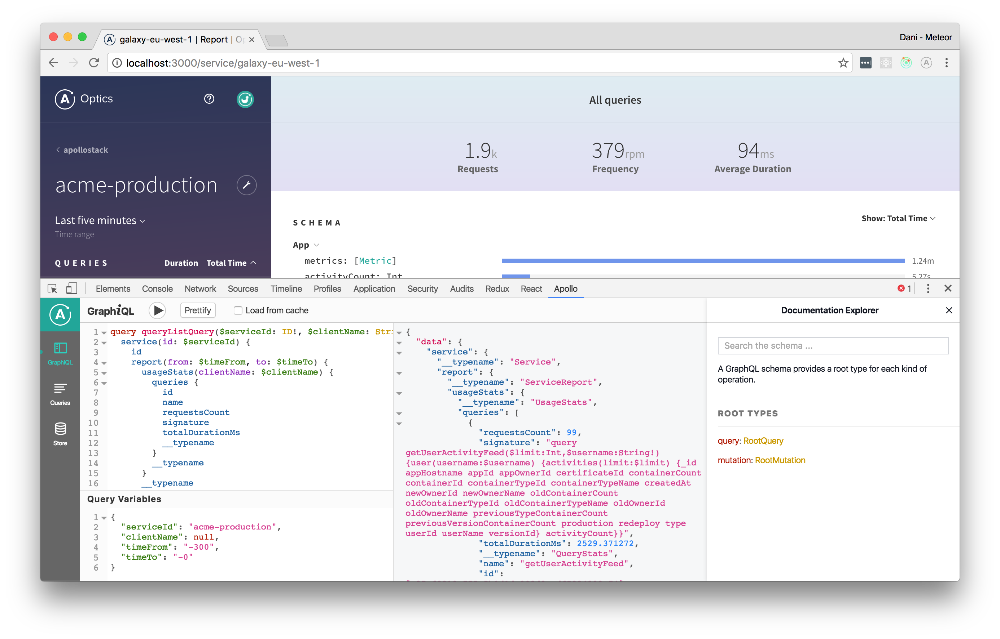
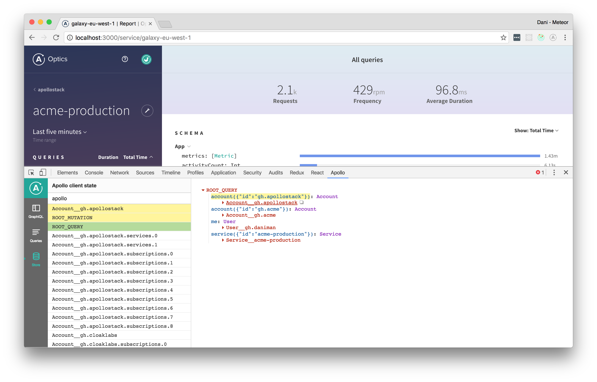
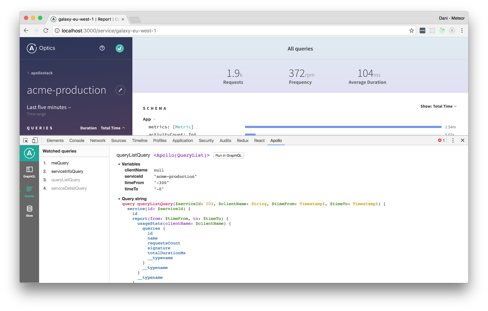

## Apollo Engine

[Apollo Engine](https://www.apollographql.com/platform/) is the best way to run GraphQL in production. It is a GraphQL gateway that helps you implement and run GraphQL over REST or any other backend with confidence. With Engine, you get a number of incredible features to help you understand your GraphQL service, and to make it run faster!

* **Improve response times**: With caching and persisted queries
* **Identify and understand hotspots**: With performance tracing and history
* **Keep an eye on your API**: With alerts and regular reports

Apollo Engine can run anywhere your GraphQL server can. It operates in one of two modes, either as a package you install into your Node server, or as a standalone proxy you can run with Docker, which works with any GraphQL server library. We've architected it to work for the most demanding of environments.

To learn more about Apollo Engine, check out the [guide](https://www.apollographql.com/platform/)

## Apollo Client Devtools

The [Apollo Client Devtools](https://chrome.google.com/webstore/detail/apollo-client-developer-t/jdkknkkbebbapilgoeccciglkfbmbnfm) is a Chrome extension.

### Features

The devtools appear as an "Apollo" tab in your Chrome inspector, along side the "Elements" and "Console" tabs. There are currently 3 main features of the devtools:

 * GraphiQL: Send queries to your server through the Apollo network interface, or query the Apollo cache to see what data is loaded.
 * Normalized store inspector: Visualize your GraphQL store the way Apollo Client sees it, and search by field names or values.
 * Watched query inspector: View active queries and variables, and locate the associated UI components.

 

Make requests against either your app’s GraphQL server or the Apollo Client cache through the Chrome developer console. This version of GraphiQL leverages your app’s network interface, so there’s no configuration necessary — it automatically passes along the proper HTTP headers, etc. the same way your Apollo Client app does.



View the state of your client-side cache as a tree and inspect every object inside. Visualize the [mental model](https://blog.apollographql.com/the-concepts-of-graphql-bc68bd819be3) of the Apollo cache. Search for specific keys and values in the store and see the path to those keys highlighted.



View the queries being actively watched on any given page. See when they're loading, what variables they're using, and, if you’re using React, which React component they’re attached to. Angular support coming soon.

### Installation

You can install the extension via the [Chrome Webstore](https://chrome.google.com/webstore/detail/apollo-client-developer-t/jdkknkkbebbapilgoeccciglkfbmbnfm).
If you want to install a local version of the extension instead, skip ahead to the __Developing__ section.

### Configuration

While your app is in dev mode, the devtools will appear as an "Apollo" tab in your chrome inspector. To enable the devtools in your app even in production, pass `connectToDevTools: true` to the ApolloClient constructor in your app.  Pass `connectToDevTools: false` if want to manually disable this functionality.

The "Apollo" tab will appear in the Chrome console if a global `window.__APOLLO_CLIENT__` object exists in your app. Apollo Client adds this hook to the window automatically unless `process.env.NODE_ENV === 'production'`. If you would like to use the devtools in production, just manually attach your Apollo Client instance to `window.__APOLLO_CLIENT__` or pass `connectToDevTools: true` to the constructor.

Find more information about contributing and debugging on the [Apollo Client DevTools GitHub page](https://github.com/apollographql/apollo-client-devtools).


## Apollo Codegen

Apollo Codegen is a tool to generate API code or type annotations based on a GraphQL schema and query documents.

It currently generates Swift code, TypeScript annotations, Flow annotations, and Scala code, we hope to add support for other targets in the future.

See [Apollo iOS](https://github.com/apollographql/apollo-ios) for details on the mapping from GraphQL results to Swift types, as well as runtime support for executing queries and mutations. For Scala, see [React Apollo Scala.js](https://github.com/apollographql/react-apollo-scalajs) for details on how to use generated Scala code in a Scala.js app with Apollo Client.

### Usage

If you want to use `apollo-codegen`, you can install it command globally:

```bash
npm install -g apollo-codegen
```

### `introspect-schema`

The purpose of this command is to create a JSON introspection dump file for a given graphql schema. The input schema can be fetched from a remote graphql server or from a local file. The resulting JSON introspection dump file is needed as input to the [generate](#generate) command.

To download a GraphQL schema by sending an introspection query to a server:

```bash
apollo-codegen introspect-schema http://localhost:8080/graphql --output schema.json
```

You can use the `header` option to add additional HTTP headers to the request. For example, to include an authentication token, use `--header "Authorization: Bearer <token>"`.

You can use the `insecure` option to ignore any SSL errors (for example if the server is running with self-signed certificate).

To generate a GraphQL schema introspection JSON from a local GraphQL schema:

```bash
apollo-codegen introspect-schema schema.graphql --output schema.json
```

### `generate`

The purpose of this command is to generate types for query and mutation operations made against the schema (it will not generate types for the schema itself).

This tool will generate Swift code by default from a set of query definitions in `.graphql` files:

```bash
apollo-codegen generate **/*.graphql --schema schema.json --output API.swift
```

You can also generate type annotations for TypeScript, Flow, or Scala using the `--target` option:

```bash
# TypeScript
apollo-codegen generate **/*.graphql --schema schema.json --target typescript --output operation-result-types.ts
# Flow
apollo-codegen generate **/*.graphql --schema schema.json --target flow --output operation-result-types.flow.js
# Scala
apollo-codegen generate **/*.graphql --schema schema.json --target scala --output operation-result-types.scala
```

### `gql` template support

If the source file for generation is a javascript or typescript file, the codegen will try to extrapolate the queries inside the [gql tag](https://github.com/apollographql/graphql-tag) templates.

The tag name is configurable using the CLI `--tag-name` option.

### .graphqlconfig support

Instead of using the `--schema` option to point out your GraphQL schema, you can specify it in a [`.graphqlconfig`](https://github.com/graphcool/graphql-config) file.

In case you specify multiple schemas in your `.graphqlconfig` file, choose which one to pick by using the `--project-name` option.

### Typescript and Flow

When using `apollo-codegen` with Typescript or Flow, make sure to add the `__typename` introspection field to every selection set within your graphql operations.

If you're using a client like `apollo-client` that does this automatically for your GraphQL operations, pass in the `--addTypename` option to `apollo-codegen` to make sure the generated Typescript and Flow types have the `__typename` field as well. This is required to ensure proper type generation support for `GraphQLUnionType` and `GraphQLInterfaceType` fields.

**Why is the __typename field required?**

Using the type information from the GraphQL schema, we can infer the possible types for fields. However, in the case of a `GraphQLUnionType` or `GraphQLInterfaceType`, there are multiple types that are possible for that field. This is best modeled using a disjoint union with the `__typename`
as the discriminant.

For example, given a schema:

```graphql
interface Character {
  name: String!
}

type Human implements Character {
  homePlanet: String
}

type Droid implements Character {
  primaryFunction: String
}
```

Whenever a field of type `Character` is encountered, it could be either a Human or Droid. Human and Droid objects
will have a different set of fields. Within your application code, when interacting with a `Character` you'll want to make sure to handle both of these cases.

Given this query:

```graphql
query Characters {
  characters(episode: NEW_HOPE) {
    name

    ... on Human {
      homePlanet
    }

    ... on Droid {
      primaryFunction
    }
  }
}
```

Apollo Codegen will generate a union type for Character.

```ts
export type CharactersQuery = {
  characters: Array<{
    __typename: 'Human',
    name: string,
    homePlanet: ?string
  } | {
    __typename: 'Droid',
    name: string,
    primaryFunction: ?string
  }>
}
```

This type can then be used as follows to ensure that all possible types are handled:

```tsx
function CharacterFigures({ characters }: CharactersQuery) {
  return characters.map(character => {
    switch(character.__typename) {
      case "Human":
        return <HumanFigure homePlanet={character.homePlanet} name={character.name} />
      case "Droid":
        return <DroidFigure primaryFunction={character.primaryFunction} name={character.name} />
    }
  });
}
```
