At its core, Apollo Client is a **state management** library that happens to use GraphQL to interact with a remote server. Naturally, some application state doesn't _require_ a remote server because it's entirely local.

Apollo Client enables you to manage local state alongside remotely fetched state, meaning you can interact with _all_ of your application's state with a single API.

## How it works

You can store your application's local state any way you want (such as in `localStorage` or the Apollo Client cache). You then define the logic that Apollo Client uses to fetch and populate that local data when you query a particular field. You can even include both local _and_ remotely fetched fields in the same query:

```mermaid
sequenceDiagram
    participant Apollo Client;
    participant Cache;
    participant GraphQL Server;

    Apollo Client->>Cache: Queries local and remote fields;
    Note over Cache: Calculates local fields;
    Cache->>GraphQL Server: Queries remote fields;
    Note over GraphQL Server: Resolves remote fields;
    GraphQL Server->>Cache: Returns remote fields;
    Note over Cache: Caches remote fields*;
    Cache->>Apollo Client: Returns ALL fields;
    Note over Apollo Client: Time passes…;
    Apollo Client->>Cache: Executes same query;
    Note over Cache: Calculates local fields;
    Note over Cache: Fetches remote fields (now cached);
    Cache->>Apollo Client: Returns ALL fields;
```

To support this flow, Apollo Client 3 introduces two complementary mechanisms for managing local state: [field policies](#field-policies-and-local-only-fields) and [reactive variables](#reactive-variables).

> \* The [local resolver API](./local-resolvers/) from previous versions of Apollo Client is also available but is [deprecated](./local-resolvers/#deprecation-notice). Some additional steps may occur when using this, e.g. the `@client(always:true)` directive would recalculate local field resolvers after remote fields are cached.

<MinVersion version="3.0">

## Field policies and local-only fields

</MinVersion>

**Field policies** enable you to define what happens when you query a particular field, _including fields that aren't defined in your GraphQL server's schema_. By defining field policies for these **local-only fields**, you can populate them with data that's stored anywhere, such as in `localStorage` or [reactive variables](#reactive-variables).

A single GraphQL query can include both local-only fields and remotely fetched fields. In the field policy for each local-only field, you specify a function that defines how that field's value is populated.

[Get started with local-only fields](./managing-state-with-field-policies/)

<MinVersion version="3.0">

## Reactive variables

</MinVersion>

**Reactive variables** enable you to read and write local data anywhere in your application, without needing to use a GraphQL operation to do so. The [field policy](#field-policies-and-local-only-fields) of a local-only field can use a reactive variable to populate the field's current value.

Reactive variables _aren't_ stored in the Apollo Client cache, so they don't need to conform to the strict structure of a cached type. You can store anything you want in them.

Whenever the value of a reactive variable changes, Apollo Client automatically detects that change. Every active query with a field that depends on the changed variable automatically updates.

[Get started with reactive variables](./reactive-variables)

<MinVersion version="2.5">

## Local resolvers

</MinVersion>

In earlier versions of Apollo Client, you define **local resolvers** to populate and modify local-only fields. These resolvers are similar in structure and purpose to the [resolvers that your GraphQL server defines](/apollo-server/data/resolvers/).

This functionality is still available in Apollo Client 3, but will be moved out of the core module in a future major release.

[Learn more about local resolvers](./local-resolvers)
