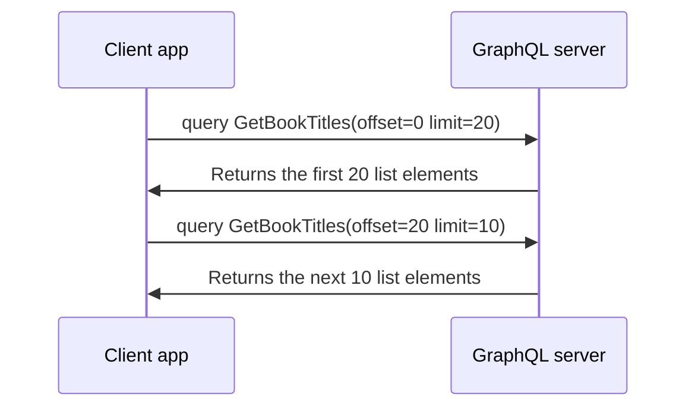

GraphQL enables you to fetch exactly the fields you need from your graph, with no unnecessary overhead. This helps keep network responses small and fast.

However, GraphQL doesn't automatically _guarantee_ small responses. This is especially apparent when you query a field that contains a **list**. A list can contain infinitely many elements, which can result in an enormous response from a seemingly small query like this one:

```graphql
query GetBookTitles {
  books {
    title
  }
}
```

If your graph includes thousands or millions of books, this query probably returns _much_ more data than you need. To resolve this issue, GraphQL servers can **paginate** their list fields.

When a client queries a paginated list field, the server returns only a portion (or "page") of the list's elements. The client's query includes arguments that indicate _which_ page the server should return:



This diagram shows **offset-based** pagination, in which a client requests a page based on an absolute index in the list (`offset`) and the maximum number of elements to return (`limit`).

There are many different pagination strategies a server can use for a particular list field: offset-based, cursor-based, page-number-based, forwards, backwards, and so on. Each strategy requires a slightly different set of arguments. Because these strategies can each be useful in different situations, neither Apollo nor the GraphQL specification prescribes a canonical pagination strategy.

## The Apollo Client approach

Instead of recommending a particular pagination strategy, Apollo Client provides flexible cache APIs that help you merge results from a paginated list field, regardless of which pagination strategy your GraphQL server uses. And because you can represent these custom pagination strategies with stateless functions, you can reuse a single function for every list field that uses the same strategy.

Ready to start paginating? Start by learning about the [Core pagination API](./core-api).
