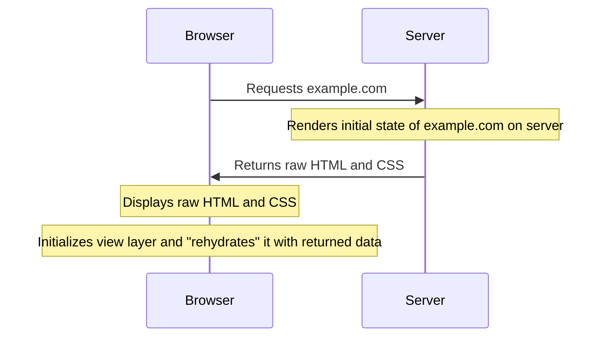

**Server-side rendering** (**SSR**) is a performance optimization for modern web apps. It enables you to render your app's initial state to raw HTML and CSS on the server _before_ serving it to a browser. This means users don't have to wait for their browser to download and initialize React (or Angular, Vue, etc.) before content is available:



Apollo Client provides a handy API for using it with server-side rendering, including a function that executes all of the GraphQL queries that are required to render your component tree. You don't need to make any changes to your queries to support this API.

## Differences from client-side rendering

When you render your React app on the server side, _most_ of the code is identical to its client-side counterpart, with a few important exceptions:

* You need to use a server-compatible router for React, such as [React Router](https://reactrouter.com/web/guides/server-rendering).

    (In the case of React Router, you wrap your application in a `StaticRouter` component instead of the `BrowserRouter` you use on the client side.)

* You need to replace relative URLs with absolute URLs wherever applicable.

* The initialization of Apollo Client changes slightly, as [described below](#initializing-apollo-client).

## Initializing Apollo Client

Here's an example _server-side_ initialization of Apollo Client:

```js {7-17}
import {
  ApolloClient,
  createHttpLink,
  InMemoryCache
} from '@apollo/client';

const client = new ApolloClient({
  ssrMode: true,
  link: createHttpLink({
    uri: 'http://localhost:3010',
    credentials: 'same-origin',
    headers: {
      cookie: req.header('Cookie'),
    },
  }),
  cache: new InMemoryCache(),
});
```

You'll notice a couple differences from a typical client-side initialization:

* You provide `ssrMode: true`. This prevents Apollo Client from refetching queries unnecessarily, and it also enables you to use the `getDataFromTree` function (covered below).

* Instead of providing a `uri` option, you provide an `HttpLink` instance to the `link` option. This enables you to specify any required authentication details when sending requests to your GraphQL endpoint from the server side.

    Note that you also might need to make sure your GraphQL endpoint is configured to accept GraphQL operations from your SSR server (for example, by safelisting its domain or IP).

> It's possible and valid for your GraphQL endpoint to be hosted by the _same server_ that's performing SSR. In this case, Apollo Client doesn't need to make network requests to execute queries. For details, see [Avoiding the network for local queries](#avoiding-the-network-for-local-queries).

## Example

Let's look at an example of SSR in a Node.js app. This example uses Express and React Router v4, although it can work with any server middleware and any router that supports SSR.

First, here's an example `app.js` file, _without_ the code for rendering React to HTML and CSS:

<ExpansionPanel title="Click to expand">

```jsx title="app.js"
import {
  ApolloProvider,
  ApolloClient,
  createHttpLink,
  InMemoryCache
} from '@apollo/client';
import Express from 'express';
import React from 'react';
import { StaticRouter } from 'react-router';

// File shown below
import Layout from './routes/Layout';

const app = new Express();
app.use((req, res) => {

  const client = new ApolloClient({
    ssrMode: true,
    link: createHttpLink({
      uri: 'http://localhost:3010',
      credentials: 'same-origin',
      headers: {
        cookie: req.header('Cookie'),
      },
    }),
    cache: new InMemoryCache(),
  });

  const context = {};

  // The client-side App will instead use <BrowserRouter>
  const App = (
    <ApolloProvider client={client}>
      <StaticRouter location={req.url} context={context}>
        <Layout />
      </StaticRouter>
    </ApolloProvider>
  );

  // TODO: rendering code (see below)
});

app.listen(basePort, () => console.log(
  `app Server is now running on http://localhost:${basePort}`
));
```

</ExpansionPanel>

So far, whenever this example server receives a request, it first initializes Apollo Client and then creates a React tree that's wrapped with the `ApolloProvider` and `StaticRouter` components. The contents of that tree depend on the request's path and the `StaticRouter`'s defined routes.

> It's important to create an _entirely new instance_ of Apollo Client for each request. Otherwise, your response to a request might include sensitive cached query results from a _previous_ request.

### Executing queries with `getDataFromTree`

Because our app uses Apollo Client, some of the components in the React tree probably execute a GraphQL query with the `useQuery` hook. We can instruct Apollo Client to execute _all_ of the queries required by the tree's components with the `getDataFromTree` function.

This function walks down the entire tree and executes every required query it encounters (including nested queries). It returns a `Promise` that resolves when all result data is ready in the Apollo Client cache.

When the `Promise` resolves, you're ready to render your React tree and return it, along with the current state of the Apollo Client cache.

> Note that if you are rendering your React tree directly to a string (instead of the component-based example below), you will need to use [`renderToStringWithData`](../api/react/ssr/#rendertostringwithdata) instead of `getDataFromTree`. This will ensure the client-side React hydration works correctly by using [`ReactDOMServer.renderToString`](https://react.dev/reference/react-dom/server/renderToString) to generate the string.

The following code replaces the `TODO` comment within the `app.use` call in the example above:

```js title="app.js"
// Add this import to the top of the file
import { getDataFromTree } from "@apollo/client/react/ssr";

// Replace the TODO with this
getDataFromTree(App).then((content) => {
  // Extract the entirety of the Apollo Client cache's current state
  const initialState = client.extract();

  // Add both the page content and the cache state to a top-level component
  const html = <Html content={content} state={initialState} />;

  // Render the component to static markup and return it
  res.status(200);
  res.send(`<!doctype html>\n${ReactDOM.renderToStaticMarkup(html)}`);
  res.end();
});
```

The definition of the top-level `Html` component that's rendered to static markup might look like this:

```jsx title="components/html.js"
export function Html({ content, state }) {
  return (
    <html>
      <body>
        <div id="root" dangerouslySetInnerHTML={{ __html: content }} />
        <script dangerouslySetInnerHTML={{
          __html: `window.__APOLLO_STATE__=${JSON.stringify(state).replace(/</g, '\\u003c')};`,
        }} />
      </body>
    </html>
  );
}
```

This results in the rendered React tree being added as a child of the `root` `div`, and the initial cache state is assigned to the `__APOLLO_STATE__` global object.

> The `replace` call in this example escapes the `<` character to prevent cross-site scripting attacks that are possible via the presence of `</script>` in a string literal.

### Rehydrating the client-side cache

Although the server-side cache's state is available in `__APOLLO_STATE__`, it isn't yet available in the _client-side_ cache. `InMemoryCache` provides a helpful `restore` function for **rehydrating** its state with data `extract`ed from another cache instance.

In your client-side initialization of Apollo Client, you can rehydrate the cache like so:

```js
const client = new ApolloClient({
  cache: new InMemoryCache().restore(window.__APOLLO_STATE__),
  uri: 'https://example.com/graphql'
});
```

Now when the client-side version of the app runs its initial queries, the data is returned instantly because it's already in the cache!

#### Overriding fetch policies during initialization

If some of your initial queries use the `network-only` or `cache-and-network` [fetch policy](../data/queries/#setting-a-fetch-policy), you can provide the `ssrForceFetchDelay` option to Apollo Client to skip force-fetching those queries during initialization. This way, even those queries initially run using only the cache:

```js
const client = new ApolloClient({
  cache: new InMemoryCache().restore(window.__APOLLO_STATE__),
  link,
  ssrForceFetchDelay: 100, // in milliseconds
});
```

## Avoiding the network for local queries

If your GraphQL endpoint is hosted by the same server that you're rendering from, you can optionally avoid using the network when executing your SSR queries. This is particularly helpful if `localhost` is firewalled in the server's environment (e.g., on Heroku).

One option is to use Apollo Link to fetch data using a local GraphQL schema instead of making a network request. To achieve this, when creating an Apollo Client on the server, you could use a [SchemaLink](../api/link/apollo-link-schema/) instead of using `createHttpLink`. `SchemaLink` uses your schema and context to run the query immediately, without any additional network requests:

```js
import { ApolloClient, InMemoryCache } from '@apollo/client'
import { SchemaLink } from '@apollo/client/link/schema';

// ...

const client = new ApolloClient({
  ssrMode: true,
  // Instead of "createHttpLink" use SchemaLink here
  link: new SchemaLink({ schema }),
  cache: new InMemoryCache(),
});
```

## Skipping a query

If you want to intentionally skip a particular query during SSR, you can include `ssr: false` in that query's options. Typically, this means the component is rendered in its "loading" state on the server. For example:

```jsx
function withClientOnlyUser() {
  useQuery(GET_USER_WITH_ID, { ssr: false });
  return <span>My query won't be run on the server</span>;
}
```
