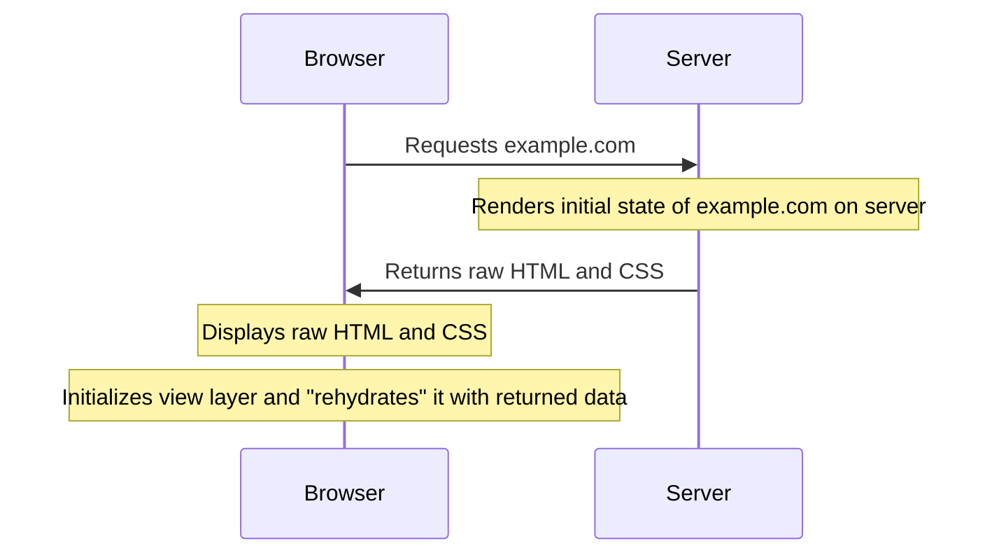

<Note>
This page describes manual server side rendering setups with React. If you are using a modern SSR-focused framework like [Next.js](https://nextjs.org/), [React Router Framework mode](https://reactrouter.com/en/main/routers/framework), or [TanStack Start](https://start.tanstack.com/), you need to use one of our Apollo Client Framework integrations instead.
You can find these integrations [on GitHub](https://github.com/apollographql/apollo-client-integrations):

- [@apollo/client-integration-nextjs](https://github.com/apollographql/apollo-client-integrations/tree/main/packages/nextjs)
- [@apollo/client-integration-react-router](https://github.com/apollographql/apollo-client-integrations/tree/main/packages/react-router)
- [@apollo/client-integration-tanstack-start](https://github.com/apollographql/apollo-client-integrations/tree/main/packages/tanstack-start)

</Note>

**Server-side rendering** (**SSR**) is a performance optimization for modern web apps. It enables you to render your app's initial state to raw HTML and CSS on the server _before_ serving it to a browser. This means users don't have to wait for their browser to download and initialize React (or Angular, Vue, etc.) before content is available:



Apollo Client provides a handy API for using it with server-side rendering, including a function that executes all of the GraphQL queries that are required to render your component tree. You don't need to make any changes to your queries to support this API.

## Differences from client-side rendering

When you render your React app on the server side, _most_ of the code is identical to its client-side counterpart, with a few important exceptions:

- You need to use a server-compatible router for React, such as [React Router](https://reactrouter.com/web/guides/server-rendering).

  (In the case of React Router, you wrap your application in a `StaticRouter` component instead of the `BrowserRouter` you use on the client side.)

- You need to replace relative URLs with absolute URLs wherever applicable.

- The initialization of Apollo Client changes slightly, as [described below](#initializing-apollo-client).

## Initializing Apollo Client

Here's an example _server-side_ initialization of Apollo Client:

```js
import { ApolloClient, HttpLink, InMemoryCache } from "@apollo/client";

const client = new ApolloClient({
  ssrMode: true,
  link: new HttpLink({
    uri: "http://localhost:3010",
    credentials: "same-origin",
    headers: {
      cookie: req.header("Cookie"),
    },
  }),
  cache: new InMemoryCache(),
});
```

Provide `ssrMode: true` to prevent Apollo Client from polling on the server. This setting also tells the client to prioritize cache values over network requests when possible.

You also might need to configure your GraphQL endpoint to accept GraphQL operations from your SSR server (for example, by safelisting its domain or IP). Use absolute URLs for your GraphQL endpoint on the server, because relative network requests can only be made in a browser.

> It's possible and valid for your GraphQL endpoint to be hosted by the _same server_ that's performing SSR. In this case, Apollo Client doesn't need to make network requests to execute queries. For details, see [Avoiding the network for local queries](#avoiding-the-network-for-local-queries).

## Example

Let's look at an example of SSR in a Node.js app. This example uses Express and React Router v4, although it can work with any server middleware and any router that supports SSR.

First, here's an example `app.js` file, _without_ the code for rendering React to HTML and CSS:

<ExpansionPanel title="Click to expand">

```jsx title="app.js"
import { ApolloClient, HttpLink, InMemoryCache } from "@apollo/client";
import { ApolloProvider } from "@apollo/client/react";
import Express from "express";
import React from "react";
import { StaticRouter } from "react-router";

// File shown below
import Layout from "./routes/Layout";

const app = new Express();
app.use((req, res) => {
  const client = new ApolloClient({
    ssrMode: true,
    link: new HttpLink({
      uri: "http://localhost:3010",
      credentials: "same-origin",
      headers: {
        cookie: req.header("Cookie"),
      },
    }),
    cache: new InMemoryCache(),
  });

  const context = {};

  // The client-side App will instead use <BrowserRouter>
  const App = (
    <ApolloProvider client={client}>
      <StaticRouter location={req.url} context={context}>
        <Layout />
      </StaticRouter>
    </ApolloProvider>
  );

  // TODO: rendering code (see below)
});

app.listen(basePort, () =>
  console.log(`app Server is now running on http://localhost:${basePort}`)
);
```

</ExpansionPanel>

So far, whenever this example server receives a request, it first initializes Apollo Client and then creates a React tree that's wrapped with the `ApolloProvider` and `StaticRouter` components. The contents of that tree depend on the request's path and the `StaticRouter`'s defined routes.

<Caution>

It's important to create an _entirely new instance_ of Apollo Client for each request. Otherwise, your response to a request might include sensitive cached query results from a _previous_ request.

</Caution>

### Executing queries with `prerenderStatic`

You can instruct Apollo Client to execute all of the queries executed by the `useQuery` or the suspenseful query hooks (like `useSuspenseQuery` and `useBackgroundQuery`) in the React tree's components with the `prerenderStatic` function.

This function rerenders your React tree until no more network requests are made. When you use suspenseful hooks with a suspense-ready rendering function, the tree is rendered once and suspends while network requests are executed. When you use non-suspenseful hooks (like `useQuery`), this function renders all components, waits for all requests to finish, and then re-renders the tree until no more requests are made.

The function returns a `Promise` that resolves when all result data is ready in the Apollo Client cache and the final render is complete.

#### Choosing a rendering function

`prerenderStatic` supports multiple React rendering functions:

- **`prerender`** from `react-dom/static` - Recommended for Deno or modern edge runtimes with Web Streams. Supports React Suspense.
- **`prerenderToNodeStream`** from `react-dom/static` - Recommended for Node.js. Supports React Suspense.
- **`renderToString`** from `react-dom/server` - Legacy API without Suspense support. Won't work with suspenseful hooks.
- **`renderToStaticMarkup`** from `react-dom/server` - Legacy API without Suspense support. Slightly faster than `renderToString`, but the result cannot be hydrated.

The following code replaces the `TODO` comment within the `app.use` call in the example above:

```js title="app.js"
// Add these imports to the top of the file
import { prerenderStatic } from "@apollo/client/react/ssr";
import { prerenderToNodeStream } from "react-dom/static";

// Replace the TODO with this
prerenderStatic({
  tree: App,
  // this is optional if your `App` component contains an <ApolloProvider>
  context: { client },
  renderFunction: prerenderToNodeStream,
}).then(async ({ result }) => {
  // Extract the entirety of the Apollo Client cache's current state
  const initialState = client.extract();

  // TODO: Send the response to the client (see below for examples)
});
```

#### Sending the response

After `prerenderStatic` completes, you need to send the HTML response to the client. The approach depends on the rendering function you chose.

##### Using streaming with `renderToPipeableStream`

For Node.js environments, you can stream the response to the client using `renderToPipeableStream`. This allows the browser to start displaying content before the entire page is rendered:

```js title="app.js"
import { renderToPipeableStream } from "react-dom/server";

// After prerenderStatic completes
prerenderStatic({
  tree: App,
  context: { client },
  renderFunction: prerenderToNodeStream,
}).then(async ({ result }) => {
  const initialState = client.extract();

  // Render the app again with streaming, injecting the Apollo state
  const { pipe } = renderToPipeableStream(
    <html>
      <head>
        <title>My App</title>
      </head>
      <body>
        <div id="root">
          <App />
        </div>
      </body>
    </html>,
    {
      bootstrapScriptContent: `window.__APOLLO_STATE__=${JSON.stringify(
        initialState
      ).replace(/</g, "\\u003c")}`,
      bootstrapScripts: ["/client.js"],
      onShellReady() {
        // Start streaming the response to the browser
        res.setHeader("Content-Type", "text/html");
        res.statusCode = 200;
        pipe(res);
      },
      onError(error) {
        console.error("Rendering error:", error);
      },
    }
  );
});
```

<Note>
Instead of rendering `<div id="root"><App /></div>`, you can also render `<div id="root" dangerouslySetInnerHTML={{ __html: result }} />` to avoid rendering the entire tree twice.
However, if you go this approach, React cannot decide on the order in which components are streamed to the browser, which might be suboptimal.
In the end, it's a tradeoff between more work on the server and a potential delay in displaying content in the browser that you need to make based on your individual requirements.
</Note>

<Tip>
If you are only using suspenseful hooks (like `useSuspenseQuery` or `useBackgroundQuery`) and no `useQuery` hooks, is also possible to use the [@apollo/client-react-streaming](https://github.com/apollographql/apollo-client-integrations/tree/main/packages/client-react-streaming) package to stream data dynamically while it is fetching, without requiring a first render pass with `prerenderStatic`.
You can find an example application that uses this approach in the [integration tests for that package](https://github.com/apollographql/apollo-client-integrations/tree/main/integration-test/vite-streaming).
</Tip>

<Note>
The `replace` call in these examples escapes the `<` character to prevent cross-site scripting attacks that are possible via the presence of `</script>` in a string literal.
</Note>

##### Using `renderToString` for synchronous rendering

For simpler use cases or environments without stream support, you can use `renderToString` to render the entire page synchronously:

```js title="app.js"
import { renderToString } from "react-dom/server";

// After prerenderStatic completes
prerenderStatic({
  tree: App,
  context: { client },
  renderFunction: renderToString,
}).then(async ({ result }) => {
  const initialState = client.extract();

  // Create a complete HTML document with the cache state
  const Html = () => (
    <html>
      <head>
        <title>My App</title>
      </head>
      <body>
        <div id="root" dangerouslySetInnerHTML={{ __html: result }} />
        <script
          dangerouslySetInnerHTML={{
            __html: `window.__APOLLO_STATE__=${JSON.stringify(
              initialState
            ).replace(/</g, "\\u003c")};`,
          }}
        />
        <script src="/client.js" />
      </body>
    </html>
  );

  // Render to string and send
  const html = renderToString(<Html />);

  res.setHeader("Content-Type", "text/html");
  res.status(200);
  res.send(`<!DOCTYPE html>${html}`);
  res.end();
});
```

<Note>
The `replace` call in these examples escapes the `<` character to prevent cross-site scripting attacks that are possible via the presence of `</script>` in a string literal.
</Note>

#### Advanced options

`prerenderStatic` provides several options to customize the rendering process:

##### Diagnostics

You can enable diagnostics to detect inefficient rendering structures (like `useQuery` waterfalls) in your app:

```js
const { diagnostics } = await prerenderStatic({
  tree: App,
  context: { client },
  renderFunction: prerenderToNodeStream,
  diagnostics: true,
});

console.log(`Rendered ${diagnostics.renderCount} times`);
// If renderCount is high, consider using fragment colocation
```

**Timeout support**

You can use an `AbortSignal` to stop the render loop early:

```js
const signal = AbortSignal.timeout(2000); // 2 second timeout

const { result, aborted } = await prerenderStatic({
  tree: App,
  context: { client },
  renderFunction: (tree) => prerenderToNodeStream(tree, { signal }),
  signal,
});

if (aborted) {
  console.log("Render timed out, returning partial result");
}
```

##### Maximum rerenders

If you have deep `useQuery` waterfalls, you can increase the `maxRerenders` option (default: 50):

```js
await prerenderStatic({
  tree: App,
  context: { client },
  renderFunction: prerenderToNodeStream,
  maxRerenders: 100,
});
```

### Rehydrating the client-side cache

Although the server-side cache's state is available in `__APOLLO_STATE__`, it isn't yet available in the _client-side_ cache. `InMemoryCache` provides a helpful `restore` function for **rehydrating** its state with data `extract`ed from another cache instance.

In your client-side initialization of Apollo Client, you can rehydrate the cache like so:

```js
const client = new ApolloClient({
  cache: new InMemoryCache().restore(window.__APOLLO_STATE__),
  uri: "https://example.com/graphql",
});
```

Now when the client-side version of the app runs its initial queries, the data is returned instantly because it's already in the cache!

#### Overriding fetch policies during initialization

If some of your initial queries use the `network-only` or `cache-and-network` [fetch policy](../data/queries/#setting-a-fetch-policy), you can provide the `ssrForceFetchDelay` option to Apollo Client to skip force-fetching those queries during initialization. This way, even those queries initially run using only the cache:

```js
const client = new ApolloClient({
  cache: new InMemoryCache().restore(window.__APOLLO_STATE__),
  link,
  ssrForceFetchDelay: 100, // in milliseconds
});
```

## Avoiding the network for local queries

If your GraphQL endpoint is hosted by the same server that you're rendering from, you can optionally avoid using the network when executing your SSR queries. This is particularly helpful if `localhost` is firewalled in the server's environment (e.g., on Heroku).

When creating an Apollo Client on the server, use a [SchemaLink](../api/link/apollo-link-schema/) instead of an `HttpLink`. `SchemaLink` uses your schema and context to run the query immediately, without the need for a network request:

```js
import { ApolloClient, InMemoryCache } from "@apollo/client";
import { SchemaLink } from "@apollo/client/link/schema";

// ...

const client = new ApolloClient({
  // Instead of HttpLink use SchemaLink here
  link: new SchemaLink({ schema }),
  cache: new InMemoryCache(),
});
```

## Selectively disabling query execution during SSR

If you want to prevent a particular query from executing during SSR, use `ssr: false` in that query's options. This is useful for queries that should only run on the client side, such as user-specific data that isn't available during SSR.

When `ssr: false` is set, the component receives a result with `loading: true`, `dataState: "empty"`, and `data: undefined` during server-side rendering. The query will execute normally once the component hydrates on the client.

```jsx
function ClientOnlyUser() {
  const { loading, data } = useQuery(GET_USER_WITH_ID, { ssr: false });

  if (loading) {
    return <span>Loading...</span>;
  }

  return <span>User: {data?.user?.name || "Not loaded"}</span>;
}
```

<Note>

`ssr: false` behaves differently than `skip: true`, which prevents the query from executing on both the server and client until `skip` is set to `false`. During SSR, `skip: true` results in `loading: false` and `networkStatus: NetworkStatus.ready`.

</Note>

## Legacy APIs

Apollo Client provides two legacy SSR functions that are both replaced by `prerenderStatic`:

- **`getDataFromTree`** - Executes all queries in a component tree and returns when data is ready. Uses `renderToStaticMarkup` by default.
- **`renderToStringWithData`** - Similar to `getDataFromTree`, but returns the rendered string using `renderToString`.

These functions are deprecated. Use `prerenderStatic` instead, which offers better flexibility and performance with modern React rendering APIs.
