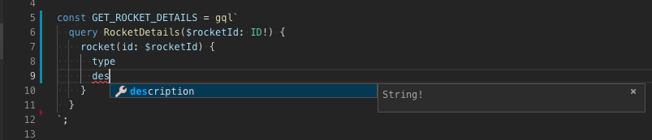
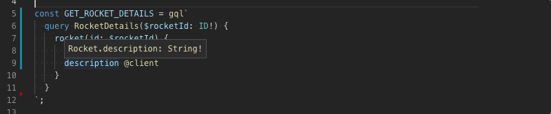
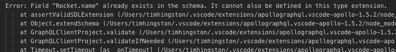

Imagine we're building out a new feature in our Space Explorer app — we'd like to display a description of each rocket we can choose — but the backend support for this feature isn't going to be available for another few weeks. In keeping with [schema-first design](https://www.apollographql.com/docs/tutorial/schema.html#write-schema), the team has decided that we'll be adding a new field called `description` to an existing type in our schema called `Rocket`.

Even though this field doesn't exist in the schema yet, we can take advantage of client schemas to document it as a _client-side_ field. In this guide, we'll walk through a simple recipe for this technique:

- declare client-side extensions to the schema using Apollo Client;
- enhance client resolvers with mock data;
- write GraphQL queries that leverage client-only types and fields.

## 1. Extend your server schema with a client-only field.

Before we can include this data in the UI, we'll need to define a client schema that extends our server schema. We'll start by constructing an instance of ApolloClient with a few small additions. Simply pass in `typeDefs` with extensions to the schema and `resolvers` which actually provide the mock data:

```js
const typeDefs = gql`
  extend type Rocket {
    description: String!
  }
`;

const resolvers = {
  Rocket: {
    description: () => "A boilerplate standard space rocket"
  }
};

const client = new ApolloClient({
  cache,
  link,
  typeDefs,
  resolvers
});
```

Documenting your client-side API in [Schema Definition Language](https://apollographql.com/docs/graphql-tools/generate-schema.html#schema-language) is incredibly valuable, as other developers can easily see what client state is available in your app. Developers familiar with GraphQL schemas should quickly be able to understand how to query for these fields in other places throughout your app.

Additional tools available from Apollo can further enrich the developer experience when working with client-side schemas. The Apollo Visual Studio Code Plugin provides autocompletion of client-side fields as well as inline mouse-over documentation:




We'll also see error messages in the VSCode console if we add fields that collide with the server-side schema:



## 2. Introduce richer mock data.

Now that we have a basic resolver, we might find that during testing it's a bit boring to show the same boilerplate text every time. In fact we might want to test different lengths of text to make sure our layout still looks good. Introducing a mock data helper library such as [faker.js](https://github.com/marak/Faker.js/) can help keep the mock data varied while testing. We can incorporate it easily into this workflow:

```js
import faker from "faker/locale/en";

// returns either 1 or 2 latin sentences, like
// 'Lorem ipsum dolor sit amet, consectetur adipiscing elit...
const oneOrTwoSentences = () =>
  faker.lorem.sentences(Math.random() < 0.5 ? 1 : 2);

const resolvers = {
  Rocket: {
    description: () => oneOrTwoSentences()
  }
};
```

> _Note:_ the faker.js library comes bundled with lots and lots of strings that can consume precious bundle bytes. For this reason you should make sure to only include the faker.js dependency in development mode and take care not to include this in your production bundle.

## 3. Query the mocked field with the `@client` directive.

Now, you’re ready to query your new field inside the `RocketDetails` component. Just add your new field to the query and specify the `@client` directive, and start using it in your UI.

```js
const GET_ROCKET_DETAILS = gql`
  query RocketDetails($rocketId: ID!) {
    rocket(id: $rocketId) {
      type
      description @client
    }
  }
`;

export default function RocketDetails({ rocketId }) {
  return (
    <Query query={GET_ROCKET_DETAILS} variables={{ rocketId }}>
      {({ data }) => (
        <div>
          <p>Rocket Type: {data.rocket.type}</p>
          <p>Description: {data.rocket.description}</p>
        </div>
      )}
    </Query>
  );
}
```

## 4. Toggle on “real” data.

Once the feature is ready on the backend, just remove the `@client` directive from your query. You should now be able to see your real production data returned instead. It's probably a good idea to clean up any unused client schema and resolvers at this time.

There you have it, a workflow for developing new features with new schema fields ahead of the actual schema implementation. For further reading, visit the [tutorial guide](https://www.apollographql.com/docs/tutorial/local-state.html#virtual-fields) which describes how to use client fields to manage local state in greater depth.

If you have feedback on this workflow, experiences you want to share, or just want to join the general discussion on client-side development and mocking, join us on [Spectrum](https://spectrum.chat/apollo)!
