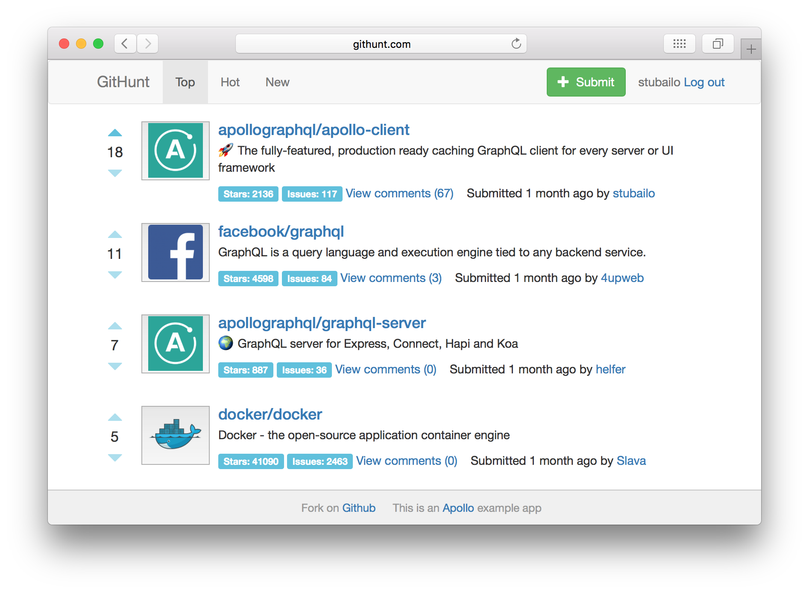

GitHunt is an application in the style of Product Hunt that shows a list of GitHub repositories, sorted by votes with attached comments. It can be a useful reference to see a lot of Apollo features in action, although it has a lot of functionality so the code is not simple for beginners.

- [View the live app frontend](http://www.githunt.com/)
- [Run queries against the live server](http://api.githunt.com/graphiql)

<h2 id="code">Get the code</h2>

- [The API server code](https://github.com/apollographql/GitHunt-API) demonstrates combining two data sources--a third-party API and a local database--in a single GraphQL endpoint.
- The [React UI](https://github.com/apollographql/GitHunt-React) demonstrates a lot of the concepts in this guide.
